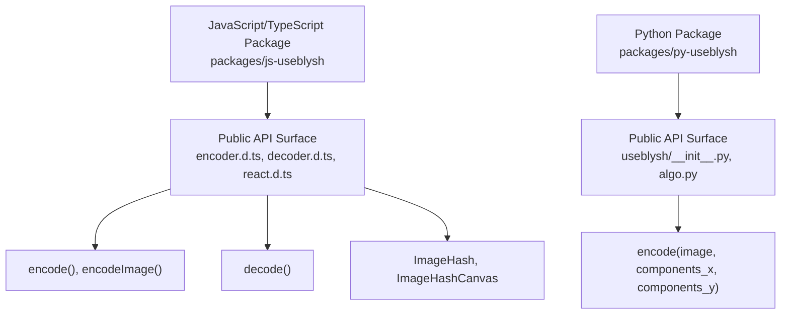
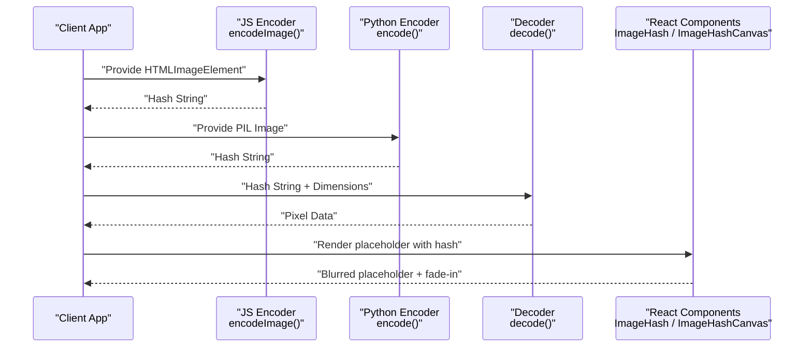
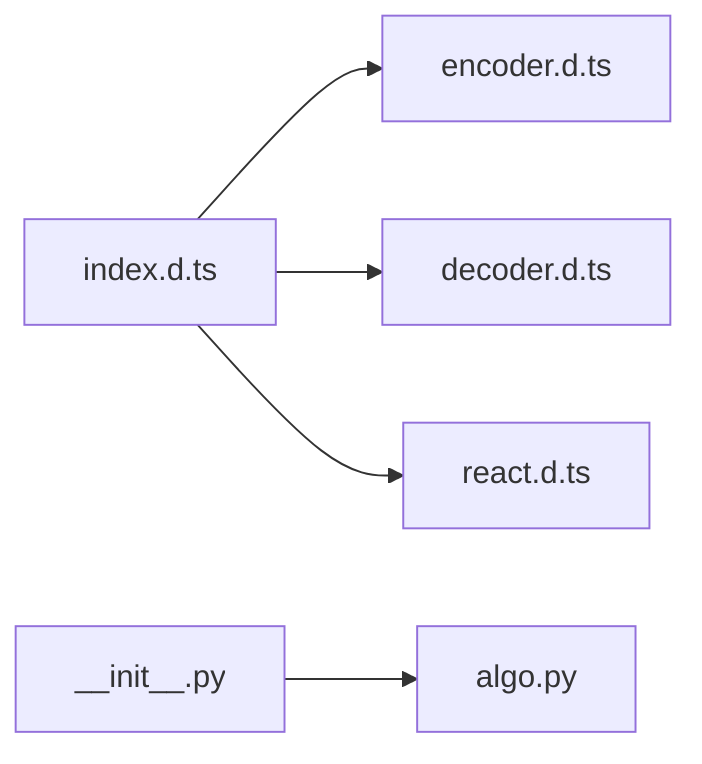

# API Reference

<cite>
**Referenced Files in This Document**
- [README.md](file://README.md)
- [packages/js-useblysh/dist/index.d.ts](file://packages/js-useblysh/dist/index.d.ts)
- [packages/js-useblysh/dist/encoder.d.ts](file://packages/js-useblysh/dist/encoder.d.ts)
- [packages/js-useblysh/dist/decoder.d.ts](file://packages/js-useblysh/dist/decoder.d.ts)
- [packages/js-useblysh/dist/react.d.ts](file://packages/js-useblysh/dist/react.d.ts)
- [packages/py-useblysh/useblysh/__init__.py](file://packages/py-useblysh/useblysh/__init__.py)
- [packages/py-useblysh/useblysh/algo.py](file://packages/py-useblysh/useblysh/algo.py)
</cite>

## Table of Contents
1. [Introduction](#introduction)
2. [Project Structure](#project-structure)
3. [Core Components](#core-components)
4. [Architecture Overview](#architecture-overview)
5. [Detailed Component Analysis](#detailed-component-analysis)
6. [Dependency Analysis](#dependency-analysis)
7. [Performance Considerations](#performance-considerations)
8. [Troubleshooting Guide](#troubleshooting-guide)
9. [Conclusion](#conclusion)
10. [Appendices](#appendices)

## Introduction
This document provides a comprehensive API reference for the unified useblysh toolkit across JavaScript/TypeScript and Python. It covers:
- JavaScript/TypeScript APIs: encodeImage, encode, decode, ImageHash, ImageHashCanvas, and related TypeScript interfaces.
- Python API: encode function, supported parameters, PIL Image requirements, exceptions, and return formats.
- Cross-platform consistency, parameter standardization, error handling, and practical usage examples.
- Version metadata and migration guidance.

## Project Structure
The repository provides two packages:
- JavaScript/TypeScript package under packages/js-useblysh with compiled TypeScript declaration files exposing the public API surface.
- Python package under packages/py-useblysh implementing the core algorithm and exposing the encode function and supporting utilities.

**Diagram sources**
- [packages/js-useblysh/dist/index.d.ts:1-5](file://packages/js-useblysh/dist/index.d.ts#L1-L5)
- [packages/js-useblysh/dist/encoder.d.ts:1-6](file://packages/js-useblysh/dist/encoder.d.ts#L1-L6)
- [packages/js-useblysh/dist/decoder.d.ts:1-2](file://packages/js-useblysh/dist/decoder.d.ts#L1-L2)
- [packages/js-useblysh/dist/react.d.ts:1-18](file://packages/js-useblysh/dist/react.d.ts#L1-L18)
- [packages/py-useblysh/useblysh/__init__.py:1-5](file://packages/py-useblysh/useblysh/__init__.py#L1-L5)
- [packages/py-useblysh/useblysh/algo.py:1-112](file://packages/py-useblysh/useblysh/algo.py#L1-L112)

**Section sources**
- [README.md:1-163](file://README.md#L1-L163)
- [packages/js-useblysh/dist/index.d.ts:1-5](file://packages/js-useblysh/dist/index.d.ts#L1-L5)
- [packages/py-useblysh/useblysh/__init__.py:1-5](file://packages/py-useblysh/useblysh/__init__.py#L1-L5)

## Core Components
This section summarizes the primary APIs and their roles.

- JavaScript/TypeScript
  - encodeImage(imageElement, componentsX?, componentsY?): Generates a hash from an HTMLImageElement.
  - encode(pixels, width, height, componentsX?, componentsY?): Low-level encoder from raw pixel data.
  - decode(hash, width, height, punch?): Decodes a hash into pixel data for rendering.
  - ImageHash: React component that renders a blurred placeholder while loading the real image.
  - ImageHashCanvas: React component for manual control over canvas rendering of the blur.

- Python
  - encode(image: PIL.Image.Image, components_x=4, components_y=3): Computes the hash string from a PIL Image.

**Section sources**
- [packages/js-useblysh/dist/encoder.d.ts:1-6](file://packages/js-useblysh/dist/encoder.d.ts#L1-L6)
- [packages/js-useblysh/dist/decoder.d.ts:1-2](file://packages/js-useblysh/dist/decoder.d.ts#L1-L2)
- [packages/js-useblysh/dist/react.d.ts:1-18](file://packages/js-useblysh/dist/react.d.ts#L1-L18)
- [packages/py-useblysh/useblysh/algo.py:39-112](file://packages/py-useblysh/useblysh/algo.py#L39-L112)

## Architecture Overview
The system consists of:
- Encoding pipeline: Converts an image into a compact Base83-encoded string using DCT-based frequency quantization.
- Decoding pipeline: Reconstructs a low-resolution representation suitable for a blurred placeholder.
- React components: Provide out-of-the-box UI behavior for progressive image loading.

**Diagram sources**
- [packages/js-useblysh/dist/encoder.d.ts:1-6](file://packages/js-useblysh/dist/encoder.d.ts#L1-L6)
- [packages/py-useblysh/useblysh/algo.py:39-112](file://packages/py-useblysh/useblysh/algo.py#L39-L112)
- [packages/js-useblysh/dist/decoder.d.ts:1-2](file://packages/js-useblysh/dist/decoder.d.ts#L1-L2)
- [packages/js-useblysh/dist/react.d.ts:1-18](file://packages/js-useblysh/dist/react.d.ts#L1-L18)

## Detailed Component Analysis

### JavaScript/TypeScript API

#### Function: encodeImage
- Purpose: Generate a hash from an HTMLImageElement.
- Signature: encodeImage(image: HTMLImageElement, componentsX?: number, componentsY?: number): string
- Parameters:
  - image: HTMLImageElement representing the source image.
  - componentsX: Optional number controlling horizontal frequency components (default aligns with Python defaults).
  - componentsY: Optional number controlling vertical frequency components (default aligns with Python defaults).
- Returns: string containing the Base83-encoded hash.
- Validation and Defaults:
  - Parameter validation mirrors Python’s constraints: components must be integers in [1..9].
  - Default values are intended to match Python’s encode defaults (components_x=4, components_y=3).
- Notes:
  - The underlying implementation converts the image to pixel data and delegates to encode.

**Section sources**
- [packages/js-useblysh/dist/encoder.d.ts:1-6](file://packages/js-useblysh/dist/encoder.d.ts#L1-L6)

#### Function: encode (low-level)
- Purpose: Encode raw pixel data into a hash string.
- Signature: encode(pixels: Uint8ClampedArray, width: number, height: number, componentsX?: number, componentsY?: number): string
- Parameters:
  - pixels: Raw RGBA pixel buffer.
  - width, height: Dimensions of the pixel array.
  - componentsX, componentsY: Frequency grid controls (see validation below).
- Returns: string hash.
- Validation and Defaults:
  - components must be integers within [1..9]; otherwise behavior is undefined without explicit checks here.
  - Defaults align with Python’s encode defaults.

**Section sources**
- [packages/js-useblysh/dist/encoder.d.ts:1-6](file://packages/js-useblysh/dist/encoder.d.ts#L1-L6)

#### Function: decode
- Purpose: Decode a hash into pixel data for rendering.
- Signature: decode(hash: string, width: number, height: number, punch?: number): Uint8ClampedArray
- Parameters:
  - hash: Base83-encoded string produced by encode/encodeImage.
  - width, height: Target output dimensions.
  - punch: Optional contrast/detail modifier influencing reconstruction sharpness.
- Returns: Uint8ClampedArray representing decoded pixel data.
- Notes:
  - Used internally by ImageHashCanvas to draw the placeholder.

**Section sources**
- [packages/js-useblysh/dist/decoder.d.ts:1-2](file://packages/js-useblysh/dist/decoder.d.ts#L1-L2)

#### React Component: ImageHash
- Purpose: Renders a blurred placeholder immediately and fades in the real image once loaded.
- Props: Extends standard img attributes plus:
  - hash: string; the hash generated by encodeImage or encode.
  - src: string; URL of the full-quality image to load.
- Behavior:
  - Uses decode to produce a low-res representation from hash.
  - Manages loading lifecycle to swap placeholder with the real image.

**Section sources**
- [packages/js-useblysh/dist/react.d.ts:1-18](file://packages/js-useblysh/dist/react.d.ts#L1-L18)

#### React Component: ImageHashCanvas
- Purpose: Provides manual control over canvas rendering of the decoded placeholder.
- Props: Extends canvas attributes plus:
  - hash: string; the hash to decode.
  - width?: number; canvas width.
  - height?: number; canvas height.
  - punch?: number; optional detail modifier.
- Behavior:
  - Decodes hash to pixel data and draws onto a canvas.
  - Leaves image loading and transition logic to the caller.

**Section sources**
- [packages/js-useblysh/dist/react.d.ts:1-18](file://packages/js-useblysh/dist/react.d.ts#L1-L18)

#### TypeScript Interfaces
- ImageHashCanvasProps:
  - hash: string
  - width?: number
  - height?: number
  - punch?: number
- ImageHashProps:
  - hash: string
  - src: string

**Section sources**
- [packages/js-useblysh/dist/react.d.ts:1-18](file://packages/js-useblysh/dist/react.d.ts#L1-L18)

### Python API

#### Function: encode
- Purpose: Compute a hash string from a PIL Image.
- Signature: encode(image: PIL.Image.Image, components_x=4, components_y=3)
- Parameters:
  - image: PIL Image in RGB mode or convertible to RGB.
  - components_x: integer in [1..9], default 4.
  - components_y: integer in [1..9], default 3.
- Returns: string; Base83-encoded hash.
- Exceptions:
  - Raises ValueError if components_x or components_y are outside [1..9].
- Notes:
  - Internally resamples to 32x32, converts to linear RGB, computes DCT factors, quantizes DC/AC, and encodes to Base83.

**Section sources**
- [packages/py-useblysh/useblysh/algo.py:39-112](file://packages/py-useblysh/useblysh/algo.py#L39-L112)

### Cross-Platform Consistency and Parameter Standardization
- Both JavaScript and Python expose componentsX/componentsY (or components_x/components_y) to control the DCT frequency grid.
- Recommended defaults:
  - componentsX/componentsY ≈ 4×3 (matching Python defaults) to balance quality and compactness.
- Validation:
  - Clamp to [1..9] on both sides.
- Hash format:
  - Base83 string; decoding requires width/height to reconstruct pixel arrays.
- React components:
  - ImageHash and ImageHashCanvas consume the hash and render a placeholder; they do not alter the encoding logic.

**Section sources**
- [packages/js-useblysh/dist/encoder.d.ts:1-6](file://packages/js-useblysh/dist/encoder.d.ts#L1-L6)
- [packages/py-useblysh/useblysh/algo.py:39-112](file://packages/py-useblysh/useblysh/algo.py#L39-L112)
- [packages/js-useblysh/dist/react.d.ts:1-18](file://packages/js-useblysh/dist/react.d.ts#L1-L18)

### Practical Usage Scenarios

- JavaScript (Browser)
  - Generate hash during upload and send to backend alongside file metadata.
  - Render a placeholder with ImageHash while the real image loads.

- Python (Backend)
  - Precompute hashes for image feeds to avoid repeated computation.
  - Store the hash string with the media record for immediate frontend rendering.

Examples are demonstrated in the repository’s README under the “Simple Examples” section.

**Section sources**
- [README.md:47-137](file://README.md#L47-L137)

## Dependency Analysis
- JavaScript package exports:
  - index.d.ts re-exports utils, encoder, decoder, and react modules.
- Python package exports:
  - __init__.py exposes encode and auxiliary functions for convenience.

**Diagram sources**
- [packages/js-useblysh/dist/index.d.ts:1-5](file://packages/js-useblysh/dist/index.d.ts#L1-L5)
- [packages/js-useblysh/dist/encoder.d.ts:1-6](file://packages/js-useblysh/dist/encoder.d.ts#L1-L6)
- [packages/js-useblysh/dist/decoder.d.ts:1-2](file://packages/js-useblysh/dist/decoder.d.ts#L1-L2)
- [packages/js-useblysh/dist/react.d.ts:1-18](file://packages/js-useblysh/dist/react.d.ts#L1-L18)
- [packages/py-useblysh/useblysh/__init__.py:1-5](file://packages/py-useblysh/useblysh/__init__.py#L1-L5)
- [packages/py-useblysh/useblysh/algo.py:1-112](file://packages/py-useblysh/useblysh/algo.py#L1-L112)

**Section sources**
- [packages/js-useblysh/dist/index.d.ts:1-5](file://packages/js-useblysh/dist/index.d.ts#L1-L5)
- [packages/py-useblysh/useblysh/__init__.py:1-5](file://packages/py-useblysh/useblysh/__init__.py#L1-L5)

## Performance Considerations
- Hash size increases with components; choose defaults (e.g., 4×3) for balanced quality and compactness.
- Decoding produces a low-resolution representation suitable for placeholders; avoid excessive width/height for canvas rendering.
- Prefer precomputing hashes on the backend for image feeds to reduce client-side work.

[No sources needed since this section provides general guidance]

## Troubleshooting Guide
Common issues and resolutions:
- Invalid components range:
  - Symptom: ValueError on Python encode or undefined behavior on JavaScript.
  - Fix: Ensure components are integers within [1..9].
- Wrong image mode:
  - Symptom: Errors when converting to RGB or computing DCT.
  - Fix: Convert PIL Image to RGB mode before calling encode.
- Mismatched dimensions:
  - Symptom: Blurry placeholder does not fit container.
  - Fix: Provide accurate width/height to decode and render components.

**Section sources**
- [packages/py-useblysh/useblysh/algo.py:39-112](file://packages/py-useblysh/useblysh/algo.py#L39-L112)

## Conclusion
The useblysh toolkit offers a consistent hashing pipeline across JavaScript and Python, enabling efficient progressive image loading with minimal layout shift. By adhering to standardized parameters and leveraging the provided React components, developers can achieve fast, visually pleasing image delivery.

[No sources needed since this section summarizes without analyzing specific files]

## Appendices

### Version and Metadata
- Python package version is exported via __version__.

**Section sources**
- [packages/py-useblysh/useblysh/__init__.py:3-3](file://packages/py-useblysh/useblysh/__init__.py#L3-L3)

### Migration and Compatibility Notes
- Maintain consistent components values across platforms to preserve hash compatibility.
- When upgrading, verify that downstream consumers pass width/height to decode and render components accordingly.

[No sources needed since this section provides general guidance]