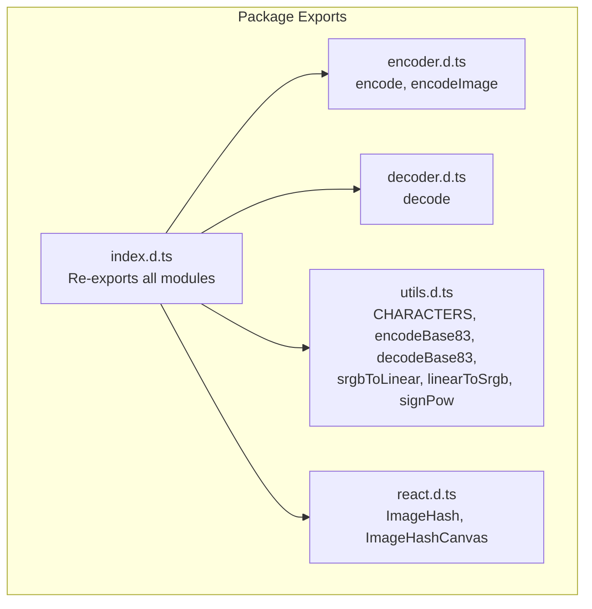
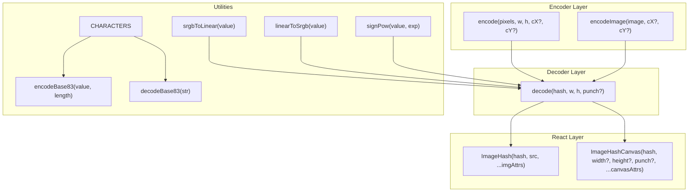
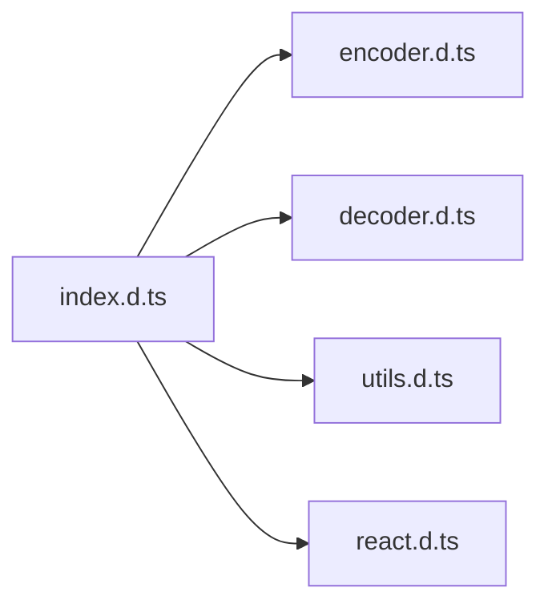

# JavaScript/TypeScript API

<cite>
**Referenced Files in This Document**
- [README.md](file://README.md)
- [package.json](file://packages/js-useblysh/package.json)
- [index.d.ts](file://packages/js-useblysh/dist/index.d.ts)
- [react.d.ts](file://packages/js-useblysh/dist/react.d.ts)
- [encoder.d.ts](file://packages/js-useblysh/dist/encoder.d.ts)
- [decoder.d.ts](file://packages/js-useblysh/dist/decoder.d.ts)
- [utils.d.ts](file://packages/js-useblysh/dist/utils.d.ts)
</cite>

## Table of Contents
1. [Introduction](#introduction)
2. [Project Structure](#project-structure)
3. [Core Components](#core-components)
4. [Architecture Overview](#architecture-overview)
5. [Detailed Component Analysis](#detailed-component-analysis)
6. [Dependency Analysis](#dependency-analysis)
7. [Performance Considerations](#performance-considerations)
8. [Troubleshooting Guide](#troubleshooting-guide)
9. [Conclusion](#conclusion)
10. [Appendices](#appendices)

## Introduction
This document provides comprehensive JavaScript/TypeScript API documentation for the useblysh library. It covers exported functions, React components, and type definitions with precise parameter specifications, return types, validation rules, and error handling patterns. It also includes practical usage examples, browser compatibility notes, performance considerations, and best practices for React integration.

## Project Structure
The package exports a cohesive API surface through TypeScript declaration files that define:
- Encoder functions for generating hashes from pixel data or HTMLImageElement instances
- Decoder function for reconstructing pixel arrays from hash strings
- Utility functions for base conversion and color space transformations
- React components for rendering blurred placeholders and managing progressive image loading

**Diagram sources**
- [index.d.ts:1-5](file://packages/js-useblysh/dist/index.d.ts#L1-L5)
- [encoder.d.ts:1-6](file://packages/js-useblysh/dist/encoder.d.ts#L1-L6)
- [decoder.d.ts:1-2](file://packages/js-useblysh/dist/decoder.d.ts#L1-L2)
- [utils.d.ts:1-7](file://packages/js-useblysh/dist/utils.d.ts#L1-L7)
- [react.d.ts:1-18](file://packages/js-useblysh/dist/react.d.ts#L1-L18)

**Section sources**
- [index.d.ts:1-5](file://packages/js-useblysh/dist/index.d.ts#L1-L5)
- [package.json:1-62](file://packages/js-useblysh/package.json#L1-L62)

## Core Components
This section documents the primary APIs exposed by the package.

- encode(pixels, width, height, componentsX?, componentsY?): string
  - Purpose: Encodes raw pixel data into a compact hash string.
  - Parameters:
    - pixels: Uint8ClampedArray containing RGBA pixel data.
    - width: number, image width in pixels.
    - height: number, image height in pixels.
    - componentsX?: number, optional horizontal DCT component count (default behavior governed by implementation).
    - componentsY?: number, optional vertical DCT component count (default behavior governed by implementation).
  - Returns: string representing the encoded hash.
  - Validation rules:
    - width and height must be positive integers.
    - pixels length must equal 4 × width × height.
    - componentsX and componentsY must be positive integers when provided.
  - Error handling: Invalid parameters may cause runtime errors or undefined behavior; callers should sanitize inputs before invoking.

- encodeImage(image, componentsX?, componentsY?): string
  - Purpose: Encodes an HTMLImageElement into a hash string.
  - Parameters:
    - image: HTMLImageElement, must be fully loaded (naturalWidth > 0 and naturalHeight > 0).
    - componentsX?: number, optional horizontal DCT component count.
    - componentsY?: number, optional vertical DCT component count.
  - Returns: string representing the encoded hash.
  - Validation rules:
    - image must be loaded; otherwise, the underlying pipeline may fail.
    - componentsX and componentsY must be positive integers when provided.
  - Error handling: Attempting to encode an unloaded image may lead to zero-sized rendering and invalid output.

- decode(hash, width, height, punch?): Uint8ClampedArray
  - Purpose: Reconstructs a pixel array from a hash string for manual rendering.
  - Parameters:
    - hash: string, previously generated by encode or encodeImage.
    - width: number, target width for reconstruction.
    - height: number, target height for reconstruction.
    - punch?: number, optional contrast/brightness modifier for manual control.
  - Returns: Uint8ClampedArray of RGBA pixels suitable for canvas rendering.
  - Validation rules:
    - hash must be a valid Base83-encoded string produced by the encoder.
    - width and height must be positive integers.
    - punch must be a finite number when provided.
  - Error handling: Invalid hash or mismatched dimensions may produce corrupted pixels or throw errors.

- ImageHashCanvasProps
  - hash: string, required.
  - width?: number, optional canvas width.
  - height?: number, optional canvas height.
  - punch?: number, optional manual blur/contrast control.
  - Extends: React.CanvasHTMLAttributes<HTMLCanvasElement>.
  - Default values: width and height inferred from canvas context; punch defaults to implementation-defined value if omitted.

- ImageHashProps
  - hash: string, required.
  - src: string, required URL of the real image.
  - Extends: React.ImgHTMLAttributes<HTMLImageElement>.
  - Default values: Inherits standard img attributes; no defaults for hash or src.

- ImageHash
  - A React functional component that renders a blurred placeholder immediately and fades in the real image upon load.
  - Props: hash, src, plus standard img attributes.
  - Behavior: Renders a placeholder via internal decoding and canvas drawing; manages image loading lifecycle.

- ImageHashCanvas
  - A React component that draws the decoded placeholder directly onto a canvas for advanced control.
  - Props: hash, width, height, punch, plus standard canvas attributes.
  - Behavior: Decodes hash to pixels and renders to canvas; useful when building custom loading experiences.

- Utility Functions
  - CHARACTERS: string constant defining the Base83 alphabet.
  - encodeBase83(value, length): Converts a numeric value into a fixed-length Base83 string.
  - decodeBase83(str): Converts a Base83 string into a numeric value.
  - srgbToLinear(value): Converts gamma-encoded sRGB to linear RGB.
  - linearToSrgb(value): Converts linear RGB to gamma-encoded sRGB.
  - signPow(value, exp): Applies signed exponentiation for perceptual adjustments.

**Section sources**
- [encoder.d.ts:1-6](file://packages/js-useblysh/dist/encoder.d.ts#L1-L6)
- [decoder.d.ts:1-2](file://packages/js-useblysh/dist/decoder.d.ts#L1-L2)
- [react.d.ts:1-18](file://packages/js-useblysh/dist/react.d.ts#L1-L18)
- [utils.d.ts:1-7](file://packages/js-useblysh/dist/utils.d.ts#L1-L7)

## Architecture Overview
The API follows a layered design:
- Encoder layer: converts images or pixel data into compact hash strings.
- Decoder layer: reconstructs pixel arrays from hash strings.
- React layer: provides high-level components for progressive image loading and manual canvas rendering.
- Utilities layer: supports base conversion and color space transformations.

**Diagram sources**
- [encoder.d.ts:1-6](file://packages/js-useblysh/dist/encoder.d.ts#L1-L6)
- [decoder.d.ts:1-2](file://packages/js-useblysh/dist/decoder.d.ts#L1-L2)
- [react.d.ts:1-18](file://packages/js-useblysh/dist/react.d.ts#L1-L18)
- [utils.d.ts:1-7](file://packages/js-useblysh/dist/utils.d.ts#L1-L7)

## Detailed Component Analysis

### encodeImage API
- Purpose: Generate a hash from an HTMLImageElement.
- Parameters:
  - image: HTMLImageElement, must be loaded.
  - componentsX?: number, optional horizontal DCT components.
  - componentsY?: number, optional vertical DCT components.
- Returns: string hash.
- Validation and error handling:
  - Ensure image.naturalWidth > 0 and image.naturalHeight > 0 before calling.
  - Provide positive integer components when overriding defaults.
- Example usage patterns:
  - Browser-side upload flow: create an Image from a Blob/File, wait for onload, then call encodeImage.
  - Backend parity: use the Python encoder for identical hashes on the server.

**Section sources**
- [encoder.d.ts:1-6](file://packages/js-useblysh/dist/encoder.d.ts#L1-L6)
- [README.md:47-91](file://README.md#L47-L91)

### ImageHash Component
- Props:
  - hash: string, required.
  - src: string, required.
  - Additional img attributes supported via inheritance.
- Behavior:
  - Renders a blurred placeholder immediately using decode and canvas drawing.
  - Fades in the real image once loaded.
- Best practices:
  - Pass a unique key to force reinitialization when hash or src change.
  - Combine with CSS transitions for smooth opacity changes.

**Section sources**
- [react.d.ts:9-17](file://packages/js-useblysh/dist/react.d.ts#L9-L17)
- [README.md:93-106](file://README.md#L93-L106)

### ImageHashCanvas Component
- Props:
  - hash: string, required.
  - width?: number, optional canvas width.
  - height?: number, optional canvas height.
  - punch?: number, optional manual control for blur/contrast.
  - Additional canvas attributes supported via inheritance.
- Behavior:
  - Decodes hash to pixels and draws directly to canvas.
  - Useful for custom loading UIs and layered overlays.
- Manual blur control:
  - punch parameter allows fine-tuning of the reconstructed image’s perceived sharpness.

**Section sources**
- [react.d.ts:2-8](file://packages/js-useblysh/dist/react.d.ts#L2-L8)
- [README.md:108-137](file://README.md#L108-L137)

### Decoder Module
- decode(hash, width, height, punch?): Uint8ClampedArray
  - hash: string produced by encoder.
  - width/height: target resolution for reconstruction.
  - punch?: number for manual adjustment.
- Output:
  - RGBA pixel buffer suitable for direct canvas rendering.
- Typical usage:
  - Render placeholder via canvas for custom layouts.
  - Combine with image loading to implement fade-in effects.

**Section sources**
- [decoder.d.ts:1-2](file://packages/js-useblysh/dist/decoder.d.ts#L1-L2)

### Encoder Module
- encode(pixels, width, height, componentsX?, componentsY?): string
  - pixels: Uint8ClampedArray of RGBA values.
  - width/height: image dimensions.
  - componentsX/componentsY: optional DCT component counts.
- encodeImage(image, componentsX?, componentsY?): string
  - image: HTMLImageElement, must be loaded.

**Section sources**
- [encoder.d.ts:1-6](file://packages/js-useblysh/dist/encoder.d.ts#L1-L6)

### Utilities Module
- CHARACTERS: Base83 alphabet used for encoding.
- encodeBase83(value, length): Fixed-length Base83 encoding.
- decodeBase83(str): Decodes Base83 string to number.
- srgbToLinear(value): sRGB to linear conversion.
- linearToSrgb(value): Linear to sRGB conversion.
- signPow(value, exp): Signed power for perceptual adjustments.

**Section sources**
- [utils.d.ts:1-7](file://packages/js-useblysh/dist/utils.d.ts#L1-L7)

## Dependency Analysis
The public API is organized into cohesive modules with explicit exports.

**Diagram sources**
- [index.d.ts:1-5](file://packages/js-useblysh/dist/index.d.ts#L1-L5)

**Section sources**
- [index.d.ts:1-5](file://packages/js-useblysh/dist/index.d.ts#L1-L5)

## Performance Considerations
- Prefer encodeImage for browser-side uploads to avoid manual pixel extraction.
- Use ImageHash for out-of-the-box progressive loading with minimal code.
- Use ImageHashCanvas when you need precise control over rendering timing and overlay composition.
- Keep component props stable to avoid unnecessary re-renders; pass a unique key when hash or src changes.
- Avoid excessive re-encoding; cache hashes server-side and reuse them client-side.

## Troubleshooting Guide
- Blank or corrupted placeholder:
  - Ensure the image is loaded (naturalWidth > 0) before calling encodeImage.
  - Verify hash validity and matching width/height.
- Incorrect dimensions:
  - Ensure width and height match the intended output resolution.
- Unexpected blur/sharpness:
  - Adjust punch parameter in ImageHashCanvas or decode to tune perceived sharpness.
- React warnings:
  - Pass only supported attributes for img or canvas elements as per inherited HTML attributes.

**Section sources**
- [react.d.ts:1-18](file://packages/js-useblysh/dist/react.d.ts#L1-L18)
- [decoder.d.ts:1-2](file://packages/js-useblysh/dist/decoder.d.ts#L1-L2)

## Conclusion
The useblysh API provides a complete, strongly-typed solution for progressive image loading. With encoder/decoder functions, utility helpers, and React components, developers can implement fast, visually pleasing image placeholders while maintaining cross-language consistency and performance.

## Appendices

### Browser Compatibility
- Requires modern browsers with support for Canvas API, Typed Arrays, and HTMLImageElement.
- React peer dependencies: react >= 16.8.0, react-dom >= 16.8.0.

**Section sources**
- [package.json:35-38](file://packages/js-useblysh/package.json#L35-L38)

### Example Usage References
- Generate hash from uploaded image:
  - See [README.md:47-72](file://README.md#L47-L72)
- Display placeholder with ImageHash:
  - See [README.md:93-106](file://README.md#L93-L106)
- Manual canvas rendering with ImageHashCanvas:
  - See [README.md:108-137](file://README.md#L108-L137)