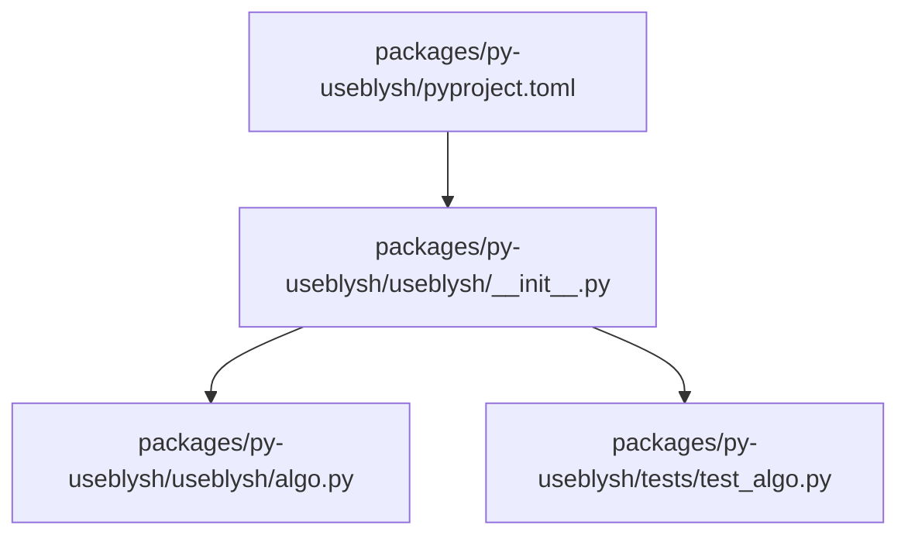
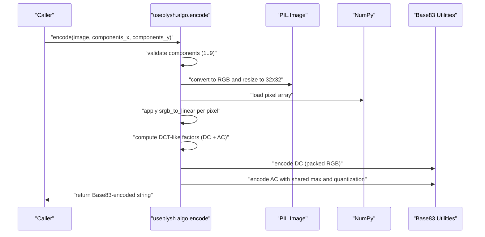
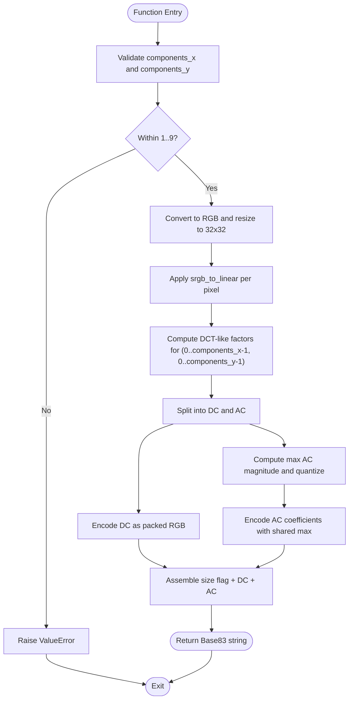
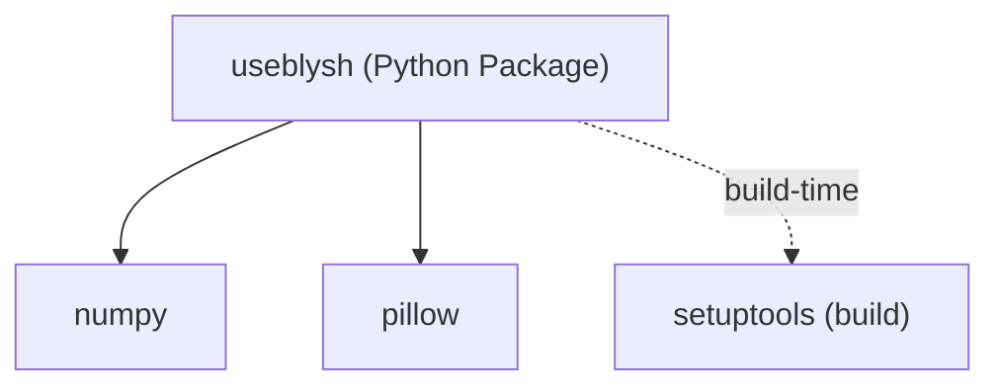

# Python API

<cite>
**Referenced Files in This Document**
- [README.md](file://README.md)
- [pyproject.toml](file://packages/py-useblysh/pyproject.toml)
- [useblysh/algo.py](file://packages/py-useblysh/useblysh/algo.py)
- [useblysh/__init__.py](file://packages/py-useblysh/useblysh/__init__.py)
- [tests/test_algo.py](file://packages/py-useblysh/tests/test_algo.py)
</cite>

## Table of Contents
1. [Introduction](#introduction)
2. [Project Structure](#project-structure)
3. [Core Components](#core-components)
4. [Architecture Overview](#architecture-overview)
5. [Detailed Component Analysis](#detailed-component-analysis)
6. [Dependency Analysis](#dependency-analysis)
7. [Performance Considerations](#performance-considerations)
8. [Troubleshooting Guide](#troubleshooting-guide)
9. [Conclusion](#conclusion)
10. [Appendices](#appendices)

## Introduction
This document provides comprehensive Python API documentation for the useblysh library with a focus on the encode function and related algorithms. It explains the encode function signature, parameter validation, supported image formats, return value formats, and integration patterns for web frameworks. It also covers algorithmic details, performance characteristics, error handling, and best practices for production usage.

## Project Structure
The Python implementation resides under packages/py-useblysh. The primary module exports the encode function and supporting utilities via the package’s public interface. Tests validate encoding correctness and error conditions.

**Diagram sources**
- [pyproject.toml:1-27](file://packages/py-useblysh/pyproject.toml#L1-L27)
- [useblysh/__init__.py:1-5](file://packages/py-useblysh/useblysh/__init__.py#L1-L5)
- [useblysh/algo.py:1-112](file://packages/py-useblysh/useblysh/algo.py#L1-L112)
- [tests/test_algo.py:1-30](file://packages/py-useblysh/tests/test_algo.py#L1-L30)

**Section sources**
- [pyproject.toml:1-27](file://packages/py-useblysh/pyproject.toml#L1-L27)
- [useblysh/__init__.py:1-5](file://packages/py-useblysh/useblysh/__init__.py#L1-L5)
- [useblysh/algo.py:1-112](file://packages/py-useblysh/useblysh/algo.py#L1-L112)
- [tests/test_algo.py:1-30](file://packages/py-useblysh/tests/test_algo.py#L1-L30)

## Core Components
- encode(image: Image.Image, components_x=4, components_y=3): Encodes a PIL Image into a compact Base83-encoded string representing a DCT-based visual hash. Parameters:
  - image: A PIL Image in RGB mode after conversion. Accepts any format readable by Pillow; internally converted to RGB and resized to 32x32.
  - components_x: Integer detail level along the X axis, clamped to 1..9.
  - components_y: Integer detail level along the Y axis, clamped to 1..9.
  - Returns: A string containing the encoded hash.
- Supporting utilities exported via the package:
  - decode_base83(s): Converts a Base83 string back to an integer.
  - encode_base83(value, length): Encodes an integer into a fixed-length Base83 string.
  - srgb_to_linear(value): Applies gamma-to-linear transformation.
  - linear_to_srgb(value): Applies linear-to-gamma transformation.
  - sign_pow(value, exp): Computes signed power preserving sign.

Key behaviors:
- Validation: Raises ValueError if components are outside the 1..9 range.
- Preprocessing: Converts image to RGB and resizes to 32x32 using LANCZOS resampling.
- Color space: Uses per-pixel gamma-to-linear conversion prior to DCT-like factor extraction.
- Encoding: Stores DC (0,0) term as an RGB triplet packed into 3 bytes, followed by quantized AC coefficients and metadata.

**Section sources**
- [useblysh/algo.py:39-112](file://packages/py-useblysh/useblysh/algo.py#L39-L112)
- [useblysh/__init__.py:1-5](file://packages/py-useblysh/useblysh/__init__.py#L1-L5)

## Architecture Overview
The encode pipeline transforms an input image into a compact textual representation suitable for immediate rendering in clients.

**Diagram sources**
- [useblysh/algo.py:39-112](file://packages/py-useblysh/useblysh/algo.py#L39-L112)

## Detailed Component Analysis

### encode Function
- Purpose: Produce a deterministic, compact hash string from a PIL Image.
- Input requirements:
  - image: A PIL Image object. Internally converted to RGB and resized to 32x32.
  - components_x, components_y: Positive integers up to 9; otherwise raises ValueError.
- Processing steps:
  1. Validate detail levels.
  2. Convert to RGB and resize to 32x32 using LANCZOS.
  3. Vectorized gamma-to-linear transform.
  4. Compute factor matrix using separable cosine basis functions up to (components_x, components_y).
  5. Split into DC and AC components.
  6. Encode DC as a 3-byte packed RGB value.
  7. Quantize and encode AC coefficients using a shared maximum and sign-preserving square-root scaling.
  8. Prefix with a size flag derived from components.
- Output: A Base83-encoded string representing the hash.

**Diagram sources**
- [useblysh/algo.py:39-112](file://packages/py-useblysh/useblysh/algo.py#L39-L112)

**Section sources**
- [useblysh/algo.py:39-112](file://packages/py-useblysh/useblysh/algo.py#L39-L112)

### Base83 Utilities
- encode_base83(value, length): Encodes an integer into a fixed-length string using a 83-character alphabet.
- decode_base83(s): Reverses the encoding to recover the original integer.

Usage:
- Used to pack DC color triplets and AC quantized indices into compact tokens.
- The alphabet supports ASCII and special characters for compactness.

**Section sources**
- [useblysh/algo.py:5-20](file://packages/py-useblysh/useblysh/algo.py#L5-L20)

### Color Space Helpers
- srgb_to_linear(value): Applies gamma-to-linear mapping for perceptual accuracy.
- linear_to_srgb(value): Converts back to sRGB with clipping and rounding.

Usage:
- Applied per-pixel before computing frequency-domain factors to emphasize perceived brightness.

**Section sources**
- [useblysh/algo.py:22-37](file://packages/py-useblysh/useblysh/algo.py#L22-L37)

### Parameter Validation and Supported Formats
- Validation:
  - components_x and components_y must be integers within 1..9; otherwise a ValueError is raised.
- Supported input formats:
  - Any format readable by Pillow; internally converted to RGB.
  - Resized to 32x32 using LANCZOS resampling.

**Section sources**
- [useblysh/algo.py:40-44](file://packages/py-useblysh/useblysh/algo.py#L40-L44)

### Return Value Format
- The returned string encodes:
  - A size flag indicating the chosen components.
  - A packed DC color triplet.
  - A sequence of quantized AC coefficients.
  - An optional normalization factor derived from the maximum AC magnitude.

**Section sources**
- [useblysh/algo.py:92-111](file://packages/py-useblysh/useblysh/algo.py#L92-L111)

### Example Workflows
- Server-side image processing:
  - Load an image with Pillow, call encode with desired components, and return the hash alongside metadata.
- Hash generation during upload:
  - On the backend, compute the hash from the uploaded image and store it with the resource.
- Web framework integration:
  - Expose an endpoint that accepts an image, computes the hash, and returns a JSON payload containing the hash and metadata.

Note: See the usage example in the repository’s README for a concise client-side and server-side snippet.

**Section sources**
- [README.md:76-91](file://README.md#L76-L91)

## Dependency Analysis
- Runtime dependencies:
  - numpy: Required for efficient numerical operations on pixel arrays.
  - pillow: Required for image loading, conversion, and resizing.
- Build-time dependency:
  - setuptools: Used by the build backend.

Compatibility:
- Requires Python >= 3.7.

**Diagram sources**
- [pyproject.toml:19-22](file://packages/py-useblysh/pyproject.toml#L19-L22)

**Section sources**
- [pyproject.toml:13-22](file://packages/py-useblysh/pyproject.toml#L13-L22)

## Performance Considerations
- Complexity:
  - The core computation scales with O(W×H×components_x×components_y) where W and H are the spatial dimensions (fixed at 32×32 post-resize). Memory usage is dominated by the pixel array and intermediate factor buffers.
- Resizing and conversion:
  - LANCZOS resampling ensures high-quality downsampling but adds computational overhead; consider caching precomputed hashes for repeated requests.
- Vectorization:
  - Per-pixel gamma conversions are vectorized to minimize Python loops.
- Quantization:
  - AC coefficients are quantized using a shared maximum and a sign-preserving square-root mapping to reduce entropy while preserving perceptual quality.
- Recommendations:
  - Batch processing: Group images and process in chunks to amortize overhead.
  - Concurrency: Use thread/process pools judiciously; I/O-bound bottlenecks dominate, so consider async I/O for storage/network.
  - Caching: Store computed hashes keyed by image identifiers to avoid recomputation.
  - Profiling: Measure CPU time spent in resizing, conversion, and factor computation.

[No sources needed since this section provides general guidance]

## Troubleshooting Guide
Common issues and resolutions:
- ValueError on components:
  - Symptom: Passing components outside 1..9 raises an error.
  - Resolution: Clamp inputs to the supported range before calling encode.
- Unsupported image modes:
  - Symptom: Unexpected artifacts or errors when passing non-RGB images.
  - Resolution: Ensure the image is converted to RGB prior to encode or rely on the internal conversion.
- Empty or corrupted images:
  - Symptom: Exceptions when opening images with Pillow.
  - Resolution: Validate image availability and readability before encoding.
- Incorrect hash mismatch:
  - Symptom: Client-side decoding differs from server-side encoding.
  - Resolution: Verify identical component settings and ensure the same Pillow and NumPy versions across environments.

Validation tests:
- Base83 round-trip correctness.
- Successful encoding of a small test image.
- Proper error raising for out-of-range components.

**Section sources**
- [useblysh/algo.py:40-41](file://packages/py-useblysh/useblysh/algo.py#L40-L41)
- [tests/test_algo.py:7-27](file://packages/py-useblysh/tests/test_algo.py#L7-L27)

## Conclusion
The useblysh Python API provides a fast, compact encoding method for generating visual hashes from images. The encode function offers configurable detail levels, robust validation, and efficient numerical processing. By following the guidelines here—especially around parameter bounds, caching, and concurrency—you can integrate useblysh into production workflows with predictable performance and reliability.

[No sources needed since this section summarizes without analyzing specific files]

## Appendices

### API Reference: encode
- Signature: encode(image: Image.Image, components_x=4, components_y=3)
- Parameters:
  - image: PIL Image object (internally converted to RGB and resized to 32x32).
  - components_x: Integer detail level along X (default 4, range 1..9).
  - components_y: Integer detail level along Y (default 3, range 1..9).
- Returns: String containing the Base83-encoded hash.
- Exceptions:
  - ValueError: Raised if components are outside the supported range.

**Section sources**
- [useblysh/algo.py:39-41](file://packages/py-useblysh/useblysh/algo.py#L39-L41)

### Installation and Compatibility
- Install: pip install useblysh
- Python: >= 3.7
- Dependencies: numpy, pillow
- Build backend: setuptools

**Section sources**
- [README.md:36-42](file://README.md#L36-L42)
- [pyproject.toml:13-22](file://packages/py-useblysh/pyproject.toml#L13-L22)

### Web Framework Integration Notes
- Django:
  - Use Django’s file handling to receive uploads, compute the hash via encode, and store both the hash and metadata.
- Flask:
  - Accept multipart/form-data, open the image with PIL, compute the hash, and return JSON with the hash and resource ID.
- FastAPI:
  - Define an UploadFile dependency, validate the image, compute the hash, and return a Pydantic model containing the hash and metadata.

[No sources needed since this section provides general guidance]

### Best Practices for Production
- Batch processing:
  - Group images and process in batches to improve throughput.
- Concurrent operations:
  - Offload I/O-bound tasks to separate workers; limit concurrency to avoid memory spikes.
- Memory management:
  - Dispose of temporary arrays promptly; reuse arrays when possible.
- Caching:
  - Cache computed hashes keyed by image identifiers to avoid recomputation.
- Monitoring:
  - Track encode latency, memory usage, and error rates.

[No sources needed since this section provides general guidance]