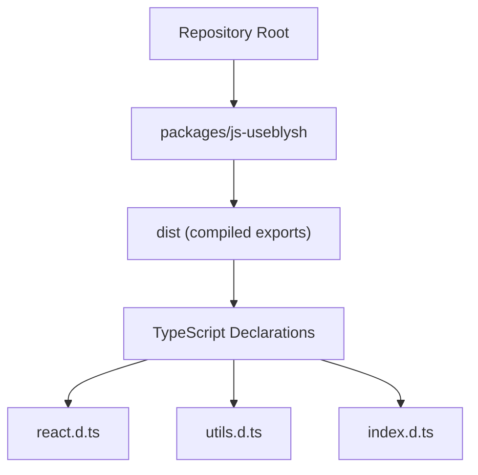
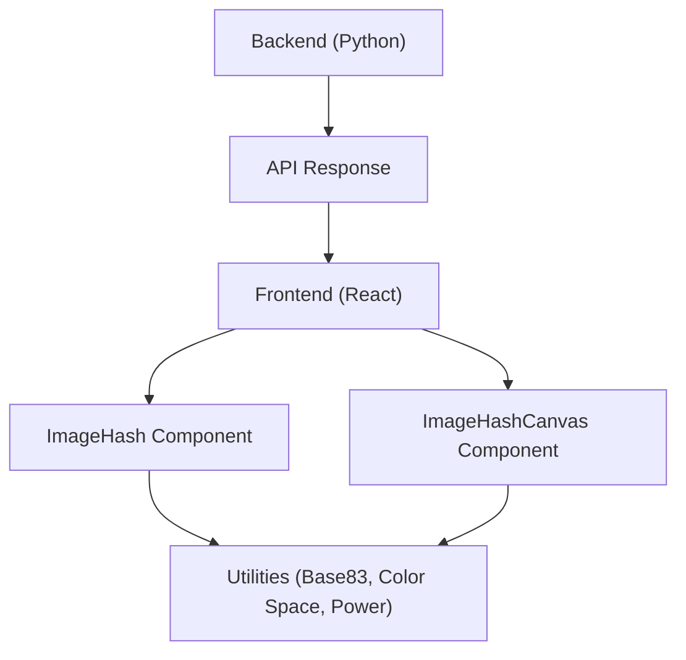
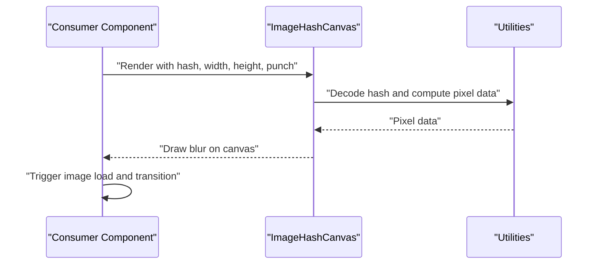
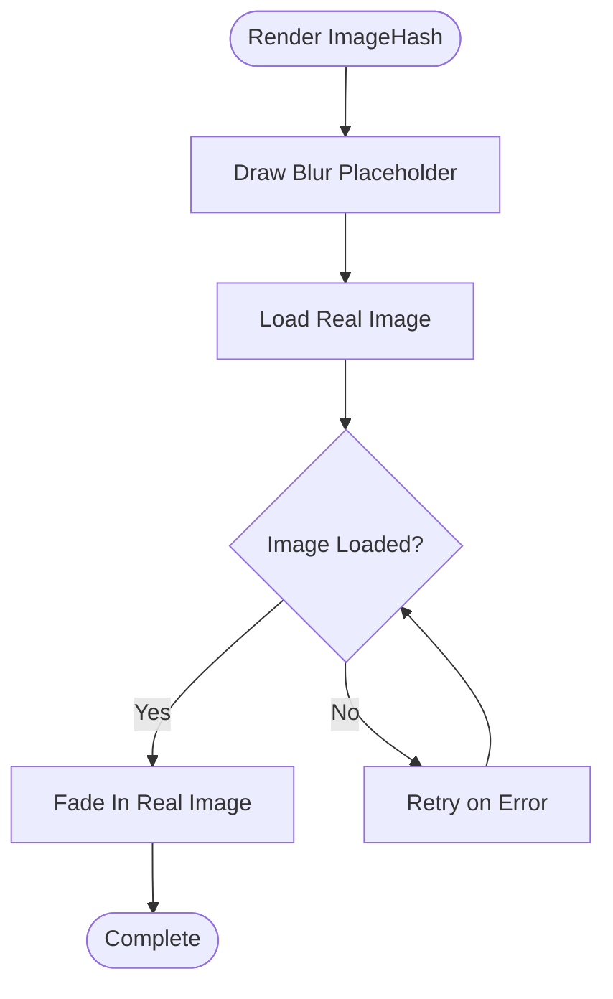
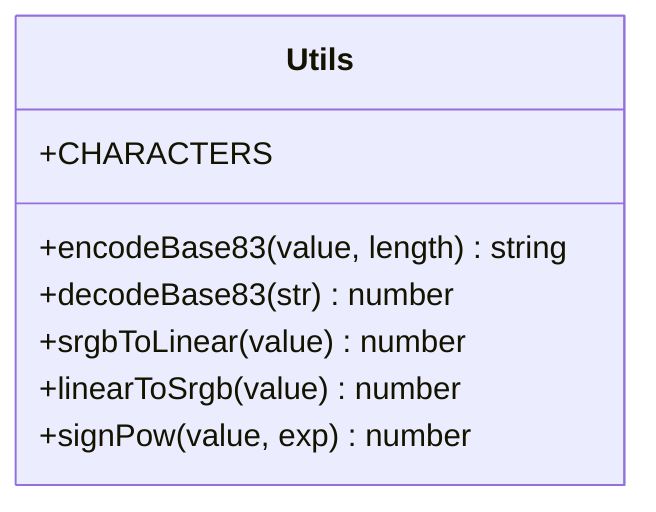
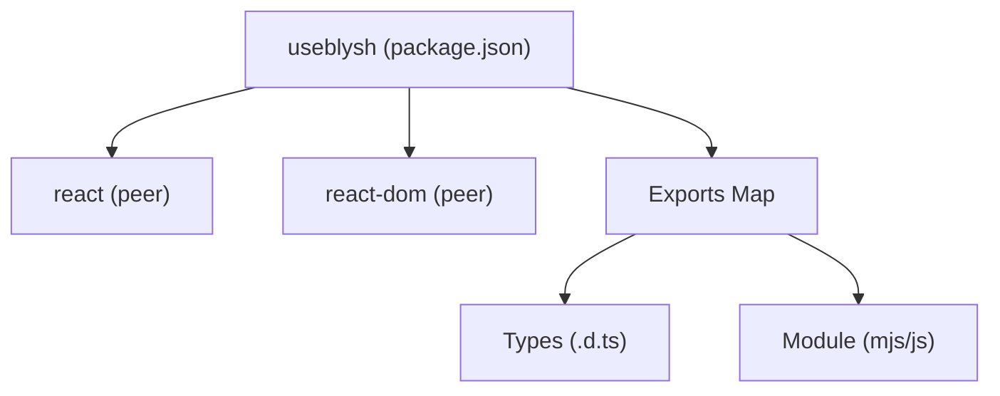

# Advanced Usage

<cite>
**Referenced Files in This Document**
- [README.md](file://README.md)
- [package.json](file://packages/js-useblysh/package.json)
- [index.d.ts](file://packages/js-useblysh/dist/index.d.ts)
- [react.d.ts](file://packages/js-useblysh/dist/react.d.ts)
- [utils.d.ts](file://packages/js-useblysh/dist/utils.d.ts)
</cite>

## Table of Contents
1. [Introduction](#introduction)
2. [Project Structure](#project-structure)
3. [Core Components](#core-components)
4. [Architecture Overview](#architecture-overview)
5. [Detailed Component Analysis](#detailed-component-analysis)
6. [Dependency Analysis](#dependency-analysis)
7. [Performance Considerations](#performance-considerations)
8. [Troubleshooting Guide](#troubleshooting-guide)
9. [Conclusion](#conclusion)
10. [Appendices](#appendices)

## Introduction
This document focuses on advanced usage patterns and customization options for sophisticated implementation scenarios with useblysh. It covers manual hash generation workflows using ImageHashCanvas for custom blur effects and advanced canvas manipulation, performance tuning strategies including algorithm optimization, caching mechanisms, and lazy loading, integration patterns with popular frameworks such as Next.js and React Router, advanced styling and theming, animation customization, responsive behavior configuration, cross-browser compatibility techniques, performance profiling methods, debugging tools, and production deployment considerations. Practical examples demonstrate advanced scenarios such as infinite scrolling feeds, dynamic image galleries, and real-time image processing applications.

## Project Structure
The repository provides a unified toolkit for generating and rendering visual hashes across JavaScript (frontend) and Python (backend). The JavaScript package exposes React components and utilities for progressive image loading and decoding. The package metadata defines peer dependencies and export configuration.

**Diagram sources**
- [package.json:1-62](file://packages/js-useblysh/package.json#L1-L62)
- [index.d.ts:1-5](file://packages/js-useblysh/dist/index.d.ts#L1-L5)
- [react.d.ts:1-18](file://packages/js-useblysh/dist/react.d.ts#L1-L18)
- [utils.d.ts:1-7](file://packages/js-useblysh/dist/utils.d.ts#L1-L7)

**Section sources**
- [package.json:1-62](file://packages/js-useblysh/package.json#L1-L62)
- [index.d.ts:1-5](file://packages/js-useblysh/dist/index.d.ts#L1-L5)
- [react.d.ts:1-18](file://packages/js-useblysh/dist/react.d.ts#L1-L18)
- [utils.d.ts:1-7](file://packages/js-useblysh/dist/utils.d.ts#L1-L7)

## Core Components
- ImageHash: A React component that renders a blurred placeholder derived from a hash and fades in the real image once loaded. It accepts a hash and an image source, and supports standard image attributes.
- ImageHashCanvas: A lower-level React component that draws a decoded blur directly onto a canvas. It requires explicit image loading and transition logic from the consumer. It accepts hash, width, height, and optional punch for intensity control.
- Utilities: Base83 encoding/decoding helpers, color space conversions (sRGB and linear), and power-like transforms for perceptual adjustments.

Key capabilities:
- Manual hash generation workflows using ImageHashCanvas for custom blur effects and advanced canvas manipulation.
- Seamless integration with React via ImageHash and fine-grained control via ImageHashCanvas.
- Strong typing for props and attributes to support advanced customization and framework integrations.

**Section sources**
- [README.md:93-137](file://README.md#L93-L137)
- [react.d.ts:1-18](file://packages/js-useblysh/dist/react.d.ts#L1-L18)
- [utils.d.ts:1-7](file://packages/js-useblysh/dist/utils.d.ts#L1-L7)

## Architecture Overview
The system architecture centers on a shared hashing pipeline: encode images into compact hash strings on the backend and decode them into visually pleasing blurs on the frontend. The React components orchestrate placeholder rendering and image transitions, while the canvas-based component enables advanced customization.

**Diagram sources**
- [README.md:141-163](file://README.md#L141-L163)
- [react.d.ts:1-18](file://packages/js-useblysh/dist/react.d.ts#L1-L18)
- [utils.d.ts:1-7](file://packages/js-useblysh/dist/utils.d.ts#L1-L7)

## Detailed Component Analysis

### ImageHashCanvas Advanced Usage
ImageHashCanvas provides a canvas-based drawing surface for decoded blurs. It accepts hash, width, height, and punch. Consumers can combine it with custom image loading and transition logic to achieve advanced blur effects and animations.

**Diagram sources**
- [react.d.ts:2-8](file://packages/js-useblysh/dist/react.d.ts#L2-L8)
- [utils.d.ts:1-7](file://packages/js-useblysh/dist/utils.d.ts#L1-L7)

Implementation guidance:
- Use width and height to match the target image’s aspect ratio and avoid layout shifts.
- Adjust punch to control blur intensity for stylistic effects.
- Combine with custom image loading and opacity transitions for smooth fade-ins.
- For advanced effects, manipulate canvas context properties (e.g., filters, blending modes) after drawing the base blur.

**Section sources**
- [README.md:108-137](file://README.md#L108-L137)
- [react.d.ts:2-8](file://packages/js-useblysh/dist/react.d.ts#L2-L8)

### ImageHash Component Behavior
ImageHash manages placeholder rendering and image loading transitions automatically. It accepts hash and src props and forwards standard image attributes.

**Diagram sources**
- [react.d.ts:9-17](file://packages/js-useblysh/dist/react.d.ts#L9-L17)

**Section sources**
- [react.d.ts:9-17](file://packages/js-useblysh/dist/react.d.ts#L9-L17)

### Utilities and Algorithm Foundation
The utilities module underpins decoding and rendering:
- Base83 encoding/decoding for compact hash representation.
- Color space conversions (sRGB ↔ linear) for perceptual accuracy.
- Power-like transforms for shaping luminance curves.

**Diagram sources**
- [utils.d.ts:1-7](file://packages/js-useblysh/dist/utils.d.ts#L1-L7)

**Section sources**
- [utils.d.ts:1-7](file://packages/js-useblysh/dist/utils.d.ts#L1-L7)

## Dependency Analysis
The JavaScript package declares peer dependencies on React and React DOM, ensuring compatibility with modern React versions. The export configuration exposes TypeScript declarations and compiled modules for both ESM and CJS consumption.

**Diagram sources**
- [package.json:35-49](file://packages/js-useblysh/package.json#L35-L49)
- [package.json:9-15](file://packages/js-useblysh/package.json#L9-L15)

**Section sources**
- [package.json:35-49](file://packages/js-useblysh/package.json#L35-L49)
- [package.json:9-15](file://packages/js-useblysh/package.json#L9-L15)

## Performance Considerations
Algorithm optimization:
- Prefer efficient color space conversions and minimal arithmetic operations in decoding loops.
- Tune component grid sizes (components_x/components_y) to balance quality and speed during backend encoding.

Caching mechanisms:
- Cache decoded pixel data keyed by hash to avoid recomputation when reusing placeholders.
- Cache rendered canvas frames per hash and dimension to reduce redraw overhead.

Lazy loading implementation:
- Defer heavy image decoding until the placeholder is near the viewport.
- Use IntersectionObserver to trigger hash decoding and canvas rendering only when needed.

Responsive behavior configuration:
- Compute canvas dimensions based on device pixel ratio and container size.
- Adjust width and height props dynamically to maintain crispness across devices.

Animation customization:
- Control fade-in duration and easing via CSS transitions or imperative animations.
- Introduce subtle blur transitions or morphing effects using canvas compositing.

Cross-browser compatibility:
- Validate canvas support and fallback to static placeholders when unavailable.
- Normalize color space handling across browsers using the provided conversion utilities.

Profiling and debugging:
- Measure decoding and rendering durations using performance.mark/performance.measure.
- Log hash validity and decoding errors to detect malformed inputs early.

[No sources needed since this section provides general guidance]

## Troubleshooting Guide
Common issues and recovery strategies:
- Invalid hash: Validate hash length and character sets before decoding. On failure, render a default placeholder and log the error.
- Canvas rendering anomalies: Verify width/height values and ensure the canvas context is properly initialized. Re-render on resize events.
- Layout shifts: Always reserve space using aspect-ratio or padding-bottom techniques; confirm ImageHash is used for automatic sizing.
- Performance regressions: Profile decoding and rendering steps; consider caching and lazy initialization.

Debugging tools:
- Inspect decoded pixel arrays and intermediate buffers to validate correctness.
- Compare rendered output against expectations using controlled test images.

**Section sources**
- [README.md:141-163](file://README.md#L141-L163)

## Conclusion
useblysh enables high-performance, visually appealing progressive image loading with strong foundations in React and shared hashing logic across platforms. By leveraging ImageHashCanvas for advanced canvas manipulation, implementing robust caching and lazy loading, and integrating seamlessly with modern frameworks, developers can build scalable, responsive experiences. The included utilities and type definitions support precise customization and reliable deployments.

[No sources needed since this section summarizes without analyzing specific files]

## Appendices

### Integration Patterns and Framework Guidance
Next.js:
- Use ImageHash for pages and components; prefetch and pre-render with reserved space.
- For ISR/SSG, embed hashes in static payloads to eliminate initial image downloads.

React Router:
- Render ImageHash in route components; ensure proper cleanup of observers and resources on navigation.

SSR considerations:
- Decode hashes on the server when generating HTML fragments to improve perceived performance.
- Guard against client-only APIs (e.g., window/canvas) by rendering placeholders on the server and hydrating with full behavior on the client.

[No sources needed since this section provides general guidance]

### Advanced Styling and Theming Options
- Theming: Apply theme-aware color spaces and contrast adjustments using the provided color conversion utilities.
- Animations: Customize fade-in timing and easing; introduce staggered animations for image grids.
- Responsive behavior: Dynamically adjust canvas resolution and blur intensity based on screen density and orientation.

[No sources needed since this section provides general guidance]

### Practical Advanced Scenarios
- Infinite scrolling feeds: Preload hashes alongside items; render placeholders immediately and swap on image load.
- Dynamic galleries: Use ImageHashCanvas to implement custom blur effects and transitions per gallery item.
- Real-time image processing: Decode hashes to canvas frames and apply live filters; cache processed frames for reuse.

[No sources needed since this section provides general guidance]