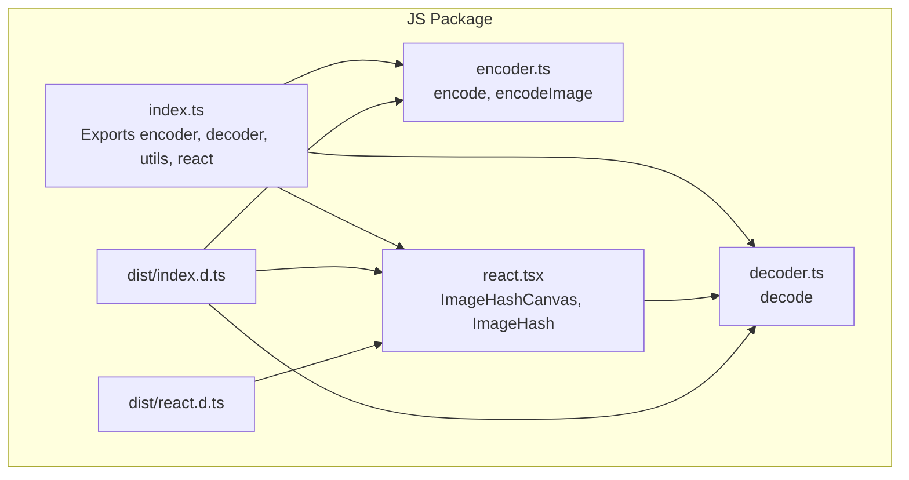
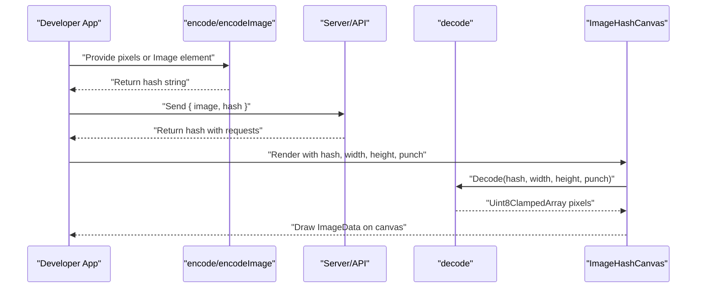
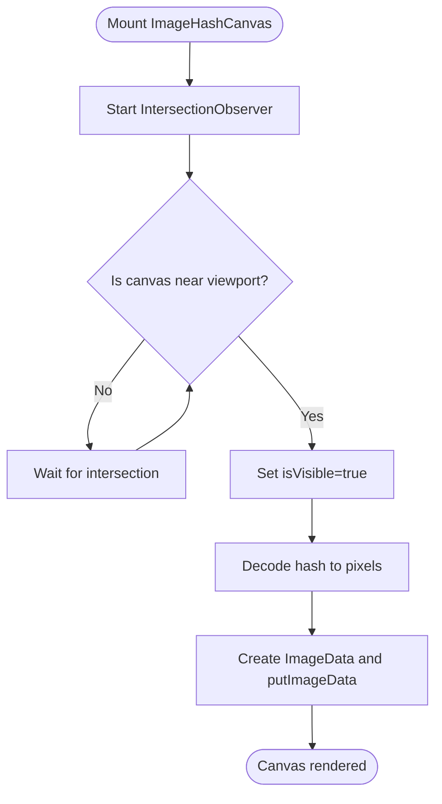
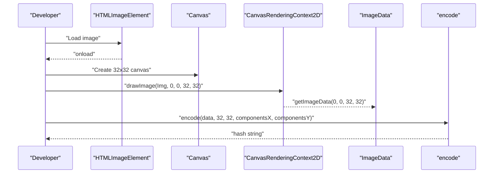
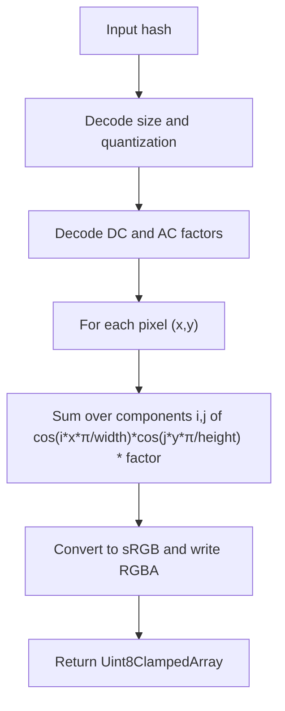
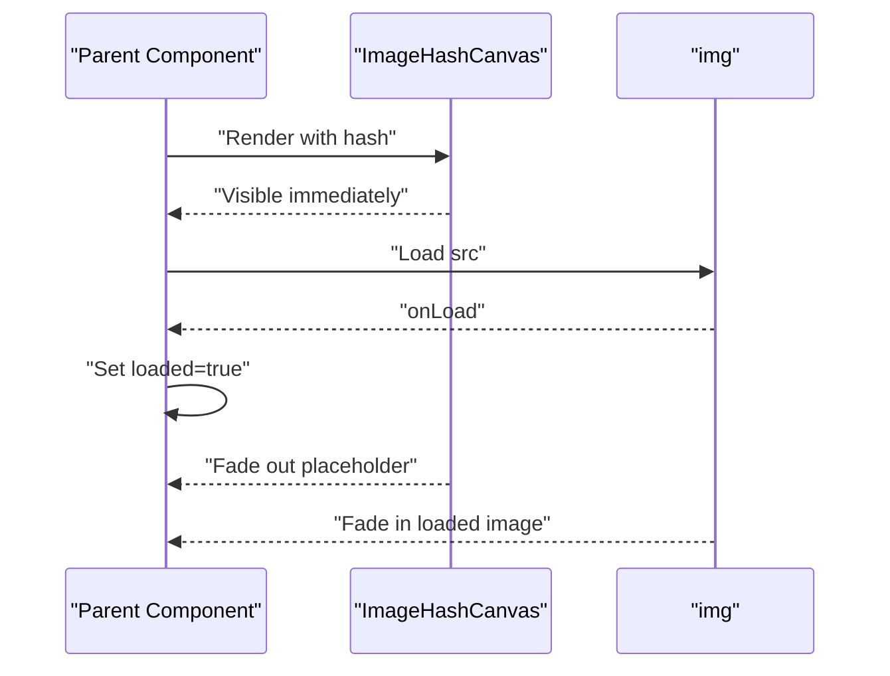
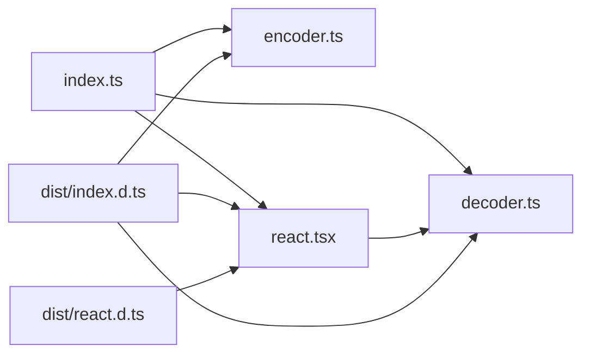

# Custom Implementations

<cite>
**Referenced Files in This Document**
- [README.md](file://README.md)
- [packages/js-useblysh/src/index.ts](file://packages/js-useblysh/src/index.ts)
- [packages/js-useblysh/src/react.tsx](file://packages/js-useblysh/src/react.tsx)
- [packages/js-useblysh/src/decoder.ts](file://packages/js-useblysh/src/decoder.ts)
- [packages/js-useblysh/src/encoder.ts](file://packages/js-useblysh/src/encoder.ts)
- [packages/js-useblysh/dist/index.d.ts](file://packages/js-useblysh/dist/index.d.ts)
- [packages/js-useblysh/dist/react.d.ts](file://packages/js-useblysh/dist/react.d.ts)
- [packages/js-useblysh/src/useblysh.test.ts](file://packages/js-useblysh/src/useblysh.test.ts)
</cite>

## Table of Contents
1. [Introduction](#introduction)
2. [Project Structure](#project-structure)
3. [Core Components](#core-components)
4. [Architecture Overview](#architecture-overview)
5. [Detailed Component Analysis](#detailed-component-analysis)
6. [Dependency Analysis](#dependency-analysis)
7. [Performance Considerations](#performance-considerations)
8. [Troubleshooting Guide](#troubleshooting-guide)
9. [Conclusion](#conclusion)
10. [Appendices](#appendices)

## Introduction
This document focuses on custom implementation approaches and manual hash generation workflows enabled by the useblysh toolkit. It explains the ImageHashCanvas component API for manual blur control and canvas rendering customization, advanced canvas manipulation techniques, pixel data processing, and custom blur effect creation. It also documents the manual hash generation workflow using the encodeImage utility for custom preprocessing scenarios, along with practical examples of custom loading states, transition animations, and specialized image display patterns. Integration with third-party libraries, custom styling approaches, and component composition patterns are addressed, alongside performance considerations, memory management strategies, and optimization techniques for complex rendering scenarios.

## Project Structure
The repository provides a unified implementation for generating and decoding visual hashes, with a React component for rendering placeholders and utilities for encoding images into compact strings. The JavaScript package exposes:
- React components: ImageHashCanvas and ImageHash
- Encoding/decoding utilities: encode, decode, encodeImage
- Type definitions for React components and module exports

**Diagram sources**
- [packages/js-useblysh/src/index.ts:1-4](file://packages/js-useblysh/src/index.ts#L1-L4)
- [packages/js-useblysh/src/react.tsx:1-137](file://packages/js-useblysh/src/react.tsx#L1-L137)
- [packages/js-useblysh/src/encoder.ts:1-96](file://packages/js-useblysh/src/encoder.ts#L1-L96)
- [packages/js-useblysh/src/decoder.ts:1-66](file://packages/js-useblysh/src/decoder.ts#L1-L66)
- [packages/js-useblysh/dist/index.d.ts:1-5](file://packages/js-useblysh/dist/index.d.ts#L1-L5)
- [packages/js-useblysh/dist/react.d.ts:1-18](file://packages/js-useblysh/dist/react.d.ts#L1-L18)

**Section sources**
- [README.md:1-163](file://README.md#L1-L163)
- [packages/js-useblysh/src/index.ts:1-4](file://packages/js-useblysh/src/index.ts#L1-L4)
- [packages/js-useblysh/dist/index.d.ts:1-5](file://packages/js-useblysh/dist/index.d.ts#L1-L5)
- [packages/js-useblysh/dist/react.d.ts:1-18](file://packages/js-useblysh/dist/react.d.ts#L1-L18)

## Core Components
- ImageHashCanvas: A forward-ref-enabled canvas component that renders a blurred placeholder from a hash. It supports manual control via props for width, height, and punch (contrast boost). It uses intersection observation to defer decoding until near-viewport and schedules decoding off the main thread to avoid UI stalls.
- ImageHash: A higher-level component combining ImageHashCanvas with an actual image, managing fade-in transitions and lazy loading.

Key capabilities:
- Manual blur control via punch prop
- Canvas rendering customization via width/height and standard canvas attributes
- Deferred decoding for performance
- Integration with React’s ref and imperative APIs

**Section sources**
- [packages/js-useblysh/src/react.tsx:4-76](file://packages/js-useblysh/src/react.tsx#L4-L76)
- [packages/js-useblysh/src/react.tsx:78-137](file://packages/js-useblysh/src/react.tsx#L78-L137)
- [packages/js-useblysh/dist/react.d.ts:2-17](file://packages/js-useblysh/dist/react.d.ts#L2-L17)

## Architecture Overview
The system follows a pipeline: encode -> store hash -> decode -> render canvas. The React components orchestrate rendering and transitions, while the encoder/decoder handle DCT-based compression and reconstruction.

**Diagram sources**
- [packages/js-useblysh/src/encoder.ts:3-96](file://packages/js-useblysh/src/encoder.ts#L3-L96)
- [packages/js-useblysh/src/decoder.ts:3-66](file://packages/js-useblysh/src/decoder.ts#L3-L66)
- [packages/js-useblysh/src/react.tsx:11-74](file://packages/js-useblysh/src/react.tsx#L11-L74)

## Detailed Component Analysis

### ImageHashCanvas API and Manual Blur Control
ImageHashCanvas exposes:
- hash: The visual hash string to render
- width/height: Target canvas resolution for the decoded image
- punch: Contrast boost multiplier applied during decoding
- Standard canvas props: className, style, and other HTMLCanvasElement attributes

Implementation highlights:
- IntersectionObserver triggers decoding when the canvas enters the viewport (with a generous root margin and small threshold)
- Decoding is scheduled asynchronously to yield to the main thread
- On successful decode, the component creates ImageData from the returned pixel array and draws it onto the canvas

**Diagram sources**
- [packages/js-useblysh/src/react.tsx:18-62](file://packages/js-useblysh/src/react.tsx#L18-L62)

**Section sources**
- [packages/js-useblysh/src/react.tsx:4-76](file://packages/js-useblysh/src/react.tsx#L4-L76)
- [packages/js-useblysh/dist/react.d.ts:2-8](file://packages/js-useblysh/dist/react.d.ts#L2-L8)

### Manual Hash Generation Workflow Using encodeImage
The encodeImage utility converts an HTMLImageElement into a compact hash by:
- Drawing the image onto a 32x32 canvas
- Extracting ImageData
- Invoking encode with configurable components for horizontal and vertical frequency detail

Practical scenarios:
- Preprocessing images before upload (resize, crop, filters) before calling encodeImage
- Generating hashes for server-side storage and client-side rendering
- Integrating with drag-and-drop or file input flows

**Diagram sources**
- [packages/js-useblysh/src/encoder.ts:82-96](file://packages/js-useblysh/src/encoder.ts#L82-L96)

**Section sources**
- [README.md:56-72](file://README.md#L56-L72)
- [packages/js-useblysh/src/encoder.ts:82-96](file://packages/js-useblysh/src/encoder.ts#L82-L96)

### Advanced Canvas Manipulation and Pixel Data Processing
The decoder reconstructs pixel data by evaluating a 2D cosine basis over the target grid and summing contributions from DC and AC factors. The resulting pixel array is a Uint8ClampedArray suitable for ImageData.

Techniques:
- Custom punch scaling to emphasize or tone down contrast
- Adjusting components to balance quality vs. string length
- Rendering to a canvas with custom styles (e.g., imageRendering) for crisp pixelation

**Diagram sources**
- [packages/js-useblysh/src/decoder.ts:3-66](file://packages/js-useblysh/src/decoder.ts#L3-L66)

**Section sources**
- [packages/js-useblysh/src/decoder.ts:3-66](file://packages/js-useblysh/src/decoder.ts#L3-L66)

### Custom Loading States, Transitions, and Specialized Display Patterns
The ImageHash component demonstrates a layered approach:
- Absolute-positioned ImageHashCanvas acts as a placeholder with opacity and transition
- Actual image loads lazily and fades in upon completion

Patterns you can adapt:
- Staggered reveal: delay placeholder removal after image load
- Multi-stage transitions: placeholder fade-out while image fade-in
- Aspect-ratio containers: reserve space and inherit object-fit behavior
- Imperative control: use forwarded ref to trigger redraws or coordinate with other UI

**Diagram sources**
- [packages/js-useblysh/src/react.tsx:87-137](file://packages/js-useblysh/src/react.tsx#L87-L137)

**Section sources**
- [README.md:93-137](file://README.md#L93-L137)
- [packages/js-useblysh/src/react.tsx:87-137](file://packages/js-useblysh/src/react.tsx#L87-L137)

### Integration with Third-Party Libraries and Custom Styling
- Canvas rendering: leverage standard canvas attributes and CSS (e.g., imageRendering) for pixel-perfect output
- Composition: wrap ImageHashCanvas with layout containers to manage aspect ratio and object-fit
- Imperative coordination: use forwarded ref to programmatically access the canvas for external effects or analytics
- Styling: pass className/style to both ImageHashCanvas and the underlying canvas; inherit objectFit from parent classes

**Section sources**
- [packages/js-useblysh/src/react.tsx:64-74](file://packages/js-useblysh/src/react.tsx#L64-L74)
- [packages/js-useblysh/src/react.tsx:103-134](file://packages/js-useblysh/src/react.tsx#L103-L134)

## Dependency Analysis
The JS package composes encoder, decoder, and React components. The index module re-exports all public APIs, while dist type definitions expose the same surface.

**Diagram sources**
- [packages/js-useblysh/src/index.ts:1-4](file://packages/js-useblysh/src/index.ts#L1-L4)
- [packages/js-useblysh/src/encoder.ts:1-96](file://packages/js-useblysh/src/encoder.ts#L1-L96)
- [packages/js-useblysh/src/decoder.ts:1-66](file://packages/js-useblysh/src/decoder.ts#L1-L66)
- [packages/js-useblysh/src/react.tsx:1-137](file://packages/js-useblysh/src/react.tsx#L1-L137)
- [packages/js-useblysh/dist/index.d.ts:1-5](file://packages/js-useblysh/dist/index.d.ts#L1-L5)
- [packages/js-useblysh/dist/react.d.ts:1-18](file://packages/js-useblysh/dist/react.d.ts#L1-L18)

**Section sources**
- [packages/js-useblysh/src/index.ts:1-4](file://packages/js-useblysh/src/index.ts#L1-L4)
- [packages/js-useblysh/dist/index.d.ts:1-5](file://packages/js-useblysh/dist/index.d.ts#L1-L5)
- [packages/js-useblysh/dist/react.d.ts:1-18](file://packages/js-useblysh/dist/react.d.ts#L1-L18)

## Performance Considerations
- Deferred decoding: IntersectionObserver ensures decode only starts when near the viewport, reducing initial work
- Main-thread yielding: Asynchronous scheduling prevents UI stalls during decode
- Canvas sizing: Keep width/height minimal for placeholders; larger canvases increase memory and CPU usage
- Punch scaling: Higher punch increases contrast but may amplify noise; tune for visual quality
- Memory management: Avoid retaining references to large ImageData or canvas contexts longer than necessary; reuse canvases when appropriate
- Batch rendering: For lists, stagger decode timing to distribute workload across frames
- Lazy loading: Combine with native lazy loading on images to minimize bandwidth and improve perceived performance

[No sources needed since this section provides general guidance]

## Troubleshooting Guide
Common issues and resolutions:
- Invalid hash: The decoder validates the hash length and format; ensure the hash originates from the same encoder version and parameters
- Out-of-range components: The encoder enforces component bounds; adjust components to valid ranges
- Canvas context errors: Ensure the canvas context is available before drawing; handle cases where context creation fails
- Visibility timing: If the placeholder does not appear, verify intersection observer thresholds and margins

Validation references:
- Hash validation and error messages
- Component range validation
- Basic tests for encode/decode correctness

**Section sources**
- [packages/js-useblysh/src/decoder.ts:9-11](file://packages/js-useblysh/src/decoder.ts#L9-L11)
- [packages/js-useblysh/src/encoder.ts:10-12](file://packages/js-useblysh/src/encoder.ts#L10-L12)
- [packages/js-useblysh/src/useblysh.test.ts:31-40](file://packages/js-useblysh/src/useblysh.test.ts#L31-L40)

## Conclusion
By leveraging ImageHashCanvas and encodeImage, developers can implement highly customized image loading experiences. The combination of deferred decoding, manual blur control, and flexible canvas rendering enables advanced UI patterns, while the encoder/decoder pipeline ensures consistent, efficient visual hashing across environments. Careful attention to performance, memory, and UX yields robust, scalable solutions for modern web applications.

[No sources needed since this section summarizes without analyzing specific files]

## Appendices

### API Reference Summary
- ImageHashCanvasProps
  - hash: string
  - width?: number
  - height?: number
  - punch?: number
- ImageHashProps
  - hash: string
  - src: string

These props enable manual control over rendering and transitions, supporting custom styling and composition patterns.

**Section sources**
- [packages/js-useblysh/dist/react.d.ts:2-17](file://packages/js-useblysh/dist/react.d.ts#L2-L17)