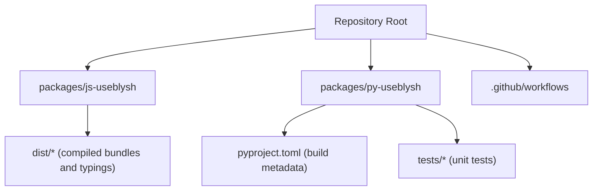
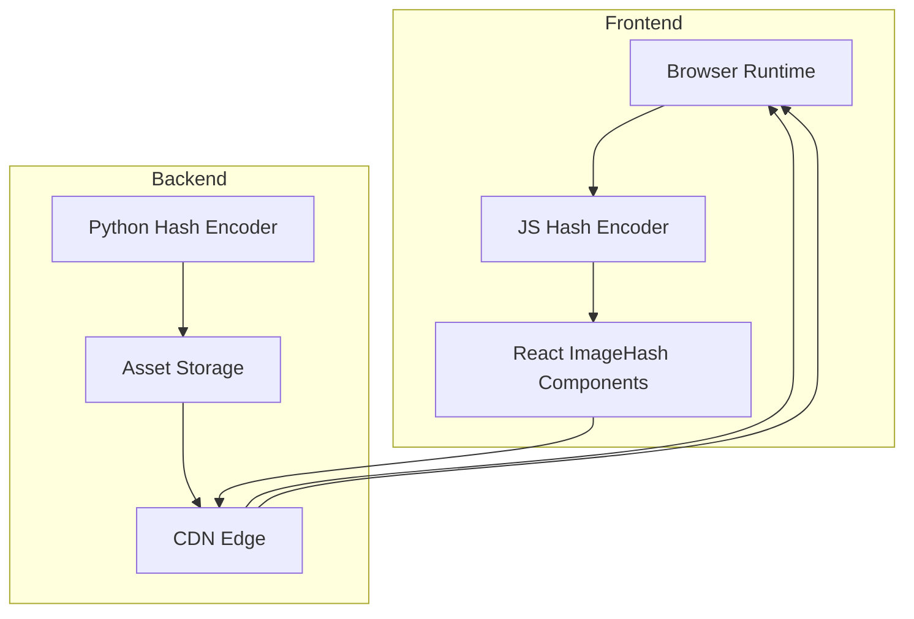
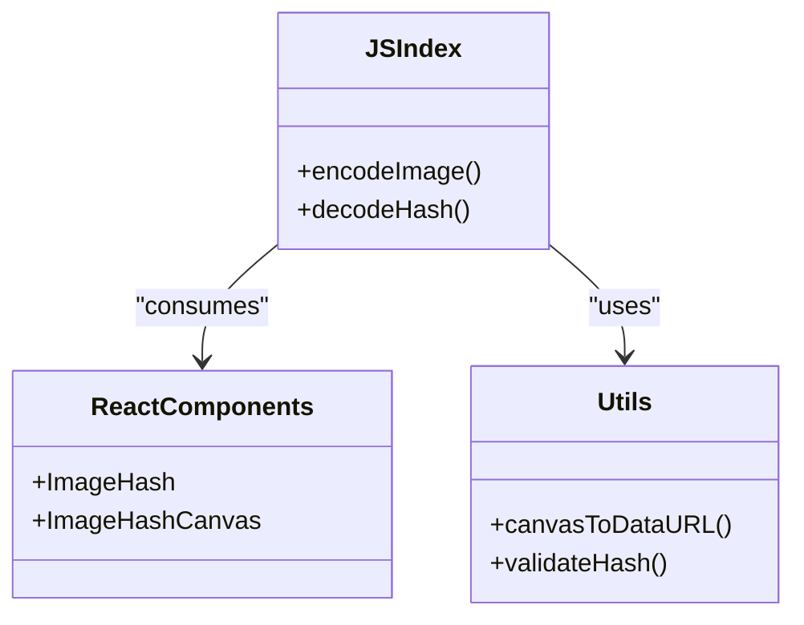
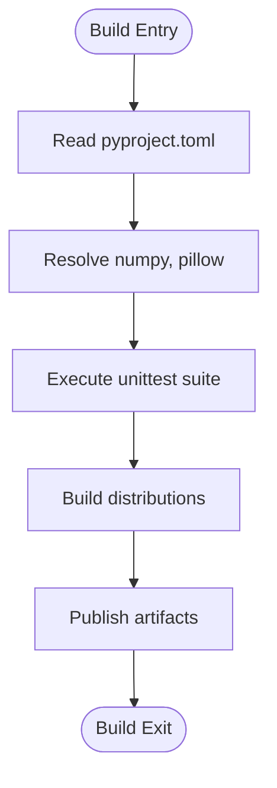
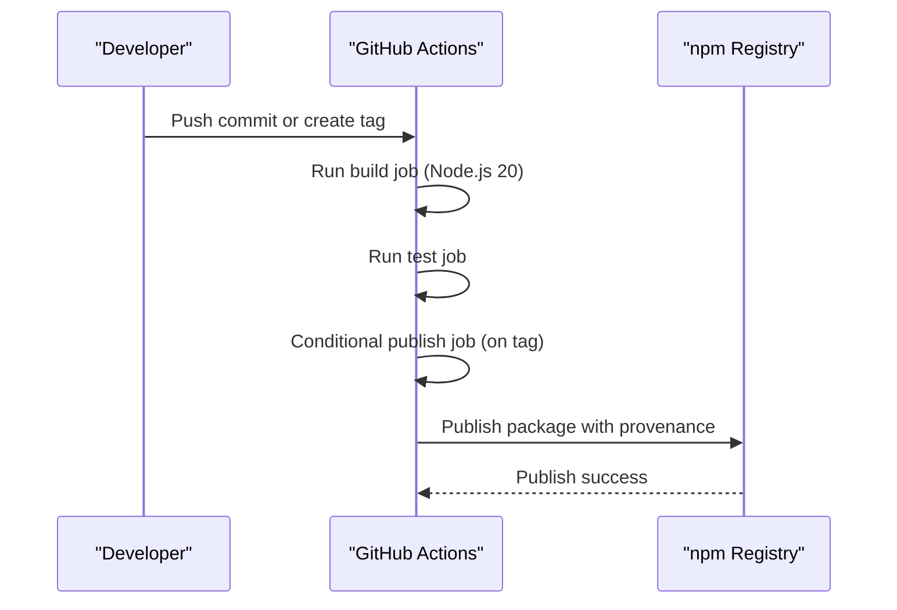
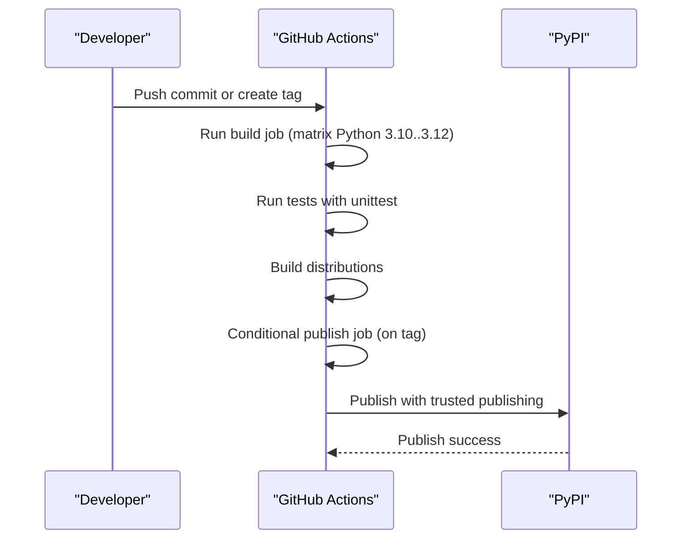

# Deployment Considerations

<cite>
**Referenced Files in This Document**
- [README.md](file://README.md)
- [.github/workflows/useblysh-js.yml](file://.github/workflows/useblysh-js.yml)
- [.github/workflows/useblysh-py.yml](file://.github/workflows/useblysh-py.yml)
- [packages/py-useblysh/pyproject.toml](file://packages/py-useblysh/pyproject.toml)
- [packages/py-useblysh/tests/test_algo.py](file://packages/py-useblysh/tests/test_algo.py)
- [packages/js-useblysh/dist/index.d.ts](file://packages/js-useblysh/dist/index.d.ts)
- [packages/js-useblysh/dist/react.d.ts](file://packages/js-useblysh/dist/react.d.ts)
- [packages/js-useblysh/dist/utils.d.ts](file://packages/js-useblysh/dist/utils.d.ts)
- [packages/js-useblysh/dist/decoder.d.ts](file://packages/js-useblysh/dist/decoder.d.ts)
- [packages/js-useblysh/dist/encoder.d.ts](file://packages/js-useblysh/dist/encoder.d.ts)
</cite>

## Table of Contents
1. [Introduction](#introduction)
2. [Project Structure](#project-structure)
3. [Core Components](#core-components)
4. [Architecture Overview](#architecture-overview)
5. [Detailed Component Analysis](#detailed-component-analysis)
6. [CI/CD Pipeline Configuration](#cicd-pipeline-configuration)
7. [Containerization Strategies](#containerization-strategies)
8. [Kubernetes Deployment Patterns](#kubernetes-deployment-patterns)
9. [Cloud Platform Integration](#cloud-platform-integration)
10. [CDN Configuration and Global Distribution](#cdn-configuration-and-global-distribution)
11. [Monitoring, Logging, and Performance Tracking](#monitoring-logging-and-performance-tracking)
12. [Security Considerations](#security-considerations)
13. [Scaling and Load Balancing](#scaling-and-load-balancing)
14. [Backup, Disaster Recovery, and Maintenance](#backup-disaster-recovery-and-maintenance)
15. [Troubleshooting Guide](#troubleshooting-guide)
16. [Conclusion](#conclusion)

## Introduction
This document provides comprehensive production deployment strategies and operational considerations for the ImgHash project, focusing on the unified toolkit for generating and rendering visual hashes across JavaScript and Python ecosystems. It consolidates CI/CD pipeline configuration, packaging metadata, and deployment-related best practices derived from the repository’s workflow definitions and package manifests.

## Project Structure
The repository is organized as a monorepo with two primary packages:
- JavaScript package under packages/js-useblysh
- Python package under packages/py-useblysh

Key characteristics:
- JavaScript package exposes typed APIs for encoding/decoding visual hashes and React integration via TypeScript declaration files.
- Python package defines build metadata, dependencies, and unit tests for algorithm validation.

**Section sources**
- [README.md:1-163](file://README.md#L1-L163)
- [packages/py-useblysh/pyproject.toml:1-27](file://packages/py-useblysh/pyproject.toml#L1-L27)

## Core Components
- JavaScript package
  - Provides encoder and decoder APIs along with React integration and utility functions.
  - Exposed via TypeScript declarations for robust client-side integration.
- Python package
  - Defines project metadata, dependencies (numpy, pillow), and unit tests for algorithm validation.

**Section sources**
- [packages/js-useblysh/dist/index.d.ts](file://packages/js-useblysh/dist/index.d.ts)
- [packages/js-useblysh/dist/react.d.ts](file://packages/js-useblysh/dist/react.d.ts)
- [packages/js-useblysh/dist/utils.d.ts](file://packages/js-useblysh/dist/utils.d.ts)
- [packages/js-useblysh/dist/decoder.d.ts](file://packages/js-useblysh/dist/decoder.d.ts)
- [packages/js-useblysh/dist/encoder.d.ts](file://packages/js-useblysh/dist/encoder.d.ts)
- [packages/py-useblysh/pyproject.toml:5-27](file://packages/py-useblysh/pyproject.toml#L5-L27)

## Architecture Overview
The system architecture centers on a dual-language hashing pipeline:
- JavaScript frontend encodes images into compact hash strings during upload or pre-processing.
- Python backend performs equivalent encoding for server-side processing.
- React components consume these hashes to render placeholder blurs while deferring full-resolution assets.

[No sources needed since this diagram shows conceptual workflow, not actual code structure]

## Detailed Component Analysis

### JavaScript Package API Surface
The JavaScript package exposes:
- Encoding/decoding functions for visual hashes
- React components for placeholder rendering
- Utility helpers for canvas-based rendering

**Diagram sources**
- [packages/js-useblysh/dist/index.d.ts](file://packages/js-useblysh/dist/index.d.ts)
- [packages/js-useblysh/dist/react.d.ts](file://packages/js-useblysh/dist/react.d.ts)
- [packages/js-useblysh/dist/utils.d.ts](file://packages/js-useblysh/dist/utils.d.ts)

**Section sources**
- [packages/js-useblysh/dist/index.d.ts](file://packages/js-useblysh/dist/index.d.ts)
- [packages/js-useblysh/dist/react.d.ts](file://packages/js-useblysh/dist/react.d.ts)
- [packages/js-useblysh/dist/utils.d.ts](file://packages/js-useblysh/dist/utils.d.ts)

### Python Package Metadata and Dependencies
The Python package defines:
- Project metadata and versioning
- Core dependencies: numpy and pillow
- Unit tests validating algorithm correctness

**Diagram sources**
- [packages/py-useblysh/pyproject.toml:1-27](file://packages/py-useblysh/pyproject.toml#L1-L27)
- [packages/py-useblysh/tests/test_algo.py](file://packages/py-useblysh/tests/test_algo.py)

**Section sources**
- [packages/py-useblysh/pyproject.toml:5-27](file://packages/py-useblysh/pyproject.toml#L5-L27)
- [packages/py-useblysh/tests/test_algo.py](file://packages/py-useblysh/tests/test_algo.py)

## CI/CD Pipeline Configuration
The repository includes GitHub Actions workflows for automated testing, building, and publishing of both JavaScript and Python packages.

### JavaScript CI/CD Workflow
- Triggers on pushes to main and tags, and PRs targeting main, scoped to the JavaScript package directory.
- Builds and tests the JavaScript package using Node.js 20.
- Publishes to the npm registry on version tag creation, enabling provenance.

**Diagram sources**
- [.github/workflows/useblysh-js.yml:1-80](file://.github/workflows/useblysh-js.yml#L1-L80)

**Section sources**
- [.github/workflows/useblysh-js.yml:1-80](file://.github/workflows/useblysh-js.yml#L1-L80)

### Python CI/CD Workflow
- Triggers on pushes to main and tags, and PRs targeting main, scoped to the Python package directory.
- Matrix strategy builds and tests across Python versions 3.10, 3.11, and 3.12.
- Publishes to PyPI using trusted publishing on version tags.

**Diagram sources**
- [.github/workflows/useblysh-py.yml:1-82](file://.github/workflows/useblysh-py.yml#L1-L82)

**Section sources**
- [.github/workflows/useblysh-py.yml:1-82](file://.github/workflows/useblysh-py.yml#L1-L82)

## Containerization Strategies
While the repository does not include Docker or Kubernetes manifests, production deployments commonly adopt the following containerization patterns for this project:

- Multi-stage builds
  - Use a Node builder stage for the JavaScript package and a Python builder stage for the backend service.
  - Copy compiled artifacts and built distributions into minimal runtime images.
- Runtime images
  - Alpine Linux-based images for reduced footprint.
  - Non-root user execution and read-only filesystems for hardening.
- Health checks and readiness probes
  - HTTP health endpoints to confirm service availability.
  - Readiness checks ensuring dependencies (storage, CDN connectivity) are ready.

[No sources needed since this section provides general guidance]

## Kubernetes Deployment Patterns
Recommended Kubernetes patterns for production:

- Deployments with rolling updates and resource limits
- Horizontal Pod Autoscaling based on CPU or custom metrics
- ConfigMaps and Secrets for environment-specific configuration
- Persistent volumes for caching frequently accessed assets
- Ingress with TLS termination and rate limiting

[No sources needed since this section provides general guidance]

## Cloud Platform Integration
Common cloud integrations for production:

- Artifact registries
  - npm registry for JavaScript packages
  - PyPI for Python packages
- CDN integration
  - Serve static assets (hash-encoded placeholders, JS bundles) via CDN for global distribution
- Monitoring and logging
  - Export logs and metrics to centralized platforms (e.g., cloud-native observability suites)
- Backup and disaster recovery
  - Regular snapshots of persistent volumes and artifact storage buckets

[No sources needed since this section provides general guidance]

## CDN Configuration and Global Distribution
Optimal CDN configuration for asset delivery:

- Static asset caching
  - Long TTLs for immutable assets (hashed filenames)
  - Short TTLs for dynamic content
- Cache invalidation
  - Invalidate by versioned URLs or cache tags upon releases
- Global distribution
  - Edge locations for low-latency delivery
  - Compression and image optimization at edge nodes
- Security
  - Signed URLs for private assets
  - HTTPS enforcement and HSTS headers

[No sources needed since this section provides general guidance]

## Monitoring, Logging, and Performance Tracking
Production-grade monitoring and logging:

- Application metrics
  - Track request latency, error rates, and throughput
  - Instrument hashing operations for performance profiling
- Distributed tracing
  - Correlate requests across frontend and backend services
- Structured logging
  - Centralized log aggregation with filtering and alerting
- Alerting
  - Threshold-based alerts for latency, errors, and capacity utilization

[No sources needed since this section provides general guidance]

## Security Considerations
Security best practices for production:

- Content Security Policy (CSP)
  - Restrict script and image sources to trusted domains
- Image sanitization
  - Validate and sanitize uploaded images before hashing
- Safe hash processing
  - Treat hashes as untrusted input; validate length and character sets
- Authentication and authorization
  - Protect endpoints serving private assets
- Secrets management
  - Store tokens and credentials in secure secret stores

[No sources needed since this section provides general guidance]

## Scaling and Load Balancing
Scaling strategies for high-traffic applications:

- Stateless frontend services behind load balancers
- Stateless backend hashing services with shared caches
- Database and CDN scaling
- Auto-scaling policies based on CPU, memory, and request queues
- Distributed hash generation
  - Parallelize hashing across worker nodes
  - Use message queues for background processing

[No sources needed since this section provides general guidance]

## Backup, Disaster Recovery, and Maintenance
Operational procedures:

- Backups
  - Automated snapshots of persistent volumes and artifact storage
- Disaster recovery
  - Multi-region deployments with failover routing
- Maintenance windows
  - Scheduled updates with blue-green or canary rollouts
- Patch management
  - Automated vulnerability scanning and dependency updates

[No sources needed since this section provides general guidance]

## Troubleshooting Guide
Operational troubleshooting tips:

- Verify CI/CD pipeline status and logs for recent failures
- Confirm package versions and dependency compatibility
- Validate CDN cache behavior and cache invalidation
- Review application logs for hashing errors and performance bottlenecks

**Section sources**
- [.github/workflows/useblysh-js.yml:1-80](file://.github/workflows/useblysh-js.yml#L1-L80)
- [.github/workflows/useblysh-py.yml:1-82](file://.github/workflows/useblysh-py.yml#L1-L82)
- [packages/py-useblysh/tests/test_algo.py](file://packages/py-useblysh/tests/test_algo.py)

## Conclusion
This document consolidates production deployment strategies and operational considerations for the ImgHash project, grounded in the existing CI/CD workflows and package metadata. By adopting the recommended containerization, Kubernetes, cloud, CDN, monitoring, security, scaling, and maintenance practices, teams can reliably operate high-performance image hashing services at scale.