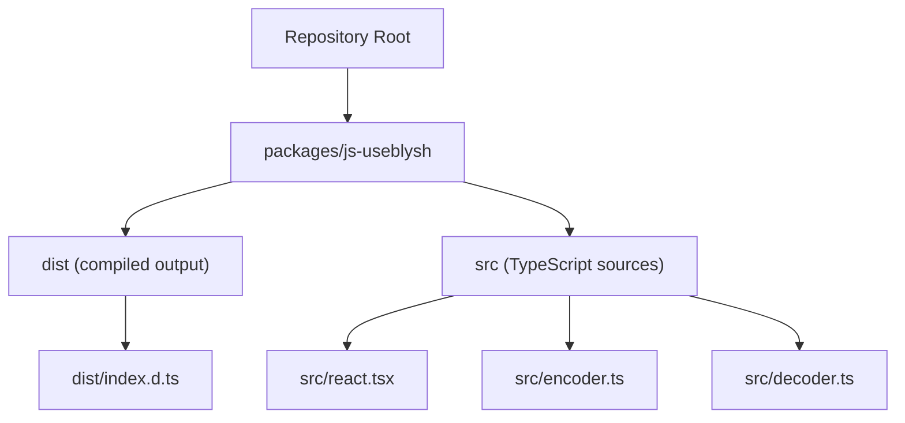
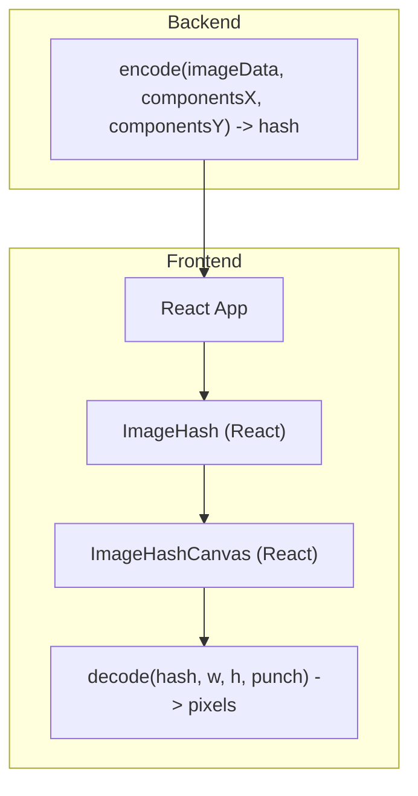
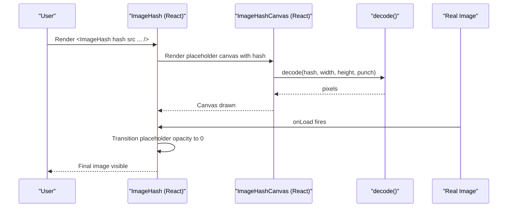
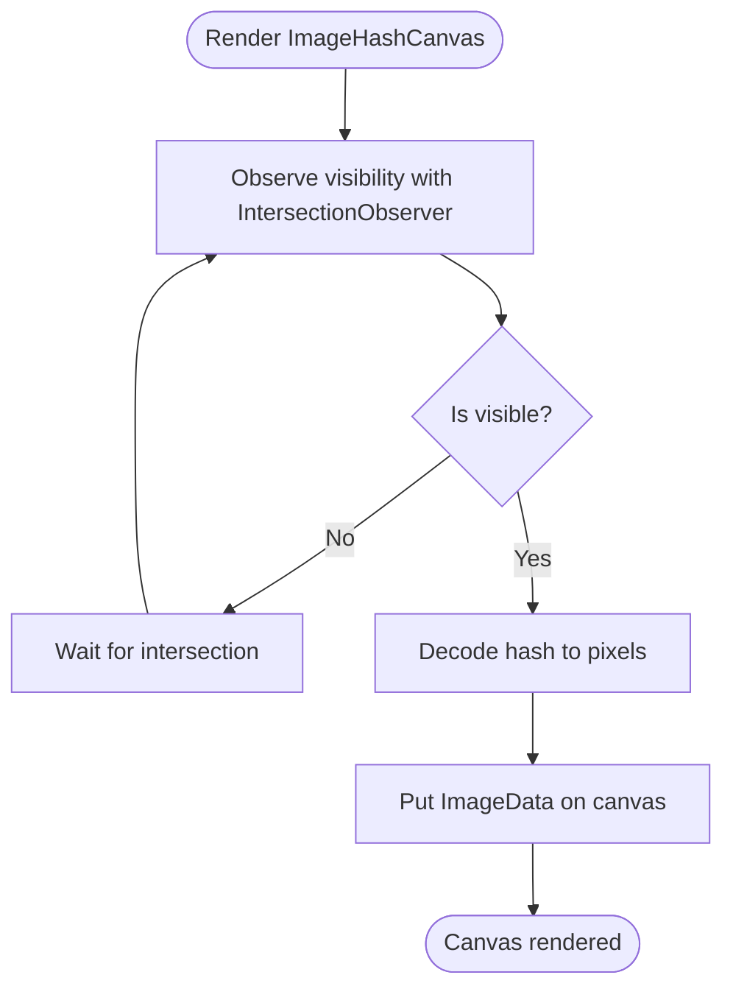
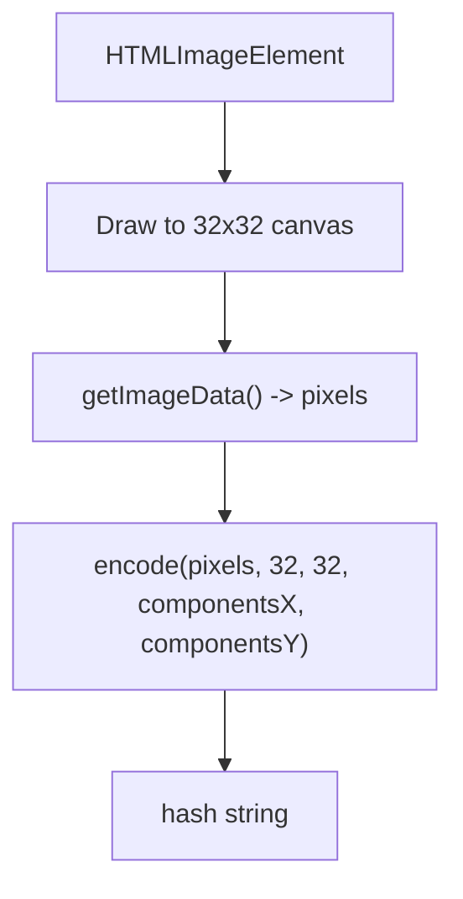
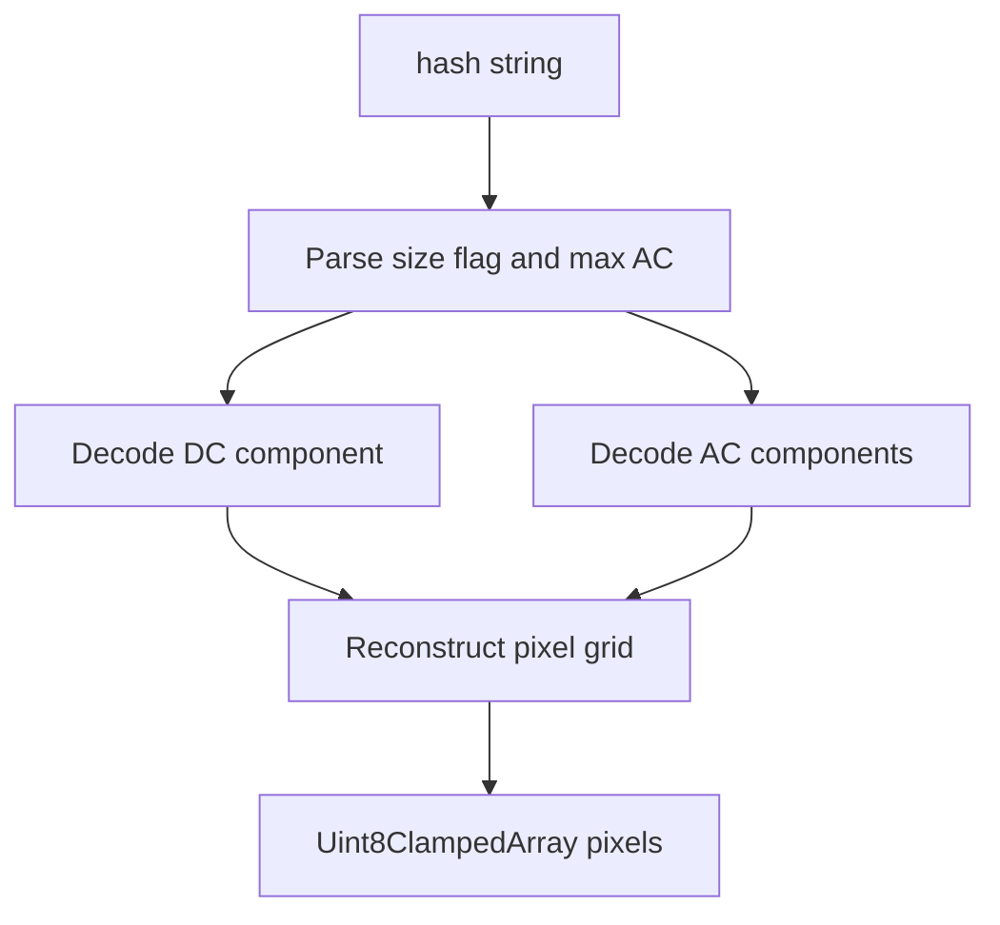
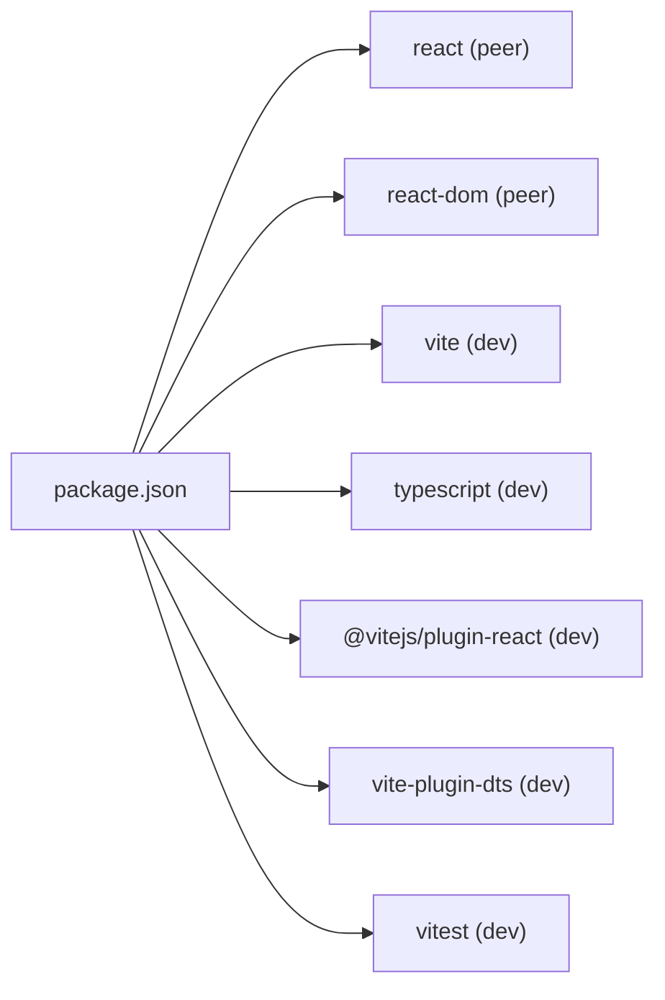

# Framework Integrations

<cite>
**Referenced Files in This Document**
- [README.md](file://README.md)
- [packages/js-useblysh/package.json](file://packages/js-useblysh/package.json)
- [packages/js-useblysh/src/react.tsx](file://packages/js-useblysh/src/react.tsx)
- [packages/js-useblysh/src/encoder.ts](file://packages/js-useblysh/src/encoder.ts)
- [packages/js-useblysh/src/decoder.ts](file://packages/js-useblysh/src/decoder.ts)
- [packages/js-useblysh/dist/index.d.ts](file://packages/js-useblysh/dist/index.d.ts)
</cite>

## Table of Contents
1. [Introduction](#introduction)
2. [Project Structure](#project-structure)
3. [Core Components](#core-components)
4. [Architecture Overview](#architecture-overview)
5. [Detailed Component Analysis](#detailed-component-analysis)
6. [Dependency Analysis](#dependency-analysis)
7. [Performance Considerations](#performance-considerations)
8. [Troubleshooting Guide](#troubleshooting-guide)
9. [Conclusion](#conclusion)
10. [Appendices](#appendices)

## Introduction
This document explains how to integrate ImgHash (useblysh) with popular React frameworks and ecosystems. It focuses on:
- Progressive image loading in SPAs using React Router
- Vite build optimization and TypeScript configuration
- State management integration with Redux, Zustand, and Recoil
- Styling and theming with Tailwind CSS, styled-components, and Material-UI
- Testing strategies with React Testing Library and performance testing with Lighthouse
- Accessibility compliance
- CMS, e-commerce, and content management system integration patterns

The repository provides a React component suite for rendering blurred placeholders while images load, plus encoding/decoding utilities for generating and displaying compact visual hashes.

## Project Structure
The repository is a monorepo with a primary JavaScript package that exports React components, encoder/decoder utilities, and TypeScript definitions. The package is configured for Vite builds, React 16.8+, and TypeScript.

**Diagram sources**
- [packages/js-useblysh/package.json:1-62](file://packages/js-useblysh/package.json#L1-L62)
- [packages/js-useblysh/src/react.tsx:1-137](file://packages/js-useblysh/src/react.tsx#L1-L137)
- [packages/js-useblysh/src/encoder.ts:1-97](file://packages/js-useblysh/src/encoder.ts#L1-L97)
- [packages/js-useblysh/src/decoder.ts:1-67](file://packages/js-useblysh/src/decoder.ts#L1-L67)
- [packages/js-useblysh/dist/index.d.ts:1-5](file://packages/js-useblysh/dist/index.d.ts#L1-L5)

**Section sources**
- [packages/js-useblysh/package.json:1-62](file://packages/js-useblysh/package.json#L1-L62)

## Core Components
- ImageHash: A React component that renders a blurred placeholder via ImageHashCanvas and fades in the real image when it loads.
- ImageHashCanvas: A React component that decodes a hash into pixel data and draws it onto a canvas when it becomes visible.
- encodeImage: Encodes an HTMLImageElement into a compact hash string suitable for transport and storage.
- decode: Decodes a hash into an array of RGBA pixel values for rendering.

These components enable progressive image loading, zero layout shift, and efficient initial payload sizes.

**Section sources**
- [README.md:93-137](file://README.md#L93-L137)
- [packages/js-useblysh/src/react.tsx:1-137](file://packages/js-useblysh/src/react.tsx#L1-L137)
- [packages/js-useblysh/src/encoder.ts:82-97](file://packages/js-useblysh/src/encoder.ts#L82-L97)
- [packages/js-useblysh/src/decoder.ts:3-67](file://packages/js-useblysh/src/decoder.ts#L3-L67)

## Architecture Overview
The integration architecture centers on two flows:
- Encoding flow: Generate hashes client-side during uploads or server-side with the Python backend.
- Rendering flow: Render ImageHash components that show a blurred placeholder until the real image loads.

**Diagram sources**
- [packages/js-useblysh/src/react.tsx:87-137](file://packages/js-useblysh/src/react.tsx#L87-L137)
- [packages/js-useblysh/src/decoder.ts:3-67](file://packages/js-useblysh/src/decoder.ts#L3-L67)
- [packages/js-useblysh/src/encoder.ts:3-77](file://packages/js-useblysh/src/encoder.ts#L3-L77)

## Detailed Component Analysis

### React Component: ImageHash
- Purpose: Renders a placeholder canvas and overlays the real image, fading it in on load.
- Behavior: Uses lazy loading on the real image and a visibility observer to defer decoding until near-viewport.
- Styling: Inherits className and passes style props; manages opacity transitions for smooth fade-in.

**Diagram sources**
- [packages/js-useblysh/src/react.tsx:87-137](file://packages/js-useblysh/src/react.tsx#L87-L137)
- [packages/js-useblysh/src/decoder.ts:3-67](file://packages/js-useblysh/src/decoder.ts#L3-L67)

**Section sources**
- [packages/js-useblysh/src/react.tsx:87-137](file://packages/js-useblysh/src/react.tsx#L87-L137)

### React Component: ImageHashCanvas
- Purpose: Decodes and draws the hash into a canvas only when it becomes visible.
- Optimization: Uses IntersectionObserver with a generous root margin and a small threshold to start decoding early but off-screen.
- Rendering: Sets imageRendering to pixelated for crisp pixel art appearance.

**Diagram sources**
- [packages/js-useblysh/src/react.tsx:11-74](file://packages/js-useblysh/src/react.tsx#L11-L74)

**Section sources**
- [packages/js-useblysh/src/react.tsx:11-74](file://packages/js-useblysh/src/react.tsx#L11-L74)

### Encoding Utilities
- encode: Converts raw pixel data into a compact hash string with configurable DCT components.
- encodeImage: Draws an HTMLImageElement onto a 32x32 canvas and encodes the resulting pixel data.

**Diagram sources**
- [packages/js-useblysh/src/encoder.ts:82-97](file://packages/js-useblysh/src/encoder.ts#L82-L97)

**Section sources**
- [packages/js-useblysh/src/encoder.ts:3-77](file://packages/js-useblysh/src/encoder.ts#L3-L77)
- [packages/js-useblysh/src/encoder.ts:82-97](file://packages/js-useblysh/src/encoder.ts#L82-L97)

### Decoding Utilities
- decode: Parses a hash string and reconstructs RGBA pixel data using inverse DCT and color space transforms.

**Diagram sources**
- [packages/js-useblysh/src/decoder.ts:3-67](file://packages/js-useblysh/src/decoder.ts#L3-L67)

**Section sources**
- [packages/js-useblysh/src/decoder.ts:3-67](file://packages/js-useblysh/src/decoder.ts#L3-L67)

## Dependency Analysis
- Peer dependencies: React >= 16.8.0 and react-dom >= 16.8.0
- Dev toolchain: Vite, React plugins, TypeScript, Vitest
- Build outputs: ES module and CommonJS bundles with TypeScript declarations

**Diagram sources**
- [packages/js-useblysh/package.json:35-49](file://packages/js-useblysh/package.json#L35-L49)

**Section sources**
- [packages/js-useblysh/package.json:35-49](file://packages/js-useblysh/package.json#L35-L49)

## Performance Considerations
- Progressive loading: ImageHashCanvas defers decoding until near-viewport to avoid blocking the main thread.
- Minimal payload: Hash strings replace large images in initial responses.
- Pixel rendering: imageRendering pixelated ensures crisp placeholder visuals.
- Lazy image loading: The real image uses native lazy loading to reduce bandwidth and improve perceived performance.
- DCT components: Tuning componentsX/componentsY balances quality vs. string length.

Practical tips:
- Use smaller component counts for very fast initial loads; increase for higher fidelity.
- Preload critical images or pre-warm decoding for hero images.
- Combine with image CDN resizing and modern formats (AVIF/WebP) for best results.

**Section sources**
- [packages/js-useblysh/src/react.tsx:18-39](file://packages/js-useblysh/src/react.tsx#L18-L39)
- [packages/js-useblysh/src/react.tsx:49-62](file://packages/js-useblysh/src/react.tsx#L49-L62)
- [packages/js-useblysh/src/encoder.ts:3-12](file://packages/js-useblysh/src/encoder.ts#L3-L12)

## Troubleshooting Guide
Common issues and resolutions:
- Canvas context missing: Ensure decode runs in a browser environment with canvas support.
- Invalid hash: decode throws on malformed hashes; validate inputs and ensure consistent component counts.
- Visibility not triggering: Adjust IntersectionObserver rootMargin/threshold if placeholders do not appear on scroll.
- Layout shift: Use container queries or aspect-ratio utilities to reserve space; ImageHash wraps images in a relative container to prevent shifts.
- Performance stalls: decode runs after a zero-delay timeout to yield to the main thread; keep component counts reasonable.

**Section sources**
- [packages/js-useblysh/src/decoder.ts:9-11](file://packages/js-useblysh/src/decoder.ts#L9-L11)
- [packages/js-useblysh/src/react.tsx:18-39](file://packages/js-useblysh/src/react.tsx#L18-L39)
- [packages/js-useblysh/src/react.tsx:49-62](file://packages/js-useblysh/src/react.tsx#L49-L62)

## Conclusion
ImgHash provides a robust, high-performance solution for progressive image loading in React applications. Its React components and utilities integrate cleanly with modern build tools and state management ecosystems, enabling fast, accessible, and visually pleasing image experiences.

## Appendices

### React Router Integration (SPA)
- Route-level placeholders: Wrap route components with ImageHash to show placeholders while route images load.
- Suspense boundaries: Pair ImageHash with React.lazy and Suspense for code-split routes.
- Navigation: Use IntersectionObserver-based decoding to start rendering placeholders before navigation completes.

[No sources needed since this section provides general guidance]

### Next.js Integration
- Static generation: Generate hashes on the server (Python) and pass them to pages; render ImageHash on the client.
- App Router: Use ImageHash in Server Components by passing precomputed hashes; client-side hydration handles lazy image loading.
- SSR considerations: Avoid server-side canvas operations; compute hashes server-side and render ImageHash on the client.

[No sources needed since this section provides general guidance]

### Vite Build Optimization and TypeScript
- Build scripts: Use the provided build and test scripts for development and preview.
- TypeScript: Full type definitions exported; configure tsconfig for React and JSX.
- Bundling: The package ships both ES module and CommonJS outputs; Vite resolves the appropriate export automatically.

**Section sources**
- [packages/js-useblysh/package.json:21-26](file://packages/js-useblysh/package.json#L21-L26)
- [packages/js-useblysh/dist/index.d.ts:1-5](file://packages/js-useblysh/dist/index.d.ts#L1-L5)

### State Management Integration
- Redux: Store image metadata (hashes, URLs) in slices; dispatch actions to update loaded states; render ImageHash with stored props.
- Zustand: Keep minimal UI state in stores; subscribe to updates and re-render placeholders efficiently.
- Recoil: Use atoms/selectors for per-image loading states; derive placeholder props from selectors.

[No sources needed since this section provides general guidance]

### Styling and Theming
- Tailwind CSS: Pass className to ImageHash and ImageHashCanvas; use aspect ratio utilities to reserve space.
- styled-components: Compose styled wrappers around ImageHash; apply transitions via styled props.
- Material-UI: Integrate ImageHash into MUI components (e.g., CardMedia) and use sx props for responsive sizing.

[No sources needed since this section provides general guidance]

### Testing Strategies
- Unit tests: Test decode/encode logic with deterministic inputs; mock canvas contexts for decoder tests.
- Component tests: Verify ImageHash transitions and placeholder visibility; simulate IntersectionObserver.
- Accessibility: Ensure images have meaningful alt attributes; verify focus order and keyboard navigation around image placeholders.

[No sources needed since this section provides general guidance]

### Performance Testing with Lighthouse
- Metrics: Monitor Largest Contentful Paint (LCP), Cumulative Layout Shift (CLS), and First Input Delay (FID).
- Recommendations: Use ImageHash to reduce CLS; ensure lazy loading does not delay above-the-fold images excessively.

[No sources needed since this section provides general guidance]

### CMS, E-commerce, and Content Systems
- Headless CMS: Store image URLs and precomputed hashes in content APIs; render ImageHash on the frontend.
- E-commerce: Use ImageHash for product galleries; preload thumbnails and lazy-load full-size images.
- Content systems: Reserve image containers with aspect ratios; render ImageHash while fetching product media.

[No sources needed since this section provides general guidance]