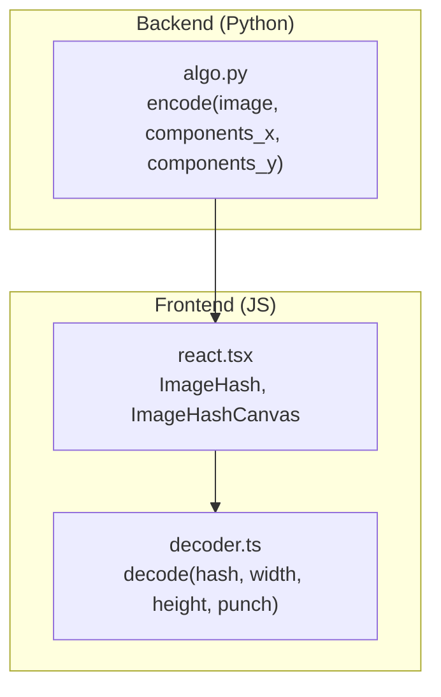
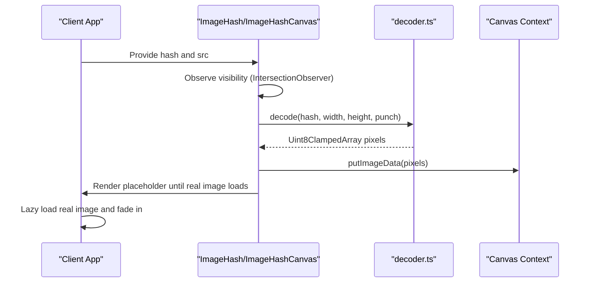
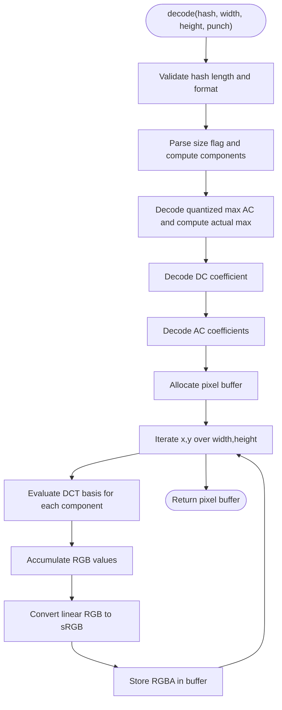
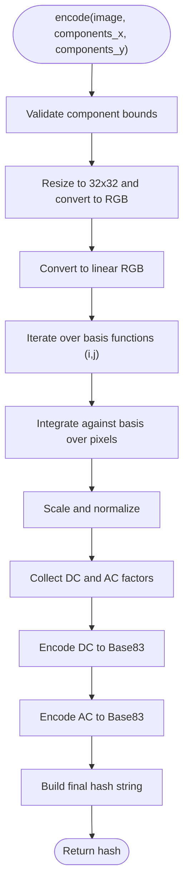
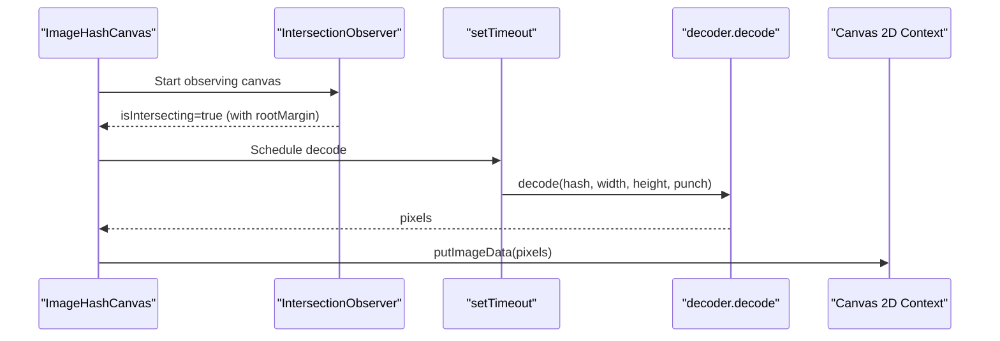

# Performance Optimization

<cite>
**Referenced Files in This Document**
- [README.md](file://README.md)
- [react.tsx](file://packages/js-useblysh/src/react.tsx)
- [decoder.ts](file://packages/js-useblysh/src/decoder.ts)
- [algo.py](file://packages/py-useblysh/useblysh/algo.py)
</cite>

## Table of Contents
1. [Introduction](#introduction)
2. [Project Structure](#project-structure)
3. [Core Components](#core-components)
4. [Architecture Overview](#architecture-overview)
5. [Detailed Component Analysis](#detailed-component-analysis)
6. [Dependency Analysis](#dependency-analysis)
7. [Performance Considerations](#performance-considerations)
8. [Troubleshooting Guide](#troubleshooting-guide)
9. [Conclusion](#conclusion)
10. [Appendices](#appendices)

## Introduction
This document focuses on performance optimization strategies and tuning techniques for the useblysh toolkit. It covers algorithmic optimizations for Discrete Cosine Transform (DCT) processing, hash generation speed improvements, and memory usage reduction. It also documents caching strategies for hash strings, image data, and rendered canvases, along with lazy loading and preloading patterns. Guidance is provided for browser performance metrics, profiling, and debugging tools, as well as CDN and asset optimization strategies. Server-side optimization for the Python implementation is addressed, including multi-threading, batch processing, and efficient hash generation workflows. Finally, benchmarking methodologies and performance monitoring best practices are outlined.

## Project Structure
The repository provides a unified implementation across JavaScript (frontend) and Python (backend), with a focus on fast visual hashing and progressive image rendering.

**Diagram sources**
- [react.tsx:1-137](file://packages/js-useblysh/src/react.tsx#L1-L137)
- [decoder.ts:1-67](file://packages/js-useblysh/src/decoder.ts#L1-L67)
- [algo.py:1-112](file://packages/py-useblysh/useblysh/algo.py#L1-L112)

**Section sources**
- [README.md:1-163](file://README.md#L1-L163)
- [react.tsx:1-137](file://packages/js-useblysh/src/react.tsx#L1-L137)
- [decoder.ts:1-67](file://packages/js-useblysh/src/decoder.ts#L1-L67)
- [algo.py:1-112](file://packages/py-useblysh/useblysh/algo.py#L1-L112)

## Core Components
- Frontend decoding pipeline: The decoder reconstructs pixel data from a compact hash string and renders it to a canvas. Rendering is deferred until the canvas becomes visible via intersection observation, reducing unnecessary work.
- Backend encoding pipeline: The Python encoder performs DCT on a 32x32 RGB image, quantizes DC/AC coefficients, and produces a Base83-encoded hash string.
- React components: ImageHash and ImageHashCanvas encapsulate lazy loading and placeholder rendering with smooth transitions.

Key performance-relevant aspects:
- Lazy rendering: Canvas decoding is triggered only when the canvas enters the viewport.
- Deferred execution: Rendering tasks yield to the main thread to avoid blocking UI interactions.
- Memory-conscious decoding: Pixel buffers are allocated once per decode operation and reused efficiently.

**Section sources**
- [react.tsx:18-74](file://packages/js-useblysh/src/react.tsx#L18-L74)
- [decoder.ts:3-66](file://packages/js-useblysh/src/decoder.ts#L3-L66)
- [algo.py:39-112](file://packages/py-useblysh/useblysh/algo.py#L39-L112)

## Architecture Overview
The system separates concerns between backend hashing and frontend rendering. The backend produces a compact hash string; the frontend decodes it to a low-resolution image and overlays it on top of the real image, which loads lazily.

**Diagram sources**
- [react.tsx:18-74](file://packages/js-useblysh/src/react.tsx#L18-L74)
- [decoder.ts:3-66](file://packages/js-useblysh/src/decoder.ts#L3-L66)

## Detailed Component Analysis

### Frontend Decoding Pipeline (decoder.ts)
The decoder reconstructs pixel data from the hash string by:
- Parsing size flags and quantized maximum AC value.
- Reconstructing DC and AC coefficients.
- Evaluating the DCT basis functions across the target resolution to compute RGB values.
- Converting linear RGB to sRGB and packing into a pixel buffer.

Optimization opportunities:
- Vectorization: Replace nested loops with vectorized operations for basis evaluation and accumulation.
- Lookup tables: Precompute trigonometric terms for basis functions to reduce repeated computations.
- Early exit: Validate hash format and dimensions early to fail fast.
- Memory reuse: Reuse pixel buffers across renders when sizes match.

**Diagram sources**
- [decoder.ts:3-66](file://packages/js-useblysh/src/decoder.ts#L3-L66)

**Section sources**
- [decoder.ts:3-66](file://packages/js-useblysh/src/decoder.ts#L3-L66)

### Backend Encoding Pipeline (algo.py)
The Python encoder:
- Resamples to 32x32 and converts to linear RGB.
- Computes DCT coefficients by integrating against cosine basis functions.
- Quantizes DC and AC coefficients and encodes them using Base83.
- Produces a compact hash string representing the image’s dominant frequencies.

Optimization opportunities:
- Numpy vectorization: Use vectorized operations for basis evaluation and accumulation.
- Precomputed constants: Cache normalization and basis terms when iterating over pixels.
- Early termination: Stop accumulating after a threshold to reduce computation.
- Batch processing: Process multiple images concurrently with worker threads or processes.
- Memory mapping: For very large batches, consider chunked processing to limit peak memory.

**Diagram sources**
- [algo.py:39-112](file://packages/py-useblysh/useblysh/algo.py#L39-L112)

**Section sources**
- [algo.py:39-112](file://packages/py-useblysh/useblysh/algo.py#L39-L112)

### React Rendering Components (react.tsx)
The React components implement:
- IntersectionObserver-based lazy decoding: Only decode when the canvas is near the viewport.
- Deferred rendering: Uses a zero-delay timeout to yield to the main thread.
- Overlay rendering: ImageHash displays a blurred placeholder until the real image loads.

Optimization opportunities:
- Visibility thresholds: Tune root margin and threshold to balance perceived performance and resource usage.
- Ref callbacks: Use imperative refs to avoid re-renders when accessing canvas context.
- Canvas sizing: Cache computed dimensions to avoid layout thrashing.
- Transition optimization: Keep CSS transitions minimal to reduce paint cost.

**Diagram sources**
- [react.tsx:18-74](file://packages/js-useblysh/src/react.tsx#L18-L74)
- [decoder.ts:3-66](file://packages/js-useblysh/src/decoder.ts#L3-L66)

**Section sources**
- [react.tsx:18-74](file://packages/js-useblysh/src/react.tsx#L18-L74)

## Dependency Analysis
- Frontend depends on the decoder module for reconstructing pixel data from the hash string.
- The React components orchestrate decoding and canvas rendering.
- Backend provides the encode function used to generate hash strings from images.
- The system relies on standard libraries: PIL for image handling, NumPy for numerical operations, and browser APIs for rendering.

**Diagram sources**
- [react.tsx:1-137](file://packages/js-useblysh/src/react.tsx#L1-L137)
- [decoder.ts:1-67](file://packages/js-useblysh/src/decoder.ts#L1-L67)
- [algo.py:1-112](file://packages/py-useblysh/useblysh/algo.py#L1-L112)

**Section sources**
- [react.tsx:1-137](file://packages/js-useblysh/src/react.tsx#L1-L137)
- [decoder.ts:1-67](file://packages/js-useblysh/src/decoder.ts#L1-L67)
- [algo.py:1-112](file://packages/py-useblysh/useblysh/algo.py#L1-L112)

## Performance Considerations

### Algorithm Performance Tuning
- DCT processing optimization:
  - Vectorize basis evaluation and accumulation using NumPy arrays.
  - Precompute trigonometric basis terms keyed by (i, j, x, y) to minimize repeated math operations.
  - Use lookup tables for cosine terms indexed by pixel coordinates and component indices.
  - Reduce precision where acceptable (e.g., float32) to improve throughput.
- Hash generation speed improvements:
  - Minimize Python loops by leveraging vectorized operations and broadcasting.
  - Cache normalization constants and reuse intermediate arrays across components.
  - Consider chunked processing for very large batches to reduce peak memory.
- Memory usage reduction:
  - Allocate pixel buffers once per decode and reuse when sizes match.
  - Avoid intermediate copies; write directly into the target buffer.
  - Use typed arrays (Uint8ClampedArray) for pixel data to reduce overhead.

### Caching Mechanisms
- Hash strings: Cache generated hashes keyed by image metadata or content hash to avoid recomputation.
- Image data: Cache resized and linearized image arrays when processing multiple hashes.
- Rendered canvases: Cache decoded pixel buffers keyed by (hash, width, height, punch) to skip decoding on subsequent renders.

### Lazy Loading and Preloading Patterns
- Lazy decoding: Trigger decoding only when the canvas is near the viewport using IntersectionObserver with tuned margins.
- Deferred rendering: Yield to the main thread using a zero-delay timeout to keep scrolling smooth.
- Preload real images: Use native lazy loading attributes and preload hints for critical images.

### Resource Management Techniques
- Canvas lifecycle: Dispose of observers and timers when components unmount.
- Image resources: Revoke object URLs and cancel in-flight requests to free memory.
- Batch processing: Process images in chunks to control memory spikes and CPU usage.

### Browser Performance Metrics, Profiling, and Debugging
- Metrics: Measure First Contentful Paint (FCP), Largest Contentful Paint (LCP), and Cumulative Layout Shift (CLS).
- Profiling: Use the Performance panel to identify long tasks and layout thrashing; inspect the Memory panel for leaks.
- Tools: DevTools CPU profiler, Flame chart, and Network panel to analyze decode timing and bandwidth usage.

### CDN Integration and Asset Optimization
- CDN: Host decoded canvas images or pre-rendered placeholders behind a CDN for global distribution.
- Compression: Enable Brotli/Gzip on static assets; optimize images with WebP or AVIF.
- Bundling: Tree-shake unused decoder utilities; split bundles to reduce initial payload.

### Server-Side Optimization (Python)
- Multi-threading: Offload image resizing and DCT computation to worker threads for I/O-bound stages.
- Batch processing: Process multiple images concurrently with thread/process pools; use queues to manage work.
- Efficient workflows:
  - Cache frequently requested hashes.
  - Use streaming for large uploads to reduce latency.
  - Employ asynchronous I/O for database operations.

### Benchmarking Methodologies and Monitoring
- Benchmarks: Measure encode/decode throughput (ops/sec) and memory footprint across resolutions and component counts.
- Monitoring: Track p95/p99 latencies for decode operations; alert on increased CPU utilization or memory growth.
- A/B testing: Compare different optimization strategies (vectorization vs. lookup tables) with controlled experiments.

[No sources needed since this section provides general guidance]

## Troubleshooting Guide
Common issues and remedies:
- Invalid hash errors: Validate hash length and character set before decoding; surface clear error messages.
- Stuttering during scroll: Ensure decoding is deferred and does not block the main thread; adjust IntersectionObserver thresholds.
- Canvas sizing mismatches: Cache computed dimensions and avoid forced reflows; use CSS containment where appropriate.
- Memory leaks: Dispose of observers, revoke object URLs, and clear timeouts on component unmount.

**Section sources**
- [decoder.ts:9-11](file://packages/js-useblysh/src/decoder.ts#L9-L11)
- [react.tsx:18-74](file://packages/js-useblysh/src/react.tsx#L18-L74)

## Conclusion
By combining algorithmic optimizations (vectorization, lookup tables, and reduced precision), strategic caching, and robust lazy-loading patterns, useblysh achieves fast, responsive image loading. On the backend, vectorized DCT computation and batch processing further improve throughput. Profiling and monitoring enable continuous refinement of performance across browsers and server environments.

[No sources needed since this section summarizes without analyzing specific files]

## Appendices

### Quick Reference: Key Functions and Responsibilities
- Frontend
  - decode(hash, width, height, punch): Reconstructs pixel data from a hash string.
  - ImageHashCanvas: Renders a blurred placeholder via canvas when visible.
  - ImageHash: Manages overlay of placeholder and lazy-loaded real image.
- Backend
  - encode(image, components_x, components_y): Generates a compact hash string from an image.

**Section sources**
- [decoder.ts:3-66](file://packages/js-useblysh/src/decoder.ts#L3-L66)
- [react.tsx:11-137](file://packages/js-useblysh/src/react.tsx#L11-L137)
- [algo.py:39-112](file://packages/py-useblysh/useblysh/algo.py#L39-L112)