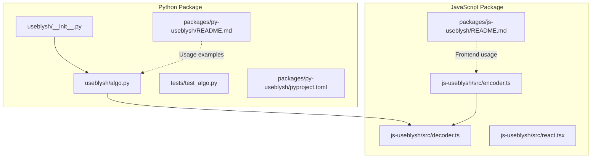
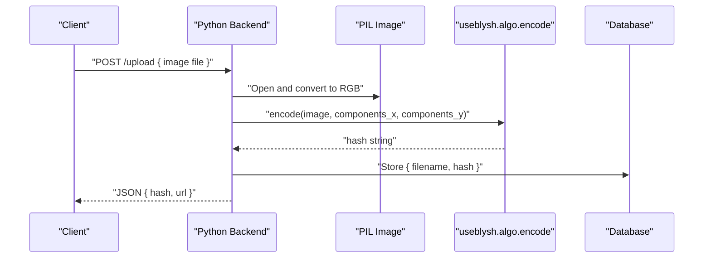
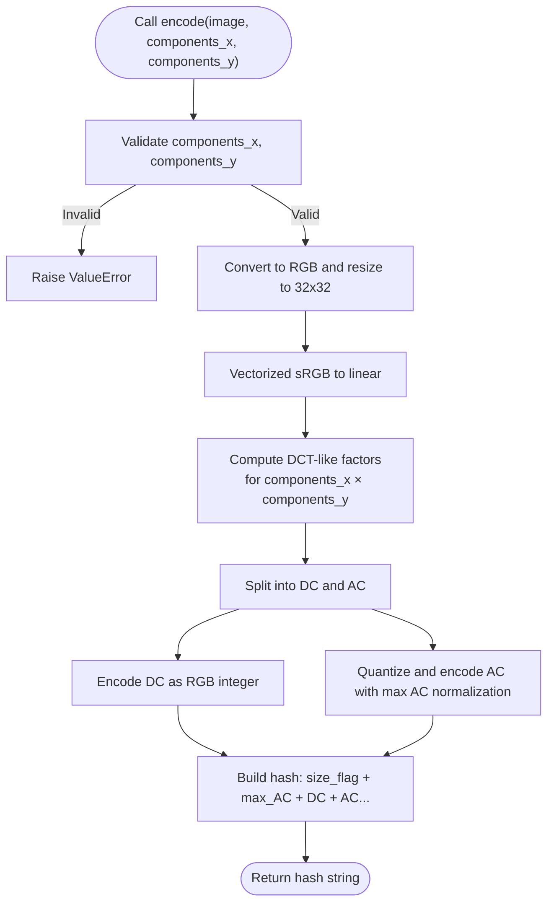
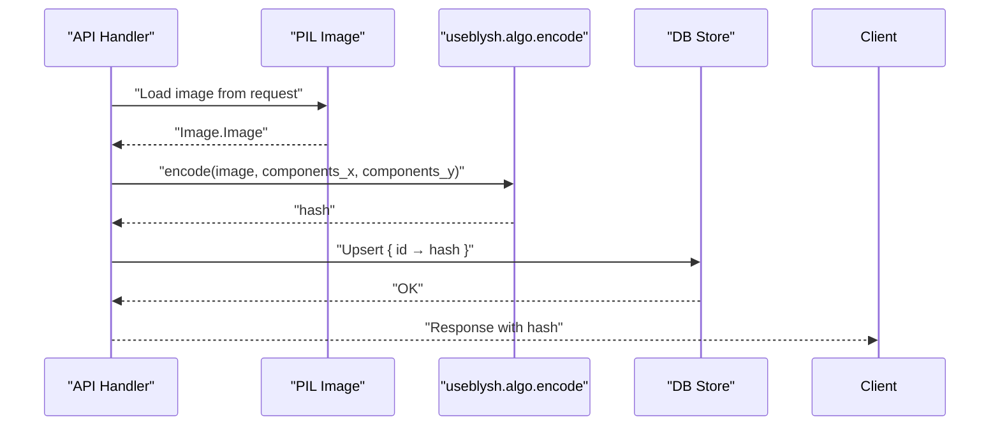
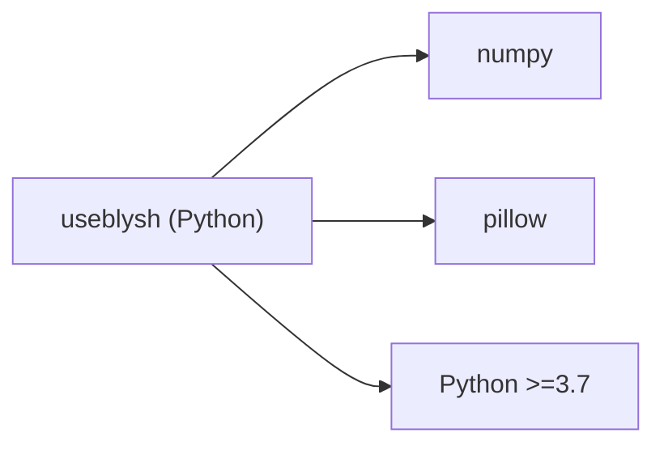

# Backend Integration

<cite>
**Referenced Files in This Document**
- [README.md](file://README.md)
- [pyproject.toml](file://packages/py-useblysh/pyproject.toml)
- [__init__.py](file://packages/py-useblysh/useblysh/__init__.py)
- [algo.py](file://packages/py-useblysh/useblysh/algo.py)
- [test_algo.py](file://packages/py-useblysh/tests/test_algo.py)
- [encoder.ts](file://packages/js-useblysh/src/encoder.ts)
- [decoder.ts](file://packages/js-useblysh/src/decoder.ts)
- [react.tsx](file://packages/js-useblysh/src/react.tsx)
</cite>

## Table of Contents
1. [Introduction](#introduction)
2. [Project Structure](#project-structure)
3. [Core Components](#core-components)
4. [Architecture Overview](#architecture-overview)
5. [Detailed Component Analysis](#detailed-component-analysis)
6. [Dependency Analysis](#dependency-analysis)
7. [Performance Considerations](#performance-considerations)
8. [Troubleshooting Guide](#troubleshooting-guide)
9. [Conclusion](#conclusion)
10. [Appendices](#appendices)

## Introduction
This document provides comprehensive guidance for integrating the Python backend with the useblysh visual hashing pipeline. It focuses on server-side image processing and hash generation, covering the encode function API, PIL Image integration, multi-version Python support, server-side workflows, performance considerations for batch and concurrent processing, algorithmic details (DCT, quantization, Base83 encoding), framework integration examples (Django, Flask, FastAPI), database storage patterns, troubleshooting, and production best practices.

## Project Structure
The repository includes a unified toolkit with identical hashing logic for Python and JavaScript. The Python package exposes a single encode function and supporting utilities for Base83 encoding/decoding and color space conversions. The frontend JavaScript package consumes the same hash format for decoding and rendering placeholders.

**Diagram sources**
- [__init__.py:1-5](file://packages/py-useblysh/useblysh/__init__.py#L1-L5)
- [algo.py:1-112](file://packages/py-useblysh/useblysh/algo.py#L1-L112)
- [test_algo.py:1-30](file://packages/py-useblysh/tests/test_algo.py#L1-L30)
- [encoder.ts:72-96](file://packages/js-useblysh/src/encoder.ts#L72-L96)
- [decoder.ts:1-45](file://packages/js-useblysh/src/decoder.ts#L1-L45)
- [react.tsx:1-90](file://packages/js-useblysh/src/react.tsx#L1-L90)

**Section sources**
- [README.md:1-163](file://README.md#L1-L163)
- [pyproject.toml:1-27](file://packages/py-useblysh/pyproject.toml#L1-L27)

## Core Components
- encode(image: Image.Image, components_x: int = 4, components_y: int = 3) -> str
  - Purpose: Generates a compact hash string representing the visual fingerprint of an image.
  - Parameters:
    - image: PIL Image in RGB mode.
    - components_x: Horizontal DCT basis count (1..9).
    - components_y: Vertical DCT basis count (1..9).
  - Returns: A Base83-encoded string representing the hash.
  - Errors:
    - Raises ValueError if components are outside the supported range.
- Supporting utilities:
  - Base83 encoding/decoding helpers.
  - sRGB-to-linear and linear-to-sRGB conversions.
  - sign_pow for signed exponentiation.

Key behaviors:
- Resizes input to 32x32 using LANCZOS resampling.
- Converts to linear RGB space.
- Computes DCT-like factors across selected basis functions.
- Quantizes and encodes DC and AC coefficients into a compact string.

**Section sources**
- [__init__.py:1-5](file://packages/py-useblysh/useblysh/__init__.py#L1-L5)
- [algo.py:39-112](file://packages/py-useblysh/useblysh/algo.py#L39-L112)
- [test_algo.py:21-27](file://packages/py-useblysh/tests/test_algo.py#L21-L27)

## Architecture Overview
The backend hashing pipeline converts uploaded images into stable, compact hashes that frontends can decode to render blurred placeholders. The frontend decoding mirrors the backend’s encoding logic to ensure cross-language compatibility.

**Diagram sources**
- [algo.py:39-112](file://packages/py-useblysh/useblysh/algo.py#L39-L112)
- [README.md:75-91](file://README.md#L75-L91)

## Detailed Component Analysis

### encode Function API
- Signature: encode(image: Image.Image, components_x: int = 4, components_y: int = 3) -> str
- Parameter constraints:
  - components_x and components_y must be integers in [1, 9].
- Processing steps:
  - Validate component bounds.
  - Convert to RGB and resize to 32x32.
  - Vectorized sRGB to linear conversion.
  - Basis function evaluation and integral computation for each DCT-like factor.
  - DC coefficient encoded as RGB integer; AC coefficients quantized and packed.
  - Maximum AC magnitude stored and normalized during decoding.
  - Hash string composed of size flag, max AC, DC, and AC segments encoded in Base83.
- Return value:
  - String of Base83 characters; length depends on component counts.
- Error handling:
  - ValueError raised for out-of-range components.

**Diagram sources**
- [algo.py:39-112](file://packages/py-useblysh/useblysh/algo.py#L39-L112)

**Section sources**
- [algo.py:39-112](file://packages/py-useblysh/useblysh/algo.py#L39-L112)
- [test_algo.py:21-27](file://packages/py-useblysh/tests/test_algo.py#L21-L27)

### PIL Image Integration
- Input requirement: Image must be convertible to RGB.
- Preprocessing:
  - Automatic conversion to RGB.
  - Fixed-size downsampling to 32x32 using LANCZOS resampling.
- Color space:
  - sRGB to linear conversion prior to frequency analysis.
  - Reverse conversion applied to DC component for robust reconstruction.

**Section sources**
- [algo.py:43-50](file://packages/py-useblysh/useblysh/algo.py#L43-L50)

### Multi-Version Python Support
- Requires Python >= 3.7.
- Dependencies: numpy, pillow.
- Compatibility:
  - The algorithm uses vectorized NumPy operations and PIL APIs consistent across recent Python versions.

**Section sources**
- [pyproject.toml:13-22](file://packages/py-useblysh/pyproject.toml#L13-L22)

### Server-Side Hash Generation Workflow
- Upload processing:
  - Accept image bytes via HTTP request.
  - Open with PIL and pass to encode.
- Hash creation:
  - Call encode with desired components.
- Database integration:
  - Store mapping of identifier (e.g., filename, record ID) to hash.
  - Retrieve hash for rendering placeholders in API responses.

**Diagram sources**
- [algo.py:39-112](file://packages/py-useblysh/useblysh/algo.py#L39-L112)

### Algorithm Implementation Details
- DCT-like processing:
  - Basis functions cos(pi*i*x/width)*cos(pi*j*y/height).
  - Integrals computed over pixel grid; normalization accounts for i=0, j=0 cases.
- Quantization:
  - DC: mapped to RGB via linear-to-sRGB.
  - AC: normalized by estimated maximum; sign_pow with exponent applied; quantized into 19×19 grid per channel.
- Base83 encoding:
  - Fixed-width encoding for compactness; supports variable-length segments for size flag and AC values.

**Section sources**
- [algo.py:52-112](file://packages/py-useblysh/useblysh/algo.py#L52-L112)

### Frontend Decoding Compatibility
- The frontend decoder reconstructs pixel arrays from the hash string using the same size flag, max AC, DC, and AC segments.
- React components can render placeholders immediately while deferring full image loading.

**Section sources**
- [decoder.ts:1-45](file://packages/js-useblysh/src/decoder.ts#L1-L45)
- [react.tsx:1-90](file://packages/js-useblysh/src/react.tsx#L1-L90)

### Practical Framework Integration Examples
Note: The following are conceptual integration patterns. Refer to the repository’s README for concise usage examples.

- Django
  - View receives uploaded image, opens with PIL, calls encode, stores hash, returns JSON with hash and image URL.
- Flask
  - Route handles multipart/form-data, processes image, generates hash, persists to DB, responds with JSON.
- FastAPI
  - Endpoint accepts UploadFile, decodes to PIL Image, computes hash, saves to DB, returns model containing hash and metadata.

These patterns align with the README’s simple example and the encode function’s API.

**Section sources**
- [README.md:75-91](file://README.md#L75-L91)

### Database Storage Optimization
- Recommended schema pattern:
  - id: unique identifier (UUID or autoincrement).
  - hash: varchar storing the Base83 hash string.
  - metadata: optional JSON field for components and sizes.
- Indexing:
  - Index on id for primary lookup.
  - Optional composite index on (components_x, components_y) if serving multiple resolutions.
- Retrieval:
  - Fetch hash by id and embed in API responses for immediate placeholder rendering.

[No sources needed since this section provides general guidance]

## Dependency Analysis
- Python runtime dependencies:
  - numpy: numerical operations and vectorization.
  - pillow: image loading, conversion, resizing.
- Version constraints:
  - requires-python >= 3.7.

**Diagram sources**
- [pyproject.toml:19-22](file://packages/py-useblysh/pyproject.toml#L19-L22)

**Section sources**
- [pyproject.toml:1-27](file://packages/py-useblysh/pyproject.toml#L1-L27)

## Performance Considerations
- Batch processing:
  - Use vectorized operations and avoid per-pixel loops except where necessary.
  - Consider batching with worker queues (e.g., Celery) to parallelize across uploads.
- Concurrency:
  - Separate hashing from I/O-bound tasks; offload to async workers.
  - Limit concurrent requests per process to control memory spikes.
- Memory management:
  - Ensure temporary images are closed promptly.
  - Prefer streaming uploads for large files when feasible.
- Component tuning:
  - Lower components_x/components_y for faster hashing at the cost of fidelity.
  - Keep consistent component settings across uploads for predictable hash lengths.

[No sources needed since this section provides general guidance]

## Troubleshooting Guide
- ValueError: “Components must be between 1 and 9”
  - Cause: components_x or components_y outside [1, 9].
  - Fix: Clamp inputs to the supported range.
- Empty or invalid hash
  - Cause: corrupted image data or unsupported modes.
  - Fix: Validate image mode and size; ensure RGB conversion succeeds.
- Performance bottlenecks
  - Symptom: Slow hashing under load.
  - Mitigation: Reduce components, enable batching, and monitor memory usage.
- Memory issues
  - Symptom: Out-of-memory errors on large batches.
  - Mitigation: Process smaller batches, close images after use, and profile memory.

**Section sources**
- [test_algo.py:21-27](file://packages/py-useblysh/tests/test_algo.py#L21-L27)
- [algo.py:40-41](file://packages/py-useblysh/useblysh/algo.py#L40-L41)

## Conclusion
The Python backend integrates seamlessly with the useblysh hashing pipeline. By leveraging PIL for preprocessing and numpy for efficient computation, the encode function produces compact, cross-compatible hashes suitable for progressive image loading. Following the outlined patterns for batch processing, concurrency, and database storage enables scalable, production-ready deployments.

[No sources needed since this section summarizes without analyzing specific files]

## Appendices

### API Reference: encode
- Function: encode(image: Image.Image, components_x: int = 4, components_y: int = 3) -> str
- Parameters:
  - image: PIL Image in RGB mode.
  - components_x: Horizontal basis count (1..9).
  - components_y: Vertical basis count (1..9).
- Returns: Base83-encoded hash string.
- Exceptions: ValueError for invalid components.

**Section sources**
- [algo.py:39-41](file://packages/py-useblysh/useblysh/algo.py#L39-L41)
- [test_algo.py:21-27](file://packages/py-useblysh/tests/test_algo.py#L21-L27)

### Cross-Language Consistency
- The frontend encoder and decoder maintain the same size flag, max AC, DC, and AC segment structure, ensuring identical hashes across Python and JavaScript.

**Section sources**
- [encoder.ts:72-96](file://packages/js-useblysh/src/encoder.ts#L72-L96)
- [decoder.ts:1-45](file://packages/js-useblysh/src/decoder.ts#L1-L45)