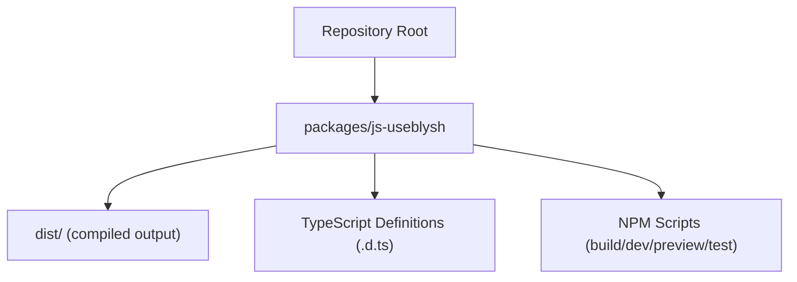
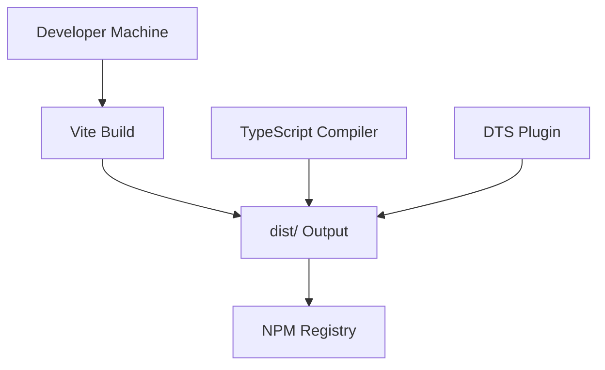
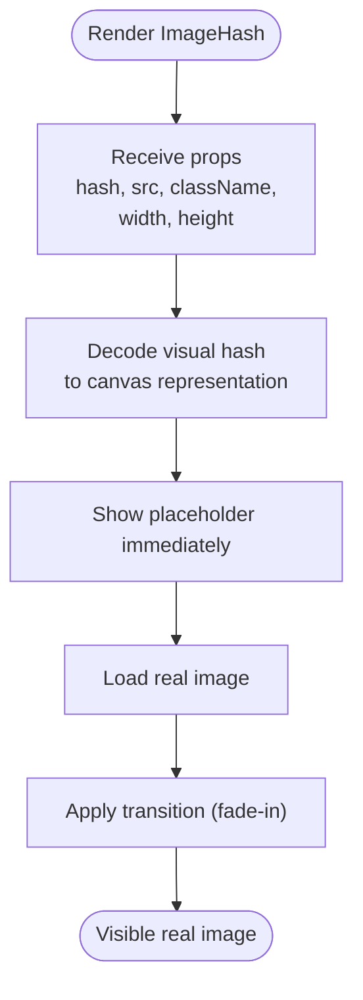
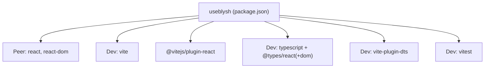

# Configuration and Customization

<cite>
**Referenced Files in This Document**
- [README.md](file://README.md)
- [package.json](file://packages/js-useblysh/package.json)
</cite>

## Table of Contents
1. [Introduction](#introduction)
2. [Project Structure](#project-structure)
3. [Core Components](#core-components)
4. [Architecture Overview](#architecture-overview)
5. [Detailed Component Analysis](#detailed-component-analysis)
6. [Dependency Analysis](#dependency-analysis)
7. [Performance Considerations](#performance-considerations)
8. [Troubleshooting Guide](#troubleshooting-guide)
9. [Conclusion](#conclusion)
10. [Appendices](#appendices)

## Introduction
This document focuses on configuration and customization for building, configuring, and deploying the useblysh JavaScript package. It covers:
- Build and deployment configuration via Vite and TypeScript
- Component configuration options such as detail levels and styling
- Animation and responsive behavior considerations
- Performance tuning and optimization strategies
- Best practices for development, staging, and production environments
- Troubleshooting common configuration issues and monitoring approaches

Where applicable, we reference concrete files and sections to ground the guidance in the repository’s current state.

## Project Structure
The repository is organized as a multi-package workspace with a primary focus on the JavaScript package that powers React-based progressive image loading. The relevant configuration surface for this document resides in the JavaScript package’s package metadata and build scripts.

**Section sources**
- [README.md:1-163](file://README.md#L1-L163)
- [package.json:1-62](file://packages/js-useblysh/package.json#L1-L62)

## Core Components
This section outlines the primary configuration surfaces for building, testing, and distributing the useblysh React package.

- Build and test scripts
  - Build: produces distribution files for ESM and CJS consumption
  - Dev: local development server
  - Preview: preview built artifacts locally
  - Test: runs unit tests with Vitest
- Exports and entry points
  - Main module entry for ESM and CJS
  - TypeScript declaration files for public APIs
- Peer and dev dependencies
  - React peer dependency ensures compatibility
  - Vite, TypeScript, React, and related plugins for build-time tooling

Practical implications:
- Consumers import from the package entry and rely on the exported types for type-safe usage.
- The build pipeline targets modern browsers and React versions indicated by peer dependencies.

**Section sources**
- [package.json:21-26](file://packages/js-useblysh/package.json#L21-L26)
- [package.json:9-15](file://packages/js-useblysh/package.json#L9-L15)
- [package.json:35-49](file://packages/js-useblysh/package.json#L35-L49)

## Architecture Overview
The build and distribution architecture centers on Vite and TypeScript with DTS generation for type declarations. The resulting package exposes:
- ESM and CJS bundles
- Public TypeScript definitions
- NPM scripts for local development and CI-friendly builds

**Diagram sources**
- [package.json:21-26](file://packages/js-useblysh/package.json#L21-L26)
- [package.json:47](file://packages/js-useblysh/package.json#L47)

**Section sources**
- [package.json:21-26](file://packages/js-useblysh/package.json#L21-L26)
- [package.json:6-15](file://packages/js-useblysh/package.json#L6-L15)

## Detailed Component Analysis
This section focuses on component configuration options exposed by the package and how to tune them for performance and UX.

- Detail level controls
  - The encoding process supports configurable grid dimensions that influence the visual hash granularity and decoding cost. These are passed during encoding to balance quality and payload size.
  - Example usage demonstrates passing grid dimensions to the encoder function to control detail level.
- Styling and theming
  - Components accept standard React props such as className to integrate with design systems and theme frameworks.
  - Canvas-based rendering allows consumers to layer transitions and effects via CSS classes and inline styles.
- Animation customization
  - The React component supports a fade-in transition after the real image loads. Consumers can customize timing and easing via CSS classes applied to the component wrapper.
- Responsive behavior
  - The component accepts width and height props suitable for responsive layouts. Consumers can adapt sizes based on breakpoints and device pixel ratios.

**Section sources**
- [README.md:93-137](file://README.md#L93-L137)
- [README.md:47-91](file://README.md#L47-L91)

## Dependency Analysis
The JavaScript package declares peer and dev dependencies that shape the build and runtime environment.

- Peer dependencies
  - React and ReactDOM: ensure compatibility with React 16.8+ and DOM rendering.
- Dev dependencies
  - Vite: build toolchain
  - @vitejs/plugin-react: React-fast-refresh and JSX transform
  - TypeScript and type packages: type checking and declarations
  - vite-plugin-dts: emit declaration files
  - vitest: unit testing framework

**Diagram sources**
- [package.json:35-49](file://packages/js-useblysh/package.json#L35-L49)

**Section sources**
- [package.json:35-49](file://packages/js-useblysh/package.json#L35-L49)

## Performance Considerations
Optimizing performance involves balancing detail level, rendering cost, and user experience.

- Detail level tuning
  - Lower grid dimensions reduce payload size and decoding cost but decrease fidelity.
  - Higher grid dimensions increase fidelity and payload size; choose based on content type and bandwidth.
- Rendering performance
  - Prefer canvas-based decoding for efficient pixel manipulation.
  - Minimize re-renders by passing stable keys and avoiding unnecessary prop churn.
- Bundle size and delivery
  - Keep TypeScript and plugin versions aligned with Vite to leverage modern bundling and tree-shaking.
  - Use CDN delivery for distribution to improve global latency.
- Memory usage
  - Avoid retaining references to large image buffers after decoding.
  - Reuse canvas contexts where appropriate to reduce allocations.

[No sources needed since this section provides general guidance]

## Troubleshooting Guide
Common configuration and runtime issues, with actionable steps grounded in the repository’s configuration.

- Build fails due to missing peer dependencies
  - Ensure React and ReactDOM versions satisfy the peer dependency range declared in the package.
  - Reference: [package.json:35-38](file://packages/js-useblysh/package.json#L35-L38)
- TypeScript errors in consumer projects
  - Align TypeScript compiler options with the package’s expectations and ensure type packages are installed.
  - Reference: [package.json:40-44](file://packages/js-useblysh/package.json#L40-L44)
- Vite plugin conflicts
  - Verify that only one JSX transform plugin is active; prefer the official React plugin.
  - Reference: [package.json:42](file://packages/js-useblysh/package.json#L42)
- Incorrect exports resolution (ESM/CJS)
  - Confirm that bundlers resolve the package entry according to the exports field.
  - Reference: [package.json:9-15](file://packages/js-useblysh/package.json#L9-L15)
- Testing setup issues
  - Use the provided test script and ensure Vitest is configured appropriately for React testing.
  - Reference: [package.json:25](file://packages/js-useblysh/package.json#L25)

**Section sources**
- [package.json:35-49](file://packages/js-useblysh/package.json#L35-L49)
- [package.json:9-15](file://packages/js-useblysh/package.json#L9-L15)

## Conclusion
The useblysh package provides a streamlined configuration surface centered on Vite and TypeScript, with clear export boundaries and peer dependencies. By tuning detail levels, leveraging responsive props, and aligning build tooling with the package’s expectations, teams can achieve fast, reliable progressive image loading across development, staging, and production environments.

[No sources needed since this section summarizes without analyzing specific files]

## Appendices
- Practical configuration scenarios
  - Development: use the dev script for rapid iteration; keep React Fast Refresh enabled.
  - Staging: build with production flags and preview artifacts locally before rollout.
  - Production: deliver via CDN and monitor CLS improvements and time-to-interactive metrics.
- Example references
  - Component usage and props: [README.md:93-137](file://README.md#L93-L137)
  - Encoding with detail levels: [README.md:76-91](file://README.md#L76-L91)

**Section sources**
- [README.md:93-137](file://README.md#L93-L137)
- [README.md:76-91](file://README.md#L76-L91)