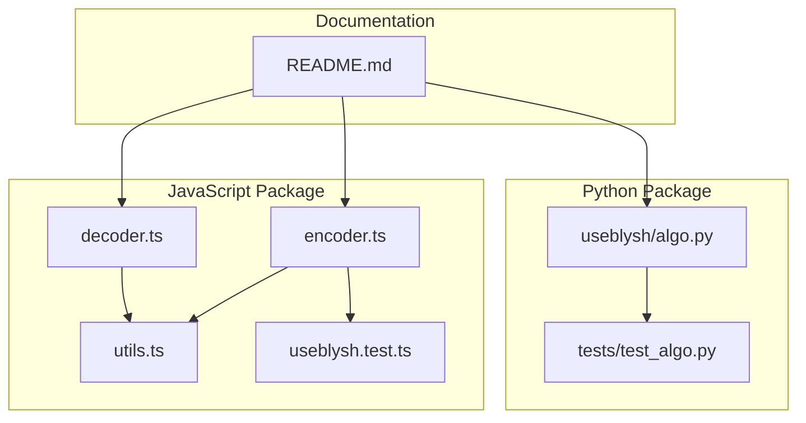
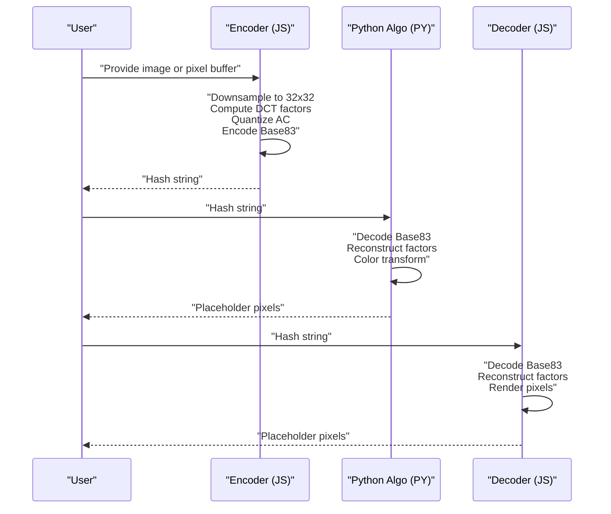
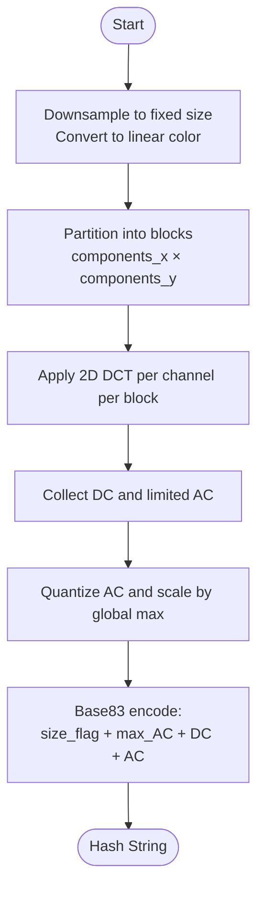
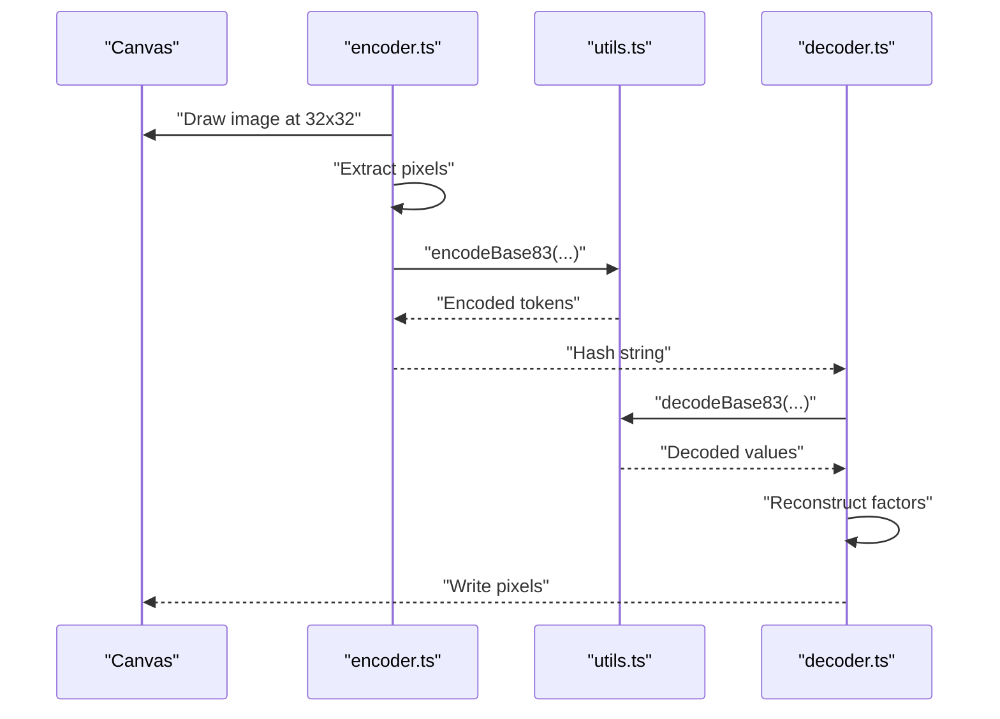
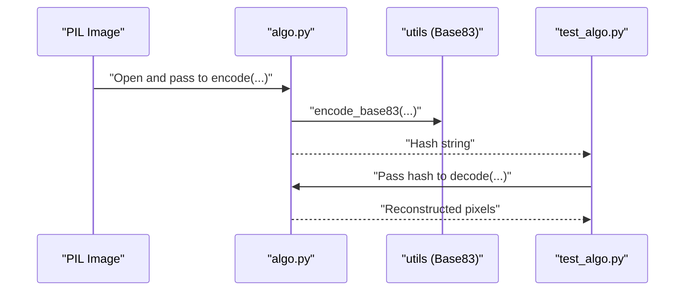
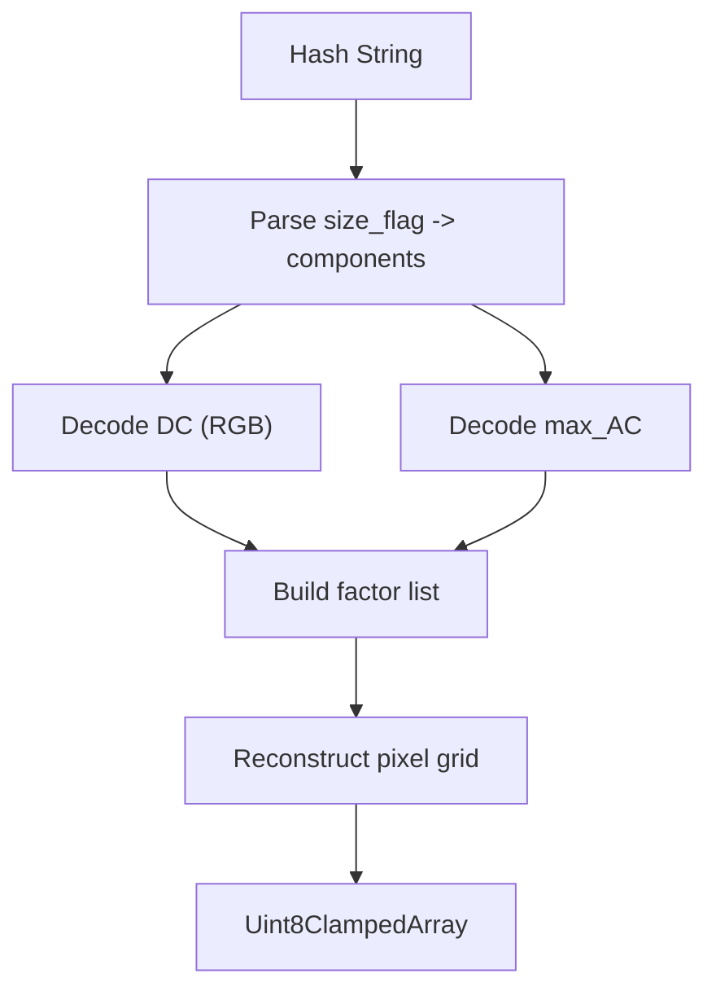
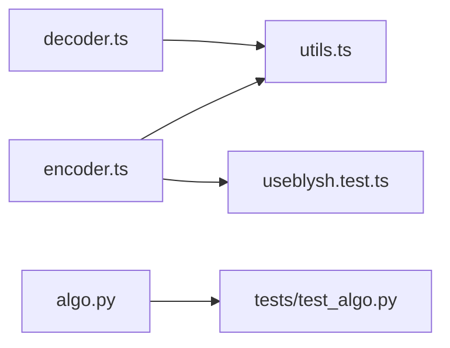

# Core Algorithm

<cite>
**Referenced Files in This Document**
- [README.md](file://README.md)
- [packages/js-useblysh/src/encoder.ts](file://packages/js-useblysh/src/encoder.ts)
- [packages/js-useblysh/src/decoder.ts](file://packages/js-useblysh/src/decoder.ts)
- [packages/js-useblysh/src/utils.ts](file://packages/js-useblysh/src/utils.ts)
- [packages/js-useblysh/src/useblysh.test.ts](file://packages/js-useblysh/src/useblysh.test.ts)
- [packages/py-useblysh/tests/test_algo.py](file://packages/py-useblysh/tests/test_algo.py)
- [packages/py-useblysh/useblysh/algo.py](file://packages/py-useblysh/useblysh/algo.py)
</cite>

## Table of Contents
1. [Introduction](#introduction)
2. [Project Structure](#project-structure)
3. [Core Components](#core-components)
4. [Architecture Overview](#architecture-overview)
5. [Detailed Component Analysis](#detailed-component-analysis)
6. [Dependency Analysis](#dependency-analysis)
7. [Performance Considerations](#performance-considerations)
8. [Troubleshooting Guide](#troubleshooting-guide)
9. [Conclusion](#conclusion)

## Introduction
This document explains the core Blysh hashing algorithm with emphasis on the mathematical foundation and implementation details. The algorithm leverages the Discrete Cosine Transform (DCT) to extract dominant color frequencies from images, compresses them into a compact Base83-encoded string, and reconstructs a smooth, low-resolution placeholder during decoding. It also documents the identical logic across JavaScript and Python implementations, the role of components_x/components_y parameters in controlling hash quality and resolution, and practical performance characteristics.

## Project Structure
The repository provides a unified hashing pipeline with platform-specific packages:
- JavaScript package: encoding/decoding utilities and tests
- Python package: algorithm implementation and tests
- Cross-language documentation and examples

**Diagram sources**
- [README.md:154-163](file://README.md#L154-L163)
- [packages/js-useblysh/src/encoder.ts:72-96](file://packages/js-useblysh/src/encoder.ts#L72-L96)
- [packages/js-useblysh/src/decoder.ts:1-45](file://packages/js-useblysh/src/decoder.ts#L1-L45)
- [packages/js-useblysh/src/utils.ts:1-200](file://packages/js-useblysh/src/utils.ts#L1-L200)
- [packages/js-useblysh/src/useblysh.test.ts:1-41](file://packages/js-useblysh/src/useblysh.test.ts#L1-L41)
- [packages/py-useblysh/tests/test_algo.py:1-29](file://packages/py-useblysh/tests/test_algo.py#L1-L29)
- [packages/py-useblysh/useblysh/algo.py:1-400](file://packages/py-useblysh/useblysh/algo.py#L1-L400)

**Section sources**
- [README.md:154-163](file://README.md#L154-L163)

## Core Components
- Encoder: downsamples input to a fixed size, computes DCT-based frequency factors, quantizes AC coefficients, and produces a Base83 string.
- Decoder: parses the Base83 string, reconstructs DC/AC factors, applies gamma-to-linear transforms, and renders pixel data.
- Utilities: Base83 encoding/decoding and color-space conversions.
- Tests: cross-language validation of encoding/decoding round-trips and parameter constraints.

Key implementation anchors:
- Encoding entry points and canvas-based preprocessing in JavaScript
- Decoding entry point and reconstruction loop in JavaScript
- Python algorithm module and unit tests

**Section sources**
- [packages/js-useblysh/src/encoder.ts:72-96](file://packages/js-useblysh/src/encoder.ts#L72-L96)
- [packages/js-useblysh/src/decoder.ts:1-45](file://packages/js-useblysh/src/decoder.ts#L1-L45)
- [packages/js-useblysh/src/utils.ts:1-200](file://packages/js-useblysh/src/utils.ts#L1-L200)
- [packages/py-useblysh/tests/test_algo.py:1-29](file://packages/py-useblysh/tests/test_algo.py#L1-L29)
- [packages/py-useblysh/useblysh/algo.py:1-400](file://packages/py-useblysh/useblysh/algo.py#L1-L400)

## Architecture Overview
The Blysh pipeline transforms an image into a compact hash and back into a low-resolution placeholder.

**Diagram sources**
- [packages/js-useblysh/src/encoder.ts:72-96](file://packages/js-useblysh/src/encoder.ts#L72-L96)
- [packages/js-useblysh/src/decoder.ts:1-45](file://packages/js-useblysh/src/decoder.ts#L1-L45)
- [packages/py-useblysh/useblysh/algo.py:1-400](file://packages/py-useblysh/useblysh/algo.py#L1-L400)

## Detailed Component Analysis

### Mathematical Foundation: Discrete Cosine Transform (DCT)
- Purpose: Extract dominant color frequencies from local regions of the image. DCT concentrates energy into a few low-frequency coefficients, enabling strong compression and robust perceptual representation.
- Dominant components:
  - DC coefficient: average color across the region.
  - AC coefficients: variations around the average per color channel.
- Quantization: AC coefficients are quantized to reduce bit count while preserving perceptual fidelity.
- Reconstruction: The decoder reconstructs a low-resolution grid using these factors and applies smoothing for visual appeal.

Why DCT is effective:
- Energy compaction: most visually important information resides in a small subset of coefficients.
- Separability: 2D DCT can be computed via 1D transforms along rows and columns.
- Compact representation: small number of factors suffices for recognizable placeholders.

[No sources needed since this section explains general principles]

### Hash Generation Process
End-to-end steps implemented in both JavaScript and Python:

1. Preprocessing
   - Downsample to a fixed size (e.g., 32x32) for consistency and performance.
   - Convert to linear color space for perceptual accuracy.
   - Split into blocks defined by components_x and components_y.

2. DCT Transformation
   - Compute 2D DCT per color channel within each block.
   - Capture DC and a bounded set of AC coefficients.

3. Quantization
   - Normalize and quantize AC coefficients to a reduced integer alphabet.
   - Store a global maximum for AC scaling during decoding.

4. Base83 Encoding
   - Encode size flag (derived from components_x/components_y).
   - Encode global AC maximum.
   - Encode DC as RGB triples.
   - Encode AC coefficients in groups.

[No sources needed since this diagram summarizes the process conceptually]

**Section sources**
- [README.md:154-163](file://README.md#L154-L163)
- [packages/js-useblysh/src/encoder.ts:72-96](file://packages/js-useblysh/src/encoder.ts#L72-L96)
- [packages/py-useblysh/tests/test_algo.py:14-20](file://packages/py-useblysh/tests/test_algo.py#L14-L20)

### JavaScript Implementation Details
- Encoding:
  - Canvas-based downsampling to 32x32.
  - Factor extraction and quantization.
  - Base83 encoding of size flag, max AC, DC, and AC coefficients.
- Decoding:
  - Parses size flag to derive components.
  - Decodes DC and AC, applies inverse transforms, and writes pixel data.
  - Supports a punch parameter to adjust AC strength.

**Diagram sources**
- [packages/js-useblysh/src/encoder.ts:72-96](file://packages/js-useblysh/src/encoder.ts#L72-L96)
- [packages/js-useblysh/src/decoder.ts:1-45](file://packages/js-useblysh/src/decoder.ts#L1-L45)
- [packages/js-useblysh/src/utils.ts:1-200](file://packages/js-useblysh/src/utils.ts#L1-L200)

**Section sources**
- [packages/js-useblysh/src/encoder.ts:72-96](file://packages/js-useblysh/src/encoder.ts#L72-L96)
- [packages/js-useblysh/src/decoder.ts:1-45](file://packages/js-useblysh/src/decoder.ts#L1-L45)
- [packages/js-useblysh/src/utils.ts:1-200](file://packages/js-useblysh/src/utils.ts#L1-L200)
- [packages/js-useblysh/src/useblysh.test.ts:1-41](file://packages/js-useblysh/src/useblysh.test.ts#L1-L41)

### Python Implementation Details
- Algorithm module:
  - Accepts PIL images and parameters components_x/components_y.
  - Performs equivalent preprocessing, DCT, quantization, and Base83 encoding.
- Tests:
  - Verify round-trip correctness and parameter bounds.

**Diagram sources**
- [packages/py-useblysh/useblysh/algo.py:1-400](file://packages/py-useblysh/useblysh/algo.py#L1-L400)
- [packages/py-useblysh/tests/test_algo.py:1-29](file://packages/py-useblysh/tests/test_algo.py#L1-L29)

**Section sources**
- [packages/py-useblysh/tests/test_algo.py:1-29](file://packages/py-useblysh/tests/test_algo.py#L1-L29)
- [packages/py-useblysh/useblysh/algo.py:1-400](file://packages/py-useblysh/useblysh/algo.py#L1-L400)

### Base83 Encoding System
- Purpose: Compact representation of integers using a 83-character alphabet, minimizing string length compared to base64.
- Encoding:
  - Fixed-length tokens encode small integers efficiently.
  - Size flag encodes components_x and components_y.
  - Global AC maximum normalizes AC coefficients during decoding.
- Decoding:
  - Reverses the mapping to recover integers and reconstruct factors.

Advantages over base64:
- Fewer characters increase readability and reduce URL/CSS payload overhead.
- Predictable token lengths simplify parsing.

**Section sources**
- [packages/js-useblysh/src/utils.ts:1-200](file://packages/js-useblysh/src/utils.ts#L1-L200)
- [packages/py-useblysh/tests/test_algo.py:7-12](file://packages/py-useblysh/tests/test_algo.py#L7-L12)
- [packages/py-useblysh/useblysh/algo.py:1-400](file://packages/py-useblysh/useblysh/algo.py#L1-L400)

### Relationship Between Hash Quality and Detail Levels
- components_x/components_y control the block grid:
  - Higher values increase the number of DCT blocks, capturing more spatial detail.
  - Lower values reduce data and improve compression but decrease fidelity.
- Size flag embedded in the hash encodes these parameters, allowing the decoder to reconstruct the intended grid.

Validation:
- Tests enforce parameter bounds and verify correct hash length and type.

**Section sources**
- [packages/js-useblysh/src/useblysh.test.ts:31-35](file://packages/js-useblysh/src/useblysh.test.ts#L31-L35)
- [packages/py-useblysh/tests/test_algo.py:21-27](file://packages/py-useblysh/tests/test_algo.py#L21-L27)

### Decoding Reconstruction
- The decoder interprets the size flag to compute components, decodes DC and AC, scales AC by the stored maximum, and reconstructs pixel values.
- Color space conversion ensures perceptual accuracy.
- Optional punch parameter modulates AC strength for stylistic control.

**Diagram sources**
- [packages/js-useblysh/src/decoder.ts:1-45](file://packages/js-useblysh/src/decoder.ts#L1-L45)

**Section sources**
- [packages/js-useblysh/src/decoder.ts:1-45](file://packages/js-useblysh/src/decoder.ts#L1-L45)

## Dependency Analysis
- JavaScript encoder depends on utils for Base83 and color-space helpers.
- Decoder depends on utils for Base83 and color-space helpers.
- Python algorithm module underpins tests that assert correctness and parameter validation.

**Diagram sources**
- [packages/js-useblysh/src/encoder.ts:72-96](file://packages/js-useblysh/src/encoder.ts#L72-L96)
- [packages/js-useblysh/src/decoder.ts:1-45](file://packages/js-useblysh/src/decoder.ts#L1-L45)
- [packages/js-useblysh/src/utils.ts:1-200](file://packages/js-useblysh/src/utils.ts#L1-L200)
- [packages/js-useblysh/src/useblysh.test.ts:1-41](file://packages/js-useblysh/src/useblysh.test.ts#L1-L41)
- [packages/py-useblysh/tests/test_algo.py:1-29](file://packages/py-useblysh/tests/test_algo.py#L1-L29)
- [packages/py-useblysh/useblysh/algo.py:1-400](file://packages/py-useblysh/useblysh/algo.py#L1-L400)

**Section sources**
- [packages/js-useblysh/src/encoder.ts:72-96](file://packages/js-useblysh/src/encoder.ts#L72-L96)
- [packages/js-useblysh/src/decoder.ts:1-45](file://packages/js-useblysh/src/decoder.ts#L1-L45)
- [packages/js-useblysh/src/utils.ts:1-200](file://packages/js-useblysh/src/utils.ts#L1-L200)
- [packages/py-useblysh/tests/test_algo.py:1-29](file://packages/py-useblysh/tests/test_algo.py#L1-L29)
- [packages/py-useblysh/useblysh/algo.py:1-400](file://packages/py-useblysh/useblysh/algo.py#L1-L400)

## Performance Considerations
- Fixed-size preprocessing (e.g., 32x32) reduces computational cost and memory footprint.
- DCT is applied per block; increasing components_x/components_y increases work but improves fidelity.
- Base83 encoding minimizes string size compared to base64, lowering bandwidth and storage costs.
- Memory usage is proportional to the number of blocks and the fixed pixel buffer size.

[No sources needed since this section provides general guidance]

## Troubleshooting Guide
Common issues and remedies:
- Invalid hash:
  - Cause: Empty or too-short hash string.
  - Fix: Ensure the hash meets minimum length and is produced by the same encoder.
- Parameter out of range:
  - Cause: components_x or components_y outside [1..9].
  - Fix: Clamp to supported range and re-encode.
- Color banding or low contrast:
  - Cause: Low components values or insufficient AC scaling.
  - Fix: Increase components or adjust punch during decoding.

**Section sources**
- [packages/js-useblysh/src/decoder.ts:9-11](file://packages/js-useblysh/src/decoder.ts#L9-L11)
- [packages/js-useblysh/src/useblysh.test.ts:31-40](file://packages/js-useblysh/src/useblysh.test.ts#L31-L40)
- [packages/py-useblysh/tests/test_algo.py:21-27](file://packages/py-useblysh/tests/test_algo.py#L21-L27)

## Conclusion
Blysh achieves compact, high-quality image placeholders by leveraging DCT to capture dominant color frequencies, quantizing and encoding them into a Base83 string. The identical logic across JavaScript and Python enables full-stack compatibility, while components_x/components_y provide tunable control over quality and data size. The approach balances performance, memory usage, and visual fidelity for modern web experiences.