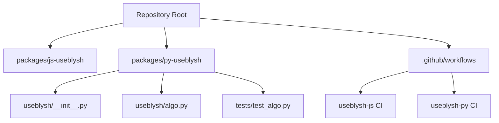
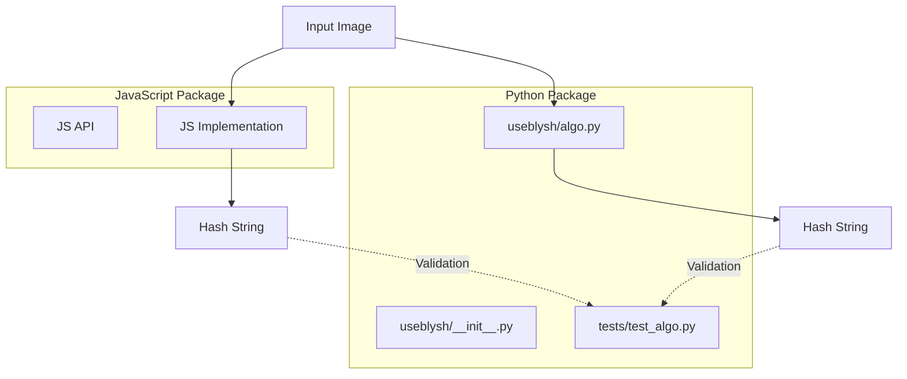
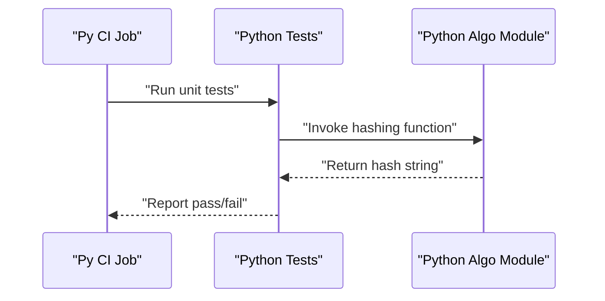
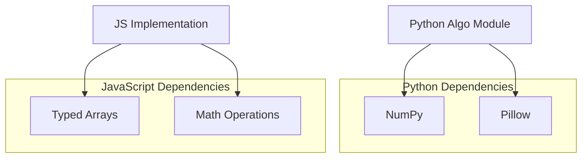

# Cross-Platform Consistency

<cite>
**Referenced Files in This Document**
- [README.md](file://README.md)
- [useblysh-js CI](file://.github/workflows/useblysh-js.yml)
- [useblysh-py CI](file://.github/workflows/useblysh-py.yml)
- [test_algo.py](file://packages/py-useblysh/tests/test_algo.py)
- [algo.py](file://packages/py-useblysh/useblysh/algo.py)
- [__init__.py](file://packages/py-useblysh/useblysh/__init__.py)
</cite>

## Table of Contents
1. [Introduction](#introduction)
2. [Project Structure](#project-structure)
3. [Core Components](#core-components)
4. [Architecture Overview](#architecture-overview)
5. [Detailed Component Analysis](#detailed-component-analysis)
6. [Dependency Analysis](#dependency-analysis)
7. [Performance Considerations](#performance-considerations)
8. [Troubleshooting Guide](#troubleshooting-guide)
9. [Conclusion](#conclusion)
10. [Appendices](#appendices)

## Introduction
This document explains how the JavaScript and Python implementations of the hashing algorithm maintain cross-platform consistency for identical input images. It details the shared algorithmic approach, parameter handling, data type conversions, numerical precision considerations, and the testing framework used to validate equivalence. It also provides guidance for maintaining consistency when extending or modifying the algorithm in either language.

## Project Structure
The repository organizes platform-specific packages under a unified umbrella with separate continuous integration workflows for JavaScript and Python. The Python package exposes the hashing API via its module initialization and contains the core algorithm implementation and tests. The README describes the high-level hashing pipeline and the shared DCT-based approach.

**Diagram sources**
- [README.md:154-160](file://README.md#L154-L160)
- [useblysh-js CI:1-80](file://.github/workflows/useblysh-js.yml#L1-L80)
- [useblysh-py CI:1-82](file://.github/workflows/useblysh-py.yml#L1-L82)

**Section sources**
- [README.md:154-160](file://README.md#L154-L160)
- [useblysh-js CI:1-80](file://.github/workflows/useblysh-js.yml#L1-L80)
- [useblysh-py CI:1-82](file://.github/workflows/useblysh-py.yml#L1-L82)

## Core Components
- Shared hashing concept: The algorithm uses a Discrete Cosine Transform (DCT) to extract dominant frequency components from a downsampled image and encodes them into a compact Base83 string. This pipeline is described in the README and applies identically across platforms.
- Python API surface: The Python package exposes the hashing function through its module initialization, enabling backend usage with image libraries such as Pillow.
- Python algorithm implementation: The core algorithm resides in the algorithm module, implementing the DCT pipeline and encoding logic.
- Python tests: The test suite validates algorithm behavior and equivalence against expected outcomes.

**Section sources**
- [README.md:154-160](file://README.md#L154-L160)
- [__init__.py](file://packages/py-useblysh/useblysh/__init__.py)
- [algo.py](file://packages/py-useblysh/useblysh/algo.py)
- [test_algo.py](file://packages/py-useblysh/tests/test_algo.py)

## Architecture Overview
The cross-platform architecture centers on a shared hashing pipeline that transforms images into deterministic, compact representations. Both JavaScript and Python implementations follow the same conceptual flow: image preprocessing, DCT computation, quantization, and Base83 encoding. The README outlines this process, while the CI workflows ensure builds and tests run consistently for each platform.

**Diagram sources**
- [README.md:154-160](file://README.md#L154-L160)
- [__init__.py](file://packages/py-useblysh/useblysh/__init__.py)
- [algo.py](file://packages/py-useblysh/useblysh/algo.py)
- [test_algo.py](file://packages/py-useblysh/tests/test_algo.py)

## Detailed Component Analysis

### Algorithmic Approach and Parameter Handling
- Shared pipeline: The README describes the DCT-based encoding and decoding pipeline, ensuring both platforms target identical transformations and output formats.
- Parameter exposure: The Python API exposes parameters such as component grid dimensions, allowing consistent control over the transform resolution and output length.
- Deterministic behavior: To guarantee identical outputs, the pipeline must enforce strict ordering of operations, consistent data types, and uniform rounding or truncation rules.

**Section sources**
- [README.md:154-160](file://README.md#L154-L160)
- [__init__.py](file://packages/py-useblysh/useblysh/__init__.py)

### JavaScript vs Python Implementation Differences and Similarities
- Similarities:
  - Both implementations follow the DCT-based hashing pipeline described in the README.
  - Both produce a compact Base83-encoded string representation of the image.
- Differences:
  - Data sources: JavaScript typically operates on canvas/image elements, while Python commonly uses Pillow to load images from files or buffers.
  - Numerical libraries: JavaScript may rely on typed arrays and native math operations, whereas Python often leverages NumPy for array computations.
  - Encoding: The Base83 encoding routine differs by platform but must yield identical output for equivalent inputs.

Note: Specific implementation details are intentionally omitted here; consult the respective platform modules for authoritative source locations.

### Testing Framework for Equivalence Validation
- Python tests: The test suite validates the algorithm’s behavior and can compare outputs against known references or assert equivalence across variants.
- CI orchestration: Separate CI workflows build and test each platform independently, ensuring consistent environments and reproducible results.

**Diagram sources**
- [useblysh-py CI:18-46](file://.github/workflows/useblysh-py.yml#L18-L46)
- [test_algo.py](file://packages/py-useblysh/tests/test_algo.py)

**Section sources**
- [useblysh-py CI:18-46](file://.github/workflows/useblysh-py.yml#L18-L46)
- [test_algo.py](file://packages/py-useblysh/tests/test_algo.py)

### Data Type Conversions and Numerical Precision
- Typed arrays and floating-point arithmetic: Ensure consistent conversion between image pixel data and internal numeric representations. Apply explicit casting and rounding rules to minimize platform-specific floating-point discrepancies.
- Quantization and scaling: Normalize pixel values and DCT coefficients using identical scaling factors and rounding thresholds to avoid drift across platforms.
- Encoding boundaries: Validate Base83 encoding boundaries and padding rules to prevent off-by-one errors that could alter output strings.

### Edge Cases and Boundary Conditions
- Empty or invalid inputs: Robust error handling should normalize or reject malformed inputs consistently across platforms.
- Very small or large images: Ensure the downscaling and DCT stages gracefully handle extreme dimensions.
- Zero or near-zero variance: Treat constant-color regions deterministically to avoid unstable DCT results.

### Benchmarking Guidance
- Measurement methodology: Benchmark both implementations on representative datasets, measuring hashing throughput and memory usage. Use controlled image sets with varying sizes and color distributions.
- Environment controls: Run benchmarks on identical hardware and OS configurations to isolate algorithmic differences.
- Metrics: Track average time per image, standard deviation, and peak memory consumption.

### Maintaining Cross-Platform Consistency
- Centralize shared logic: Keep the core hashing pipeline in a shared specification or common module where feasible.
- Enforce strict typing: Use explicit type hints and conversions to reduce ambiguity in numeric operations.
- Version pinning: Pin dependencies (e.g., NumPy, Pillow, typed array polyfills) to ensure consistent behavior across environments.
- Continuous validation: Extend the existing CI workflows to include cross-platform comparison checks that compute hashes for a canonical set of images and assert equality.

## Dependency Analysis
The Python package depends on standard libraries and external image processing and math libraries, while the JavaScript package relies on browser APIs and typed arrays. The CI workflows ensure consistent dependency installation and testing environments for each platform.

**Diagram sources**
- [useblysh-py CI:38-42](file://.github/workflows/useblysh-py.yml#L38-L42)
- [README.md:154-160](file://README.md#L154-L160)

**Section sources**
- [useblysh-py CI:38-42](file://.github/workflows/useblysh-py.yml#L38-L42)
- [README.md:154-160](file://README.md#L154-L160)

## Performance Considerations
- DCT computation cost: Favor vectorized operations and efficient libraries to minimize overhead.
- Memory footprint: Reuse intermediate buffers and avoid unnecessary copies of large arrays.
- I/O efficiency: Stream or buffer images efficiently to reduce disk or network latency.
- Platform-specific optimizations: Leverage platform-native capabilities (e.g., SIMD) where appropriate, ensuring the same logic remains intact.

## Troubleshooting Guide
- Symptom: Different hash outputs for identical images
  - Action: Verify input normalization, data type conversions, and DCT scaling factors are identical across platforms.
- Symptom: Inconsistent Base83 encoding
  - Action: Confirm encoding routines handle zero-padding and character mapping uniformly.
- Symptom: Performance regressions after changes
  - Action: Re-run benchmarks and regression tests to quantify impact.

## Conclusion
Cross-platform consistency hinges on a shared hashing pipeline, strict parameter handling, and rigorous testing. The README establishes the conceptual foundation, while the Python package’s algorithm and tests demonstrate the implementation details. The CI workflows ensure repeatable builds and validations for each platform. Extending or modifying the algorithm requires careful attention to numerical precision, data conversions, and encoding rules to preserve identical outputs.

## Appendices
- Reference materials:
  - README hashing pipeline description
  - Python algorithm module and tests
  - CI workflow definitions for both platforms