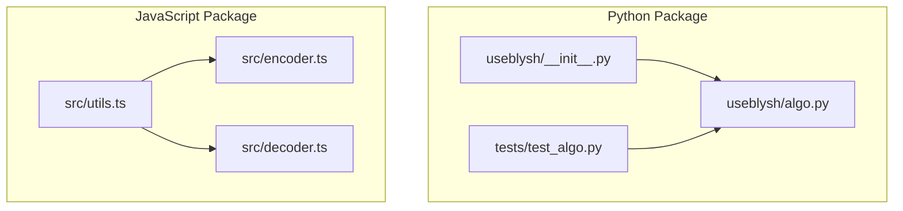
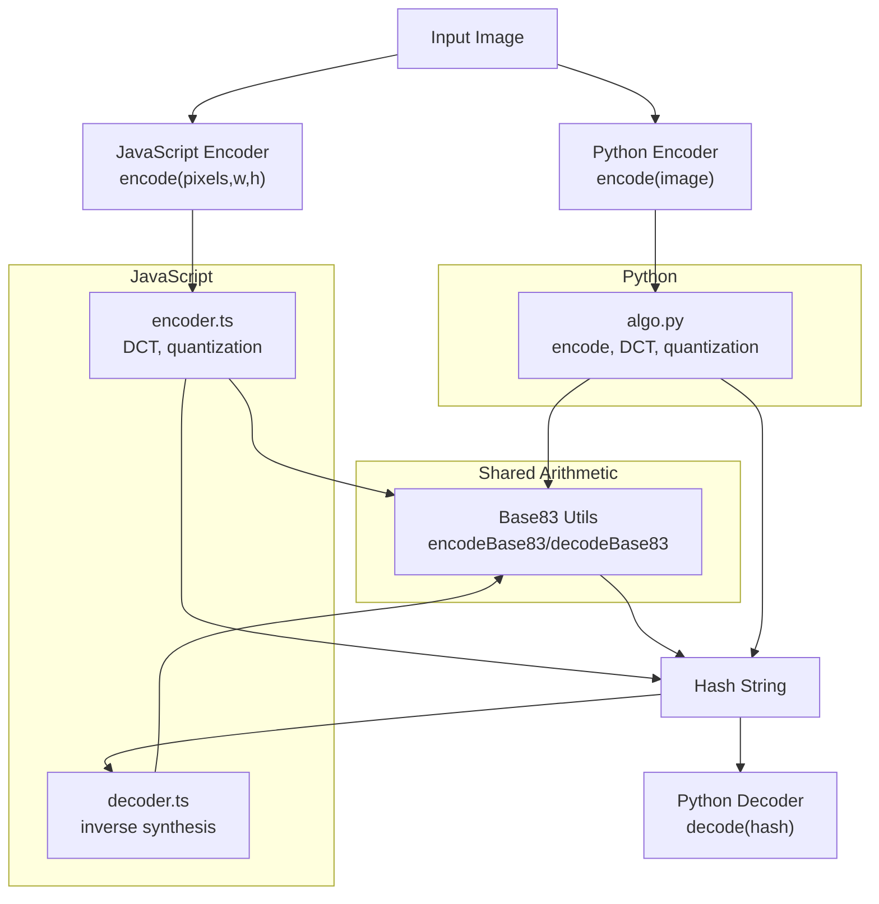
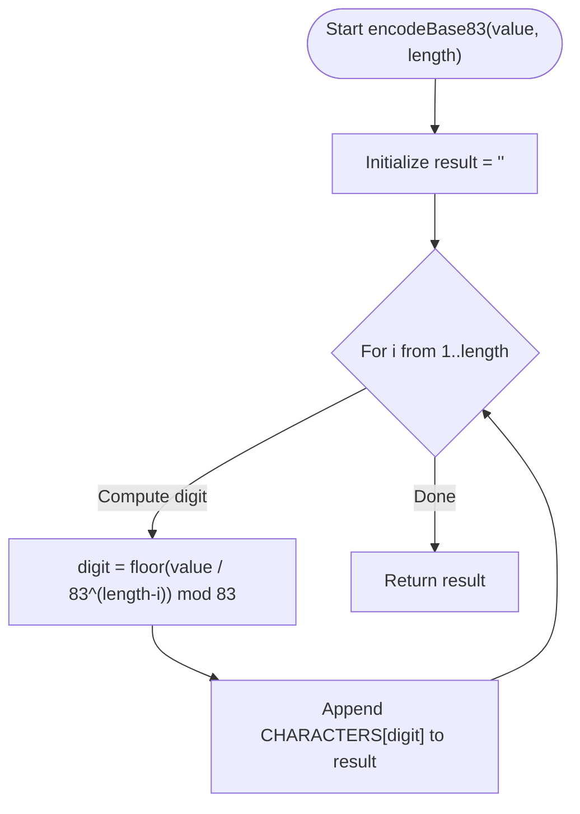
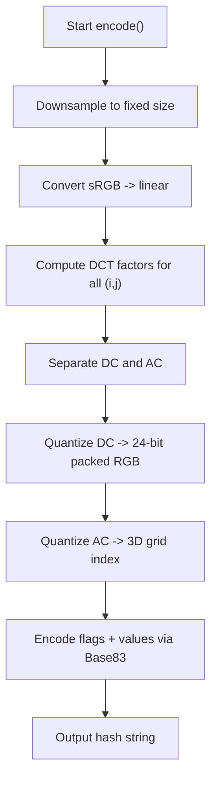
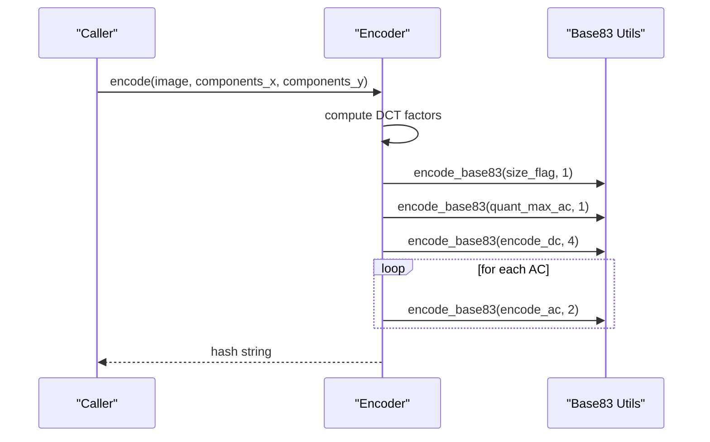
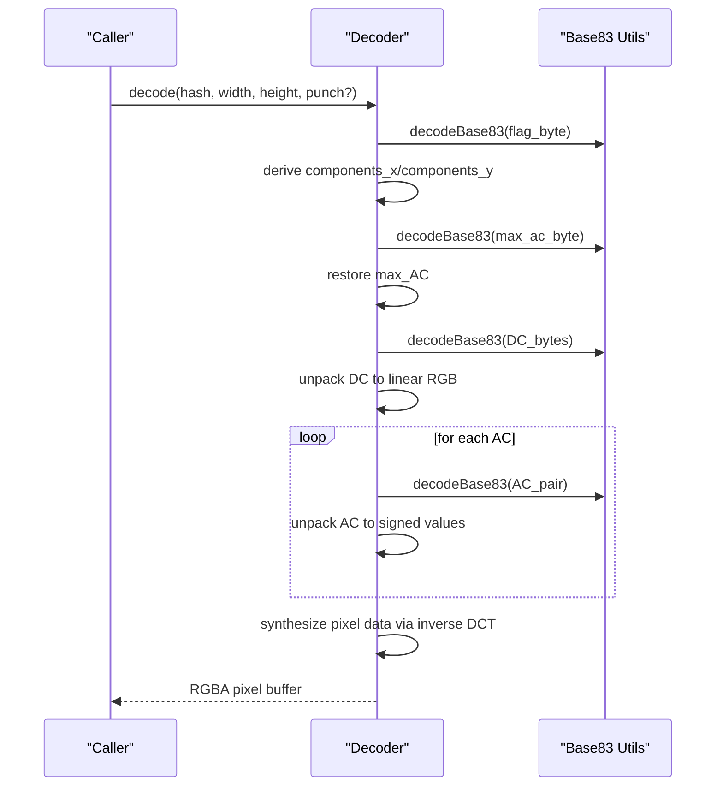
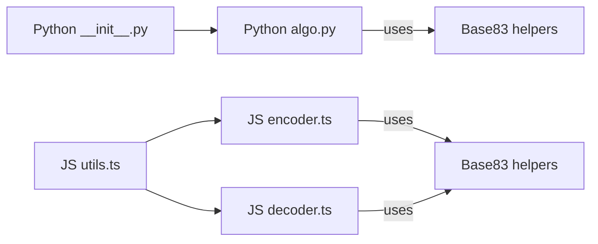

# Encoding Systems

<cite>
**Referenced Files in This Document**
- [README.md](file://README.md)
- [algo.py](file://packages/py-useblysh/useblysh/algo.py)
- [__init__.py](file://packages/py-useblysh/useblysh/__init__.py)
- [test_algo.py](file://packages/py-useblysh/tests/test_algo.py)
- [utils.ts](file://packages/js-useblysh/src/utils.ts)
- [encoder.ts](file://packages/js-useblysh/src/encoder.ts)
- [decoder.ts](file://packages/js-useblysh/src/decoder.ts)
</cite>

## Table of Contents
1. [Introduction](#introduction)
2. [Project Structure](#project-structure)
3. [Core Components](#core-components)
4. [Architecture Overview](#architecture-overview)
5. [Detailed Component Analysis](#detailed-component-analysis)
6. [Dependency Analysis](#dependency-analysis)
7. [Performance Considerations](#performance-considerations)
8. [Troubleshooting Guide](#troubleshooting-guide)
9. [Conclusion](#conclusion)

## Introduction
This document explains the encoding systems used by the project to represent image visual fingerprints as compact, readable strings. The system:
- Uses Discrete Cosine Transform (DCT) to extract dominant frequency components from images
- Quantizes and encodes the DC (average color) and AC (detail) coefficients
- Encodes the resulting data using a custom Base83 scheme for space efficiency and safe transport
- Provides symmetric encoding and decoding across Python and JavaScript implementations

The Base83 alphabet is carefully chosen to avoid common URL/HTML/JSON delimiters and special characters, improving portability and reducing parsing overhead.

## Project Structure
The encoding system spans two language implementations:
- Python package implementing the core algorithm and exposing public APIs
- JavaScript package implementing equivalent encoding/decoding and React helpers

**Diagram sources**
- [__init__.py:1-5](file://packages/py-useblysh/useblysh/__init__.py#L1-L5)
- [algo.py:1-112](file://packages/py-useblysh/useblysh/algo.py#L1-L112)
- [test_algo.py:1-30](file://packages/py-useblysh/tests/test_algo.py#L1-L30)
- [utils.ts:1-37](file://packages/js-useblysh/src/utils.ts#L1-L37)
- [encoder.ts:1-97](file://packages/js-useblysh/src/encoder.ts#L1-L97)
- [decoder.ts:1-67](file://packages/js-useblysh/src/decoder.ts#L1-L67)

**Section sources**
- [README.md:154-160](file://README.md#L154-L160)
- [__init__.py:1-5](file://packages/py-useblysh/useblysh/__init__.py#L1-L5)
- [utils.ts:1-37](file://packages/js-useblysh/src/utils.ts#L1-L37)

## Core Components
- Base83 character set and arithmetic
  - Character set: a 83-character string designed for safe transport
  - Encoding: converts numeric values to fixed-length Base83 strings
  - Decoding: reverses the mapping to recover numeric values
- DCT-based image fingerprinting
  - Downsamples to a fixed resolution
  - Converts sRGB to linear color space
  - Computes DCT basis contributions per color channel
  - Quantizes DC and AC coefficients into compact indices
- Encoding pipeline
  - Stores size flags, normalized maximum AC magnitude, DC color, and AC quantized values
- Decoding pipeline
  - Parses flags to reconstruct component grid
  - Recovers DC color and AC magnitudes
  - Reconstructs pixel data via inverse DCT synthesis

**Section sources**
- [algo.py:5-20](file://packages/py-useblysh/useblysh/algo.py#L5-L20)
- [utils.ts:1-20](file://packages/js-useblysh/src/utils.ts#L1-L20)
- [encoder.ts:3-77](file://packages/js-useblysh/src/encoder.ts#L3-L77)
- [decoder.ts:3-66](file://packages/js-useblysh/src/decoder.ts#L3-L66)

## Architecture Overview
The encoding system follows a consistent pipeline across languages, with shared logic for DCT computation and Base83 arithmetic.

**Diagram sources**
- [algo.py:39-112](file://packages/py-useblysh/useblysh/algo.py#L39-L112)
- [encoder.ts:3-77](file://packages/js-useblysh/src/encoder.ts#L3-L77)
- [decoder.ts:3-66](file://packages/js-useblysh/src/decoder.ts#L3-L66)
- [utils.ts:1-20](file://packages/js-useblysh/src/utils.ts#L1-L20)

## Detailed Component Analysis

### Base83 Encoding and Decoding
- Character set
  - 83 printable ASCII characters optimized for URLs and identifiers
  - Avoids common delimiters and unsafe characters
- Encoding algorithm
  - Fixed-length output determined by requested length
  - Iteratively computes digits in base 83 using powers and modulo
- Decoding algorithm
  - Iteratively accumulates value using base 83 arithmetic
  - Uses index lookup for each character
- Data integrity
  - Deterministic mapping ensures round-trip correctness
  - Length parameter controls output width for grouping

**Diagram sources**
- [algo.py:8-13](file://packages/py-useblysh/useblysh/algo.py#L8-L13)
- [utils.ts:3-10](file://packages/js-useblysh/src/utils.ts#L3-L10)

**Section sources**
- [algo.py:5-20](file://packages/py-useblysh/useblysh/algo.py#L5-L20)
- [utils.ts:1-20](file://packages/js-useblysh/src/utils.ts#L1-L20)

### DCT Coefficient Extraction and Quantization
- Input pipeline
  - Downsample to a fixed size
  - Convert sRGB to linear color space
- Basis computation
  - Cosine basis functions in both dimensions
  - Normalization accounts for DC terms
- Coefficient calculation
  - Sum over pixels of basis-weighted color channels
  - Scale by normalization constant
- Quantization
  - DC: packed as a 24-bit RGB triplet
  - AC: normalized by a global maximum, then mapped to a 3D grid

**Diagram sources**
- [algo.py:39-112](file://packages/py-useblysh/useblysh/algo.py#L39-L112)
- [encoder.ts:3-77](file://packages/js-useblysh/src/encoder.ts#L3-L77)

**Section sources**
- [algo.py:39-112](file://packages/py-useblysh/useblysh/algo.py#L39-L112)
- [encoder.ts:3-77](file://packages/js-useblysh/src/encoder.ts#L3-L77)

### Encoding Pipeline Details
- Size flag
  - Encodes components_x and components_y in a single digit
  - Enforces bounds for both dimensions
- Maximum AC magnitude
  - Quantized to a single Base83 digit with clamping
  - Actual maximum recovered during decoding
- DC encoding
  - Linear RGB components converted to sRGB bytes, packed into 24 bits
- AC encoding
  - Each AC coefficient quantized into a 3D grid
  - Grid index computed from three quantized axes

**Diagram sources**
- [algo.py:92-111](file://packages/py-useblysh/useblysh/algo.py#L92-L111)
- [encoder.ts:40-76](file://packages/js-useblysh/src/encoder.ts#L40-L76)

**Section sources**
- [algo.py:39-112](file://packages/py-useblysh/useblysh/algo.py#L39-L112)
- [encoder.ts:3-77](file://packages/js-useblysh/src/encoder.ts#L3-L77)

### Decoding Pipeline Details
- Parse flags
  - Recover components_x and components_y from size flag
  - Restore maximum AC magnitude from quantized value
- Rebuild coefficients
  - DC unpacked from 24-bit value and converted back to linear
  - AC indices unpacked and converted to signed values using power transform
- Reconstruction
  - Synthesize pixel data by evaluating cosine basis functions
  - Apply sRGB conversion and alpha channel assignment

**Diagram sources**
- [decoder.ts:3-66](file://packages/js-useblysh/src/decoder.ts#L3-L66)
- [algo.py:15-20](file://packages/py-useblysh/useblysh/algo.py#L15-L20)

**Section sources**
- [decoder.ts:3-66](file://packages/js-useblysh/src/decoder.ts#L3-L66)
- [algo.py:15-20](file://packages/py-useblysh/useblysh/algo.py#L15-L20)

### Character Set and Validation
- Character set definition
  - 83 characters including digits, uppercase/lowercase letters, and selected punctuation/special symbols
- Validation
  - Decoding relies on indexOf to locate each character’s position
  - Out-of-set characters will cause lookup failures during decoding
- Transport safety
  - Avoids common delimiters and whitespace to reduce escaping needs
  - Suitable for embedding in URLs, JSON, and HTML attributes

**Section sources**
- [utils.ts:1-20](file://packages/js-useblysh/src/utils.ts#L1-L20)
- [algo.py:5-6](file://packages/py-useblysh/useblysh/algo.py#L5-L6)

### Relationship Between Encoded Length and Quality
- Encoded length grows with the number of DCT components (components_x × components_y)
- More components generally capture finer detail, increasing string length
- Practical trade-off: higher component counts improve reconstruction fidelity but increase payload size

**Section sources**
- [encoder.ts:10-12](file://packages/js-useblysh/src/encoder.ts#L10-L12)
- [algo.py:40-41](file://packages/py-useblysh/useblysh/algo.py#L40-L41)

### Examples and Edge Cases
- Example formats
  - Hash strings consist of a size flag, a maximum AC magnitude indicator, a 4-digit DC segment, followed by pairs of AC segments
- Edge cases
  - Invalid component ranges trigger errors in both implementations
  - Empty or too-short hash strings are rejected during decoding
  - Out-of-set characters invalidate decoding
- Consistency
  - Both Python and JavaScript implementations share identical arithmetic and transforms

**Section sources**
- [test_algo.py:14-27](file://packages/py-useblysh/tests/test_algo.py#L14-L27)
- [decoder.ts:9-11](file://packages/js-useblysh/src/decoder.ts#L9-L11)
- [encoder.ts:10-12](file://packages/js-useblysh/src/encoder.ts#L10-L12)
- [algo.py:40-41](file://packages/py-useblysh/useblysh/algo.py#L40-L41)

## Dependency Analysis
- Cross-language parity
  - Python and JavaScript expose equivalent encode/decode functions
  - Shared color space conversions and sign-power transforms
- Internal dependencies
  - Encoder depends on Base83 utils and color transforms
  - Decoder depends on Base83 utils and color transforms
- Public exports
  - Python exposes encode and Base83 helpers via package init
  - JavaScript exports encoder, decoder, and utilities

**Diagram sources**
- [__init__.py:1-5](file://packages/py-useblysh/useblysh/__init__.py#L1-L5)
- [algo.py:1-112](file://packages/py-useblysh/useblysh/algo.py#L1-L112)
- [utils.ts:1-37](file://packages/js-useblysh/src/utils.ts#L1-L37)
- [encoder.ts:1-97](file://packages/js-useblysh/src/encoder.ts#L1-L97)
- [decoder.ts:1-67](file://packages/js-useblysh/src/decoder.ts#L1-L67)

**Section sources**
- [__init__.py:1-5](file://packages/py-useblysh/useblysh/__init__.py#L1-L5)
- [utils.ts:1-37](file://packages/js-useblysh/src/utils.ts#L1-L37)

## Performance Considerations
- Complexity
  - Encoding scales with O(width×height×components_x×components_y)
  - Decoding scales similarly for reconstruction
- Memory
  - Intermediate buffers for DCT factors and pixel synthesis
- Practical tips
  - Keep component counts moderate for small payloads
  - Pre-downsample images to the fixed size used by the encoder
  - Avoid unnecessary re-encoding by caching hash strings

[No sources needed since this section provides general guidance]

## Troubleshooting Guide
- Symptom: Decoding fails with “invalid hash”
  - Cause: Insufficient length or out-of-set characters
  - Action: Verify hash length and charset compliance
- Symptom: ValueError on encode with component ranges
  - Cause: components_x or components_y outside [1, 9]
  - Action: Adjust parameters to valid bounds
- Symptom: Incorrect colors or artifacts
  - Cause: Mismatched component counts between encode and decode
  - Action: Ensure consistent parameters across encode/decode calls

**Section sources**
- [decoder.ts:9-11](file://packages/js-useblysh/src/decoder.ts#L9-L11)
- [test_algo.py:21-27](file://packages/py-useblysh/tests/test_algo.py#L21-L27)
- [encoder.ts:10-12](file://packages/js-useblysh/src/encoder.ts#L10-L12)
- [algo.py:40-41](file://packages/py-useblysh/useblysh/algo.py#L40-L41)

## Conclusion
The encoding system combines DCT-based image summarization with a carefully designed Base83 scheme to produce compact, transportable hashes. Its symmetric Python and JavaScript implementations enable full-stack reuse, while the explicit quantization and normalization steps ensure consistent reconstruction quality across platforms.

[No sources needed since this section summarizes without analyzing specific files]