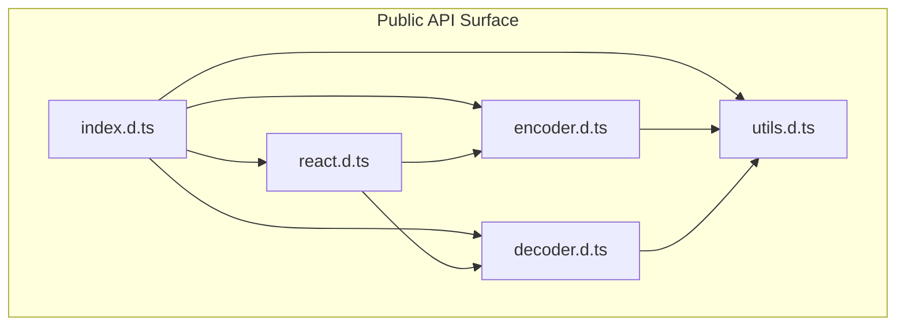
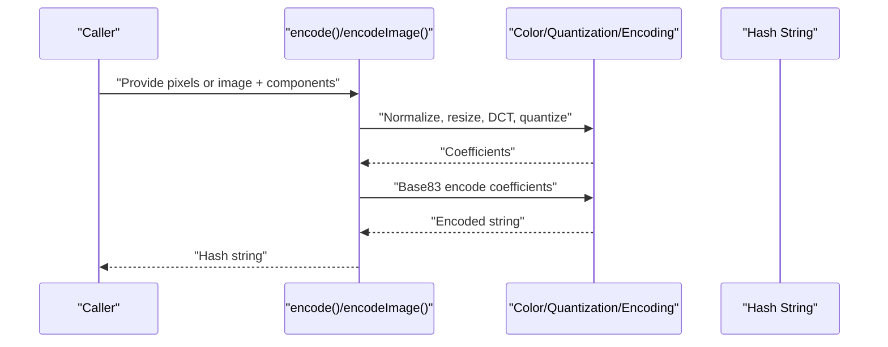
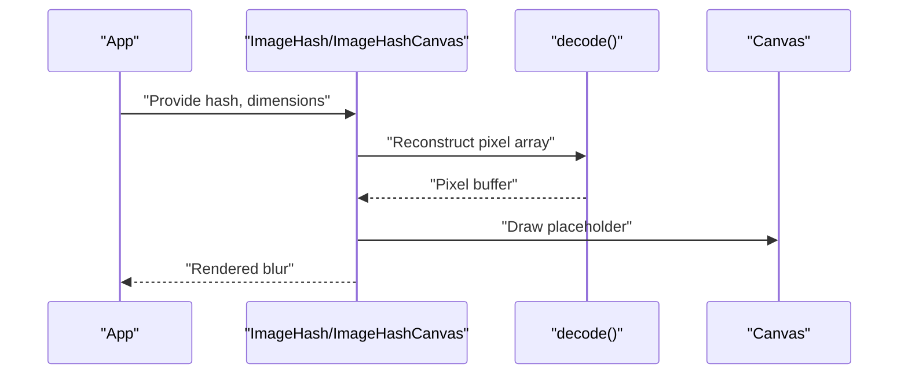
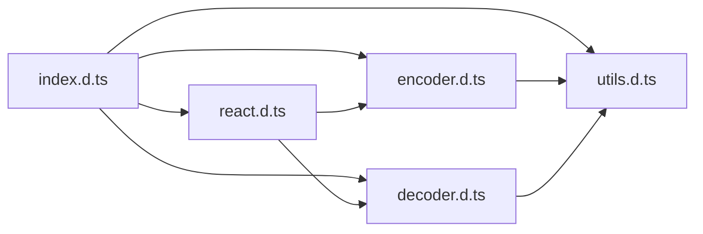

# Hash Generation Process

<cite>
**Referenced Files in This Document**
- [README.md](file://README.md)
- [encoder.d.ts](file://packages/js-useblysh/dist/encoder.d.ts)
- [decoder.d.ts](file://packages/js-useblysh/dist/decoder.d.ts)
- [utils.d.ts](file://packages/js-useblysh/dist/utils.d.ts)
- [react.d.ts](file://packages/js-useblysh/dist/react.d.ts)
- [index.d.ts](file://packages/js-useblysh/dist/index.d.ts)
</cite>

## Table of Contents
1. [Introduction](#introduction)
2. [Project Structure](#project-structure)
3. [Core Components](#core-components)
4. [Architecture Overview](#architecture-overview)
5. [Detailed Component Analysis](#detailed-component-analysis)
6. [Dependency Analysis](#dependency-analysis)
7. [Performance Considerations](#performance-considerations)
8. [Troubleshooting Guide](#troubleshooting-guide)
9. [Conclusion](#conclusion)

## Introduction
This document explains the complete hash generation process used by the library to transform images into compact, deterministic strings suitable for rendering fast, blurred placeholders. It covers the end-to-end workflow from raw pixel data to the final hash string, including resizing, normalization, frequency-domain transformation, quantization, and encoding. It also documents how the components_x/components_y parameters control hash detail and quality, the Base83 encoding scheme, and how the decoding pipeline reconstructs a low-resolution representation for display.

The high-level process is described in the project’s overview: the image is downsampled and converted into a set of mathematical factors via a Discrete Cosine Transform (DCT), then compressed into a Base83 string. On the frontend, the string is decoded to reconstruct a low-resolution version of the original image and applied with a smooth blur for an elegant placeholder.

**Section sources**
- [README.md:154-160](file://README.md#L154-L160)

## Project Structure
The JavaScript implementation exposes a clean API surface through type declarations. The main building blocks are:
- Encoder: converts pixel data and image elements into hash strings
- Decoder: reconstructs pixel arrays from hash strings for rendering
- Utilities: color space conversions, power transforms, and Base83 encoding/decoding
- React components: convenience wrappers for rendering placeholders

**Diagram sources**
- [index.d.ts:1-5](file://packages/js-useblysh/dist/index.d.ts#L1-L5)
- [encoder.d.ts:1-6](file://packages/js-useblysh/dist/encoder.d.ts#L1-L6)
- [decoder.d.ts:1-2](file://packages/js-useblysh/dist/decoder.d.ts#L1-L2)
- [utils.d.ts:1-7](file://packages/js-useblysh/dist/utils.d.ts#L1-L7)
- [react.d.ts:1-18](file://packages/js-useblysh/dist/react.d.ts#L1-L18)

**Section sources**
- [index.d.ts:1-5](file://packages/js-useblysh/dist/index.d.ts#L1-L5)
- [encoder.d.ts:1-6](file://packages/js-useblysh/dist/encoder.d.ts#L1-L6)
- [decoder.d.ts:1-2](file://packages/js-useblysh/dist/decoder.d.ts#L1-L2)
- [utils.d.ts:1-7](file://packages/js-useblysh/dist/utils.d.ts#L1-L7)
- [react.d.ts:1-18](file://packages/js-useblysh/dist/react.d.ts#L1-L18)

## Core Components
- Encoder API
  - encode(pixels, width, height, componentsX?, componentsY?): produces a hash string from raw RGBA pixels
  - encodeImage(image, componentsX?, componentsY?): produces a hash string from an HTMLImageElement
- Decoder API
  - decode(hash, width, height, punch?): reconstructs a pixel array for rendering
- Utilities
  - Base83 alphabet and helpers for fixed-length encoding/decoding
  - Color space transformations: sRGB to linear and back
  - Power function for nonlinear scaling

These APIs define the contract for the hashing pipeline and the rendering pipeline.

**Section sources**
- [encoder.d.ts:1-6](file://packages/js-useblysh/dist/encoder.d.ts#L1-L6)
- [decoder.d.ts:1-2](file://packages/js-useblysh/dist/decoder.d.ts#L1-L2)
- [utils.d.ts:1-7](file://packages/js-useblysh/dist/utils.d.ts#L1-L7)

## Architecture Overview
The hashing pipeline transforms an image into a compact representation and the decoding pipeline reconstructs a blurry placeholder for immediate display.

**Diagram sources**
- [encoder.d.ts:1-6](file://packages/js-useblysh/dist/encoder.d.ts#L1-L6)
- [utils.d.ts:1-7](file://packages/js-useblysh/dist/utils.d.ts#L1-L7)

## Detailed Component Analysis

### Pixel Input and Preprocessing
- Input forms
  - Raw RGBA pixel buffer with width and height
  - HTMLImageElement for convenience
- Preprocessing steps
  - Normalize pixel values to a consistent range
  - Optional gamma-to-linear conversion for perceptual uniformity
  - Resize to a canonical grid aligned with components_x/components_y to ensure consistent hash generation regardless of original dimensions

Impact on hash characteristics:
- Consistent spatial sampling ensures that minor differences in resolution or aspect ratio do not alter the hash
- Proper normalization stabilizes numerical behavior across different input formats

**Section sources**
- [encoder.d.ts:1-6](file://packages/js-useblysh/dist/encoder.d.ts#L1-L6)
- [utils.d.ts:4-6](file://packages/js-useblysh/dist/utils.d.ts#L4-L6)

### Frequency Domain Transformation (DCT)
- Purpose
  - Extract the most visually important low-frequency components that capture dominant color and structure
- Implementation outline
  - Apply 2D DCT to blocks aligned with components_x/components_y
  - Retain only the DC term and a small number of AC terms per block

Mathematical effect:
- Transforms spatial information into frequency domain
- Low-frequency coefficients carry the majority of perceived visual content
- High-frequency coefficients are discarded to reduce entropy and improve compression

**Section sources**
- [README.md:156-158](file://README.md#L156-L158)

### Quantization Strategy
- Goal
  - Reduce precision while preserving essential visual characteristics
- Approach
  - Quantize DCT coefficients using a perceptually tuned scale
  - Clamp extreme values to avoid overflow and stabilize encoding
- Impact
  - Controls hash length and robustness to noise
  - Higher precision (more bits) increases hash length and sensitivity to fine detail
  - Lower precision reduces length but may lose subtle texture

**Section sources**
- [README.md:156-158](file://README.md#L156-L158)

### Coefficient Selection and components_x/components_y
- Role
  - components_x controls horizontal frequency sampling granularity
  - components_y controls vertical frequency sampling granularity
- Behavior
  - Together they define the number of representative coefficients retained per block
  - Larger values increase detail and hash length
  - Smaller values reduce detail and improve compression
- Quality vs. efficiency trade-off
  - Higher components yield more distinct hashes for visually similar images
  - Lower components produce shorter hashes with faster transmission and rendering

**Section sources**
- [README.md:87-90](file://README.md#L87-L90)
- [encoder.d.ts:1-6](file://packages/js-useblysh/dist/encoder.d.ts#L1-L6)

### Encoding to Base83
- Process
  - Pack quantized coefficients into a sequence
  - Encode using a fixed-length Base83 scheme with a predefined character set
- Output
  - Deterministic, compact string suitable for transport and storage
- Length considerations
  - Hash length grows with components_x × components_y and per-coefficient bit depth
  - Shorter hashes improve bandwidth but reduce fidelity

**Section sources**
- [README.md:156-158](file://README.md#L156-L158)
- [utils.d.ts:1-3](file://packages/js-useblysh/dist/utils.d.ts#L1-L3)

### Decoding Pipeline and Rendering
- Reconstruct pixel array
  - decode(hash, width, height, punch?): reconstructs a pixel buffer for canvas rendering
- Rendering
  - React components provide convenient wrappers:
    - ImageHashCanvas: renders the placeholder on a canvas
    - ImageHash: shows the blur until the real image loads, then fades it in

**Diagram sources**
- [react.d.ts:1-18](file://packages/js-useblysh/dist/react.d.ts#L1-L18)
- [decoder.d.ts:1-2](file://packages/js-useblysh/dist/decoder.d.ts#L1-L2)

**Section sources**
- [react.d.ts:1-18](file://packages/js-useblysh/dist/react.d.ts#L1-L18)
- [decoder.d.ts:1-2](file://packages/js-useblysh/dist/decoder.d.ts#L1-L2)

### Intermediate Steps and Visual Impact
- Resizing ensures consistent hash generation across different input sizes
- DCT captures dominant frequencies; discarding high frequencies removes noise and artifacts
- Quantization reduces bit depth; finer quantization preserves more detail
- Base83 encoding compresses coefficients into a compact string

Examples of impacts:
- Increasing components_x/components_y increases the number of retained coefficients, resulting in a more detailed placeholder at the cost of longer hash length
- Using higher precision quantization yields richer detail but larger hashes
- Lower precision improves compression and speed but may smooth away fine textures

**Section sources**
- [README.md:87-90](file://README.md#L87-L90)
- [README.md:156-158](file://README.md#L156-L158)

## Dependency Analysis
The public API is composed of four modules with clear dependencies:
- index.d.ts re-exports encoder, decoder, utils, and react
- encoder depends on utils for color transforms and encoding helpers
- decoder depends on utils for Base83 decoding and reconstruction
- react components depend on both encoder and decoder for rendering

**Diagram sources**
- [index.d.ts:1-5](file://packages/js-useblysh/dist/index.d.ts#L1-L5)
- [encoder.d.ts:1-6](file://packages/js-useblysh/dist/encoder.d.ts#L1-L6)
- [decoder.d.ts:1-2](file://packages/js-useblysh/dist/decoder.d.ts#L1-L2)
- [utils.d.ts:1-7](file://packages/js-useblysh/dist/utils.d.ts#L1-L7)
- [react.d.ts:1-18](file://packages/js-useblysh/dist/react.d.ts#L1-L18)

**Section sources**
- [index.d.ts:1-5](file://packages/js-useblysh/dist/index.d.ts#L1-L5)
- [encoder.d.ts:1-6](file://packages/js-useblysh/dist/encoder.d.ts#L1-L6)
- [decoder.d.ts:1-2](file://packages/js-useblysh/dist/decoder.d.ts#L1-L2)
- [utils.d.ts:1-7](file://packages/js-useblysh/dist/utils.d.ts#L1-L7)
- [react.d.ts:1-18](file://packages/js-useblysh/dist/react.d.ts#L1-L18)

## Performance Considerations
- Computational efficiency
  - DCT and quantization complexity scales with the number of blocks defined by components_x × components_y
  - Reducing components improves speed and memory usage
- Bandwidth and storage
  - Shorter hashes reduce payload size; choose components to balance quality and transfer cost
- Rendering performance
  - Decoding reconstructs a low-resolution buffer; the React components draw efficiently on canvas
- Color space
  - Converting to linear space before DCT can improve perceptual accuracy at the cost of extra computation

[No sources needed since this section provides general guidance]

## Troubleshooting Guide
Common issues and resolutions:
- Empty or invalid input
  - Ensure the pixel buffer has the expected length (width × height × 4 for RGBA)
  - Verify width and height are positive integers
- Unexpected hash drift across identical images
  - Confirm consistent resizing and normalization
  - Keep components_x/components_y constant across runs
- Poor placeholder quality
  - Increase components_x/components_y or adjust quantization precision
  - Verify color space conversions are applied consistently
- Rendering artifacts
  - Adjust the punch parameter during decoding to control blur intensity
  - Validate that the target canvas size matches expectations

**Section sources**
- [encoder.d.ts:1-6](file://packages/js-useblysh/dist/encoder.d.ts#L1-L6)
- [decoder.d.ts:1-2](file://packages/js-useblysh/dist/decoder.d.ts#L1-L2)
- [utils.d.ts:4-6](file://packages/js-useblysh/dist/utils.d.ts#L4-L6)

## Conclusion
The hash generation process transforms images into compact, deterministic strings by downsampling, normalizing, transforming to the frequency domain, quantizing, and encoding with Base83. The components_x/components_y parameters control the trade-off between detail, hash length, and computational cost. The decoding pipeline reconstructs a low-resolution, blurred placeholder for instant visual feedback, integrating seamlessly with React components for progressive image loading.

[No sources needed since this section summarizes without analyzing specific files]