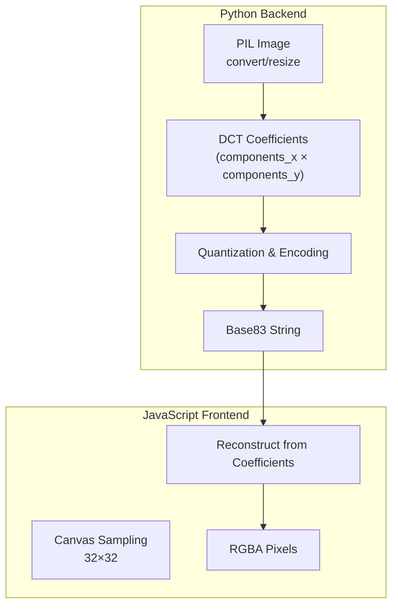
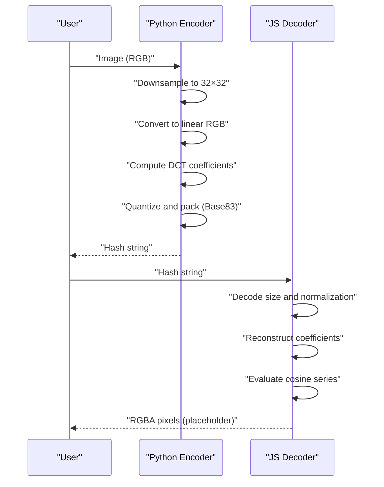
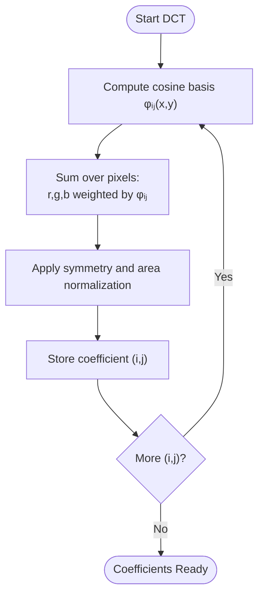
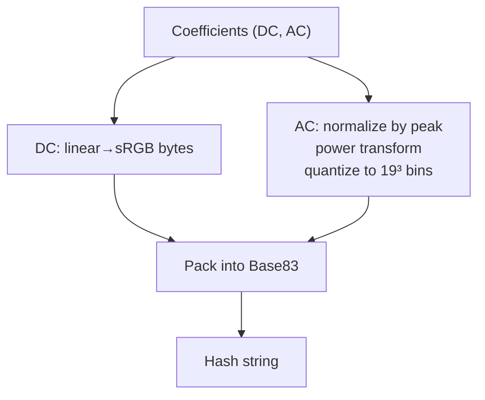
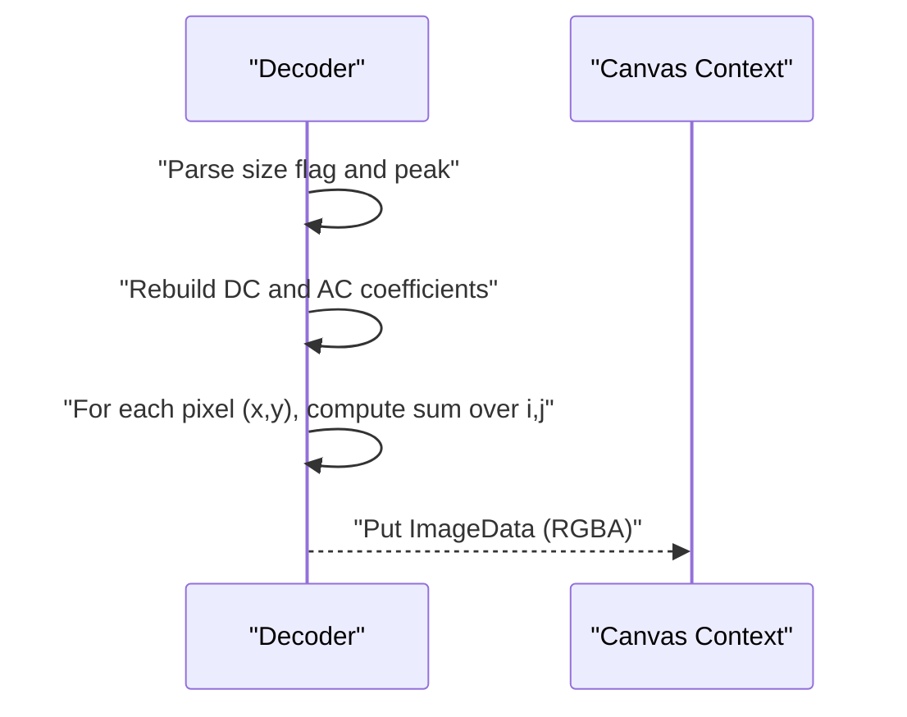
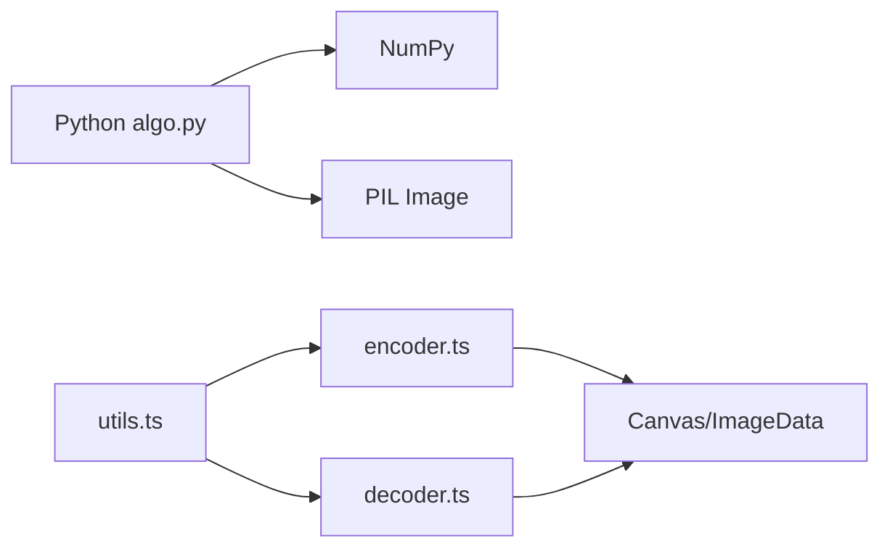

# Mathematical Foundation

<cite>
**Referenced Files in This Document**
- [README.md](file://README.md)
- [algo.py](file://packages/py-useblysh/useblysh/algo.py)
- [__init__.py](file://packages/py-useblysh/useblysh/__init__.py)
- [encoder.ts](file://packages/js-useblysh/src/encoder.ts)
- [decoder.ts](file://packages/js-useblysh/src/decoder.ts)
- [utils.ts](file://packages/js-useblysh/src/utils.ts)
- [useblysh.js](file://packages/js-useblysh/dist/useblysh.js)
- [test_algo.py](file://packages/py-useblysh/tests/test_algo.py)
</cite>

## Table of Contents
1. [Introduction](#introduction)
2. [Project Structure](#project-structure)
3. [Core Components](#core-components)
4. [Architecture Overview](#architecture-overview)
5. [Detailed Component Analysis](#detailed-component-analysis)
6. [Dependency Analysis](#dependency-analysis)
7. [Performance Considerations](#performance-considerations)
8. [Troubleshooting Guide](#troubleshooting-guide)
9. [Conclusion](#conclusion)

## Introduction
This document explains the mathematical foundation of Blysh hashing with a focus on the Discrete Cosine Transform (DCT). Blysh encodes images into compact, perceptually meaningful summaries by extracting dominant color frequencies from small, uniformly sampled patches of the image. The frequency domain representation enables efficient compression and robust similarity detection compared to raw pixel data.

The repository’s Python and JavaScript implementations demonstrate a DCT-like transform over 32×32 pixel blocks, followed by quantization and entropy-efficient encoding. The README confirms that Blysh uses DCT to extract the most important color frequencies from an image.

**Section sources**
- [README.md:154-160](file://README.md#L154-L160)

## Project Structure
The mathematical pipeline spans two language implementations:
- Python backend: image preprocessing, DCT coefficient computation, quantization, and Base83 encoding.
- JavaScript frontend: canvas sampling, DCT coefficient reconstruction, and decoding to RGBA pixels.

**Diagram sources**
- [algo.py:39-111](file://packages/py-useblysh/useblysh/algo.py#L39-L111)
- [encoder.ts:3-96](file://packages/js-useblysh/src/encoder.ts#L3-L96)
- [decoder.ts:3-66](file://packages/js-useblysh/src/decoder.ts#L3-L66)

**Section sources**
- [algo.py:39-111](file://packages/py-useblysh/useblysh/algo.py#L39-L111)
- [encoder.ts:3-96](file://packages/js-useblysh/src/encoder.ts#L3-L96)
- [decoder.ts:3-66](file://packages/js-useblysh/src/decoder.ts#L3-L66)

## Core Components
- Basis functions: cosine basis functions cos(π i x / W) and cos(π j y / H) form the DCT kernel over the 32×32 grid.
- Coefficient computation: inner products of pixel intensities with basis functions, normalized by the image dimensions and symmetry factors.
- DC/AC separation: the DC term captures average color; AC terms capture chromatic variations across spatial frequencies.
- Quantization: nonlinear scaling via a power function and uniform quantization into a compact alphabet.
- Encoding: Base83 packing of size flag, normalization, DC color, and AC quantized values.

These steps collectively transform spatial color information into a compact, perceptual summary suitable for fast similarity checks and placeholder rendering.

**Section sources**
- [algo.py:52-73](file://packages/py-useblysh/useblysh/algo.py#L52-L73)
- [algo.py:75-111](file://packages/py-useblysh/useblysh/algo.py#L75-L111)
- [encoder.ts:16-35](file://packages/js-useblysh/src/encoder.ts#L16-L35)
- [encoder.ts:65-74](file://packages/js-useblysh/src/encoder.ts#L65-L74)

## Architecture Overview
The end-to-end flow from image to hash and back:

**Diagram sources**
- [algo.py:43-44](file://packages/py-useblysh/useblysh/algo.py#L43-L44)
- [algo.py:49-50](file://packages/py-useblysh/useblysh/algo.py#L49-L50)
- [algo.py:57-73](file://packages/py-useblysh/useblysh/algo.py#L57-L73)
- [algo.py:92-111](file://packages/py-useblysh/useblysh/algo.py#L92-L111)
- [decoder.ts:13-38](file://packages/js-useblysh/src/decoder.ts#L13-L38)
- [decoder.ts:42-63](file://packages/js-useblysh/src/decoder.ts#L42-L63)

## Detailed Component Analysis

### Discrete Cosine Transform (DCT) Basis and Coefficients
Blysh computes a 2D cosine expansion over the 32×32 grid:
- Basis functions: φ_ij(x, y) = cos(π i x / W) · cos(π j y / H) for i ∈ [0..components_x), j ∈ [0..components_y).
- Coefficients: for each (i, j), integrate the inner product of φ_ij with linear RGB channels over the grid, scaled by symmetry factors and image area.

Key properties:
- i = 0 or j = 0 introduce symmetry factors that normalize energy.
- The DC coefficient (i=0, j=0) captures the average color across the block.
- Higher indices capture finer spatial variations, emphasizing edges and chromatic transitions.

Implementation references:
- Basis construction and summation: [algo.py:52-73](file://packages/py-useblysh/useblysh/algo.py#L52-L73), [encoder.ts:16-35](file://packages/js-useblysh/src/encoder.ts#L16-L35)
- Symmetry normalization and scaling: [algo.py:63](file://packages/py-useblysh/useblysh/algo.py#L63), [algo.py:72](file://packages/py-useblysh/useblysh/algo.py#L72), [encoder.ts:18](file://packages/js-useblysh/src/encoder.ts#L18), [encoder.ts:32](file://packages/js-useblysh/src/encoder.ts#L32)

**Diagram sources**
- [algo.py:52-73](file://packages/py-useblysh/useblysh/algo.py#L52-L73)
- [encoder.ts:16-35](file://packages/js-useblysh/src/encoder.ts#L16-L35)

**Section sources**
- [algo.py:52-73](file://packages/py-useblysh/useblysh/algo.py#L52-L73)
- [encoder.ts:16-35](file://packages/js-useblysh/src/encoder.ts#L16-L35)

### Quantization and Encoding Pipeline
- DC quantization: map linear RGB coefficients to integer sRGB bytes, packed into a 24-bit value.
- AC quantization: normalize by peak magnitude, apply a power transform, and quantize into a 3D grid for compact ternary representation.
- Global normalization: a single peak estimate across AC coefficients is stored and reused for decoding.
- Base83 packing: encode size flag, peak, DC, and AC quanta into a compact string.

Implementation references:
- DC packing and unpacking: [algo.py:79-83](file://packages/py-useblysh/useblysh/algo.py#L79-L83), [decoder.ts:23-28](file://packages/js-useblysh/src/decoder.ts#L23-L28)
- AC quantization and packing: [algo.py:86-90](file://packages/py-useblysh/useblysh/algo.py#L86-L90), [algo.py:108-109](file://packages/py-useblysh/useblysh/algo.py#L108-L109), [encoder.ts:65-74](file://packages/js-useblysh/src/encoder.ts#L65-L74)
- Peak normalization: [algo.py:96-104](file://packages/py-useblysh/useblysh/algo.py#L96-L104), [decoder.ts:17-18](file://packages/js-useblysh/src/decoder.ts#L17-L18)

**Diagram sources**
- [algo.py:79-111](file://packages/py-useblysh/useblysh/algo.py#L79-L111)
- [encoder.ts:56-74](file://packages/js-useblysh/src/encoder.ts#L56-L74)
- [decoder.ts:23-38](file://packages/js-useblysh/src/decoder.ts#L23-L38)

**Section sources**
- [algo.py:79-111](file://packages/py-useblysh/useblysh/algo.py#L79-L111)
- [encoder.ts:56-74](file://packages/js-useblysh/src/encoder.ts#L56-L74)
- [decoder.ts:23-38](file://packages/js-useblysh/src/decoder.ts#L23-L38)

### Reconstruction and Rendering
- Decode size flag and peak normalization.
- Rebuild DC and AC coefficients from quantized values.
- Evaluate the cosine series at each pixel position to reconstruct RGB channels.
- Convert back to sRGB for display.

Implementation references:
- Decoding and reconstruction loop: [decoder.ts:13-38](file://packages/js-useblysh/src/decoder.ts#L13-L38), [decoder.ts:42-63](file://packages/js-useblysh/src/decoder.ts#L42-L63)
- Canvas rendering in distribution bundle: [useblysh.js:1](file://packages/js-useblysh/dist/useblysh.js#L1)

**Diagram sources**
- [decoder.ts:13-38](file://packages/js-useblysh/src/decoder.ts#L13-L38)
- [decoder.ts:42-63](file://packages/js-useblysh/src/decoder.ts#L42-L63)
- [useblysh.js:1](file://packages/js-useblysh/dist/useblysh.js#L1)

**Section sources**
- [decoder.ts:13-38](file://packages/js-useblysh/src/decoder.ts#L13-L38)
- [decoder.ts:42-63](file://packages/js-useblysh/src/decoder.ts#L42-L63)
- [useblysh.js:1](file://packages/js-useblysh/dist/useblysh.js#L1)

### Color Space Conversions
- Nonlinear sRGB to linear RGB conversion ensures perceptual weighting during correlation.
- Reverse conversion to sRGB for final rendering.

Implementation references:
- sRGB↔linear conversions: [algo.py:22-34](file://packages/py-useblysh/useblysh/algo.py#L22-L34), [utils.ts:22-32](file://packages/js-useblysh/src/utils.ts#L22-L32)

**Section sources**
- [algo.py:22-34](file://packages/py-useblysh/useblysh/algo.py#L22-L34)
- [utils.ts:22-32](file://packages/js-useblysh/src/utils.ts#L22-L32)

## Dependency Analysis
- Python encoder depends on NumPy for vectorized operations and PIL for image handling.
- JavaScript encoder/decoder rely on DOM APIs (Canvas/ImageData) and a shared utils module for color space and Base83 helpers.
- Both implementations share the same DCT formulation and quantization strategy, ensuring identical hashes across platforms.

**Diagram sources**
- [algo.py:1](file://packages/py-useblysh/useblysh/algo.py#L1)
- [encoder.ts:1](file://packages/js-useblysh/src/encoder.ts#L1)
- [decoder.ts:1](file://packages/js-useblysh/src/decoder.ts#L1)
- [utils.ts:1](file://packages/js-useblysh/src/utils.ts#L1)

**Section sources**
- [algo.py:1](file://packages/py-useblysh/useblysh/algo.py#L1)
- [encoder.ts:1](file://packages/js-useblysh/src/encoder.ts#L1)
- [decoder.ts:1](file://packages/js-useblysh/src/decoder.ts#L1)
- [utils.ts:1](file://packages/js-useblysh/src/utils.ts#L1)

## Performance Considerations
- Fixed 32×32 sampling reduces computational cost while preserving dominant color and low-frequency structure.
- DCT-like decomposition yields sparse coefficients; retaining only a modest number of (i, j) pairs achieves strong perceptual fidelity.
- Quantization and Base83 packing yield compact hashes suitable for transport and storage.
- Nonlinear color space conversion aligns with human visual sensitivity, improving compression efficiency.

[No sources needed since this section provides general guidance]

## Troubleshooting Guide
Common issues and remedies:
- Invalid hash length or malformed header: ensure the hash contains at least the expected number of Base83 digits for size flag, peak, and DC.
- Component bounds: both implementations enforce 1–9 components in each direction; out-of-range values raise errors.
- Canvas context failure (JavaScript): ensure the canvas context is available before drawing and reading image data.

References:
- Hash validation and error messages: [decoder.ts:9-11](file://packages/js-useblysh/src/decoder.ts#L9-L11)
- Component range checks: [algo.py:40](file://packages/py-useblysh/useblysh/algo.py#L40), [encoder.ts:10](file://packages/js-useblysh/src/encoder.ts#L10)
- Canvas context creation: [useblysh.js:87-95](file://packages/js-useblysh/dist/useblysh.js#L87-L95)

**Section sources**
- [decoder.ts:9-11](file://packages/js-useblysh/src/decoder.ts#L9-L11)
- [algo.py:40](file://packages/py-useblysh/useblysh/algo.py#L40)
- [encoder.ts:10](file://packages/js-useblysh/src/encoder.ts#L10)
- [useblysh.js:87-95](file://packages/js-useblysh/dist/useblysh.js#L87-L95)

## Conclusion
Blysh leverages a DCT-inspired frequency-domain representation to distill images into compact, perceptually faithful summaries. By capturing dominant color frequencies and suppressing high-frequency noise, the method achieves both efficient compression and robust similarity detection. The shared mathematical framework across Python and JavaScript guarantees consistent behavior in diverse environments.

[No sources needed since this section summarizes without analyzing specific files]