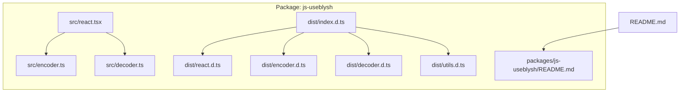
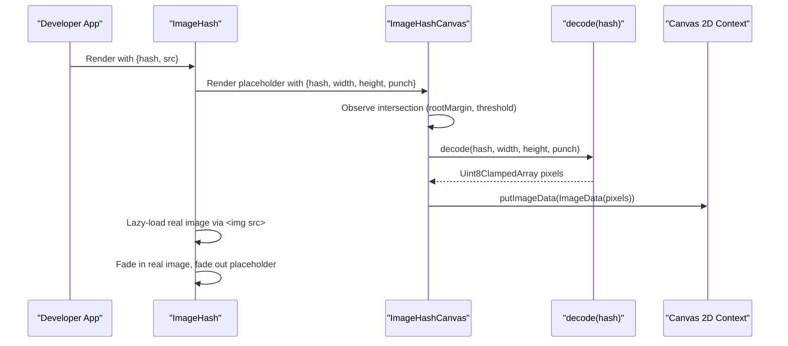
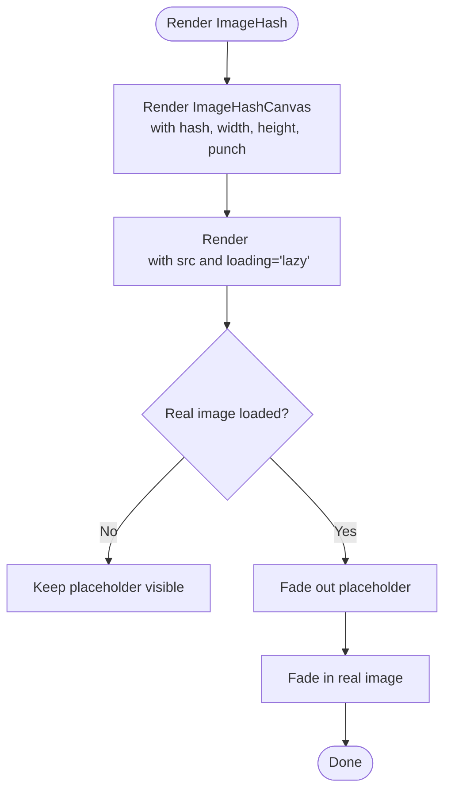
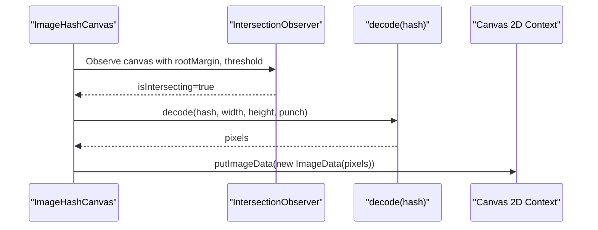
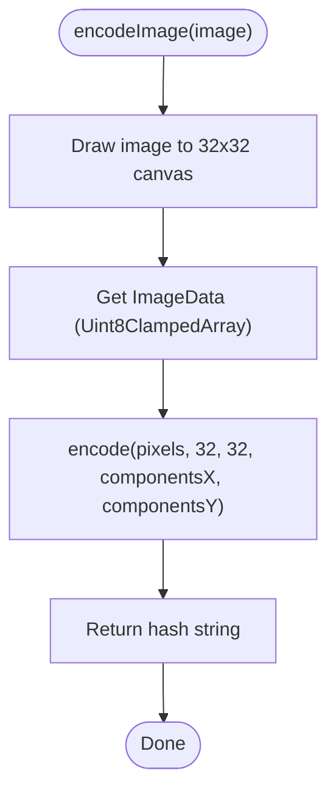
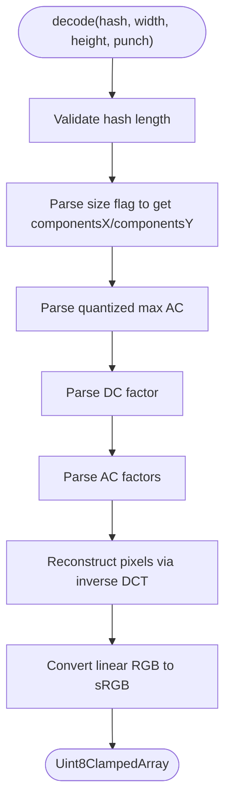
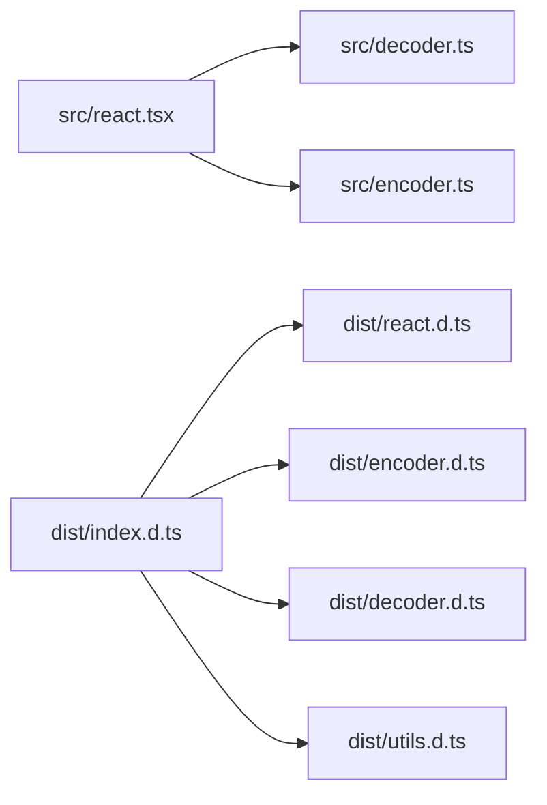

# Frontend Components

<cite>
**Referenced Files in This Document**
- [README.md](file://README.md)
- [packages/js-useblysh/README.md](file://packages/js-useblysh/README.md)
- [packages/js-useblysh/src/react.tsx](file://packages/js-useblysh/src/react.tsx)
- [packages/js-useblysh/src/encoder.ts](file://packages/js-useblysh/src/encoder.ts)
- [packages/js-useblysh/src/decoder.ts](file://packages/js-useblysh/src/decoder.ts)
- [packages/js-useblysh/dist/index.d.ts](file://packages/js-useblysh/dist/index.d.ts)
- [packages/js-useblysh/dist/react.d.ts](file://packages/js-useblysh/dist/react.d.ts)
- [packages/js-useblysh/dist/encoder.d.ts](file://packages/js-useblysh/dist/encoder.d.ts)
- [packages/js-useblysh/dist/decoder.d.ts](file://packages/js-useblysh/dist/decoder.d.ts)
- [packages/js-useblysh/dist/utils.d.ts](file://packages/js-useblysh/dist/utils.d.ts)
- [packages/js-useblysh/src/useblysh.test.ts](file://packages/js-useblysh/src/useblysh.test.ts)
</cite>

## Table of Contents
1. [Introduction](#introduction)
2. [Project Structure](#project-structure)
3. [Core Components](#core-components)
4. [Architecture Overview](#architecture-overview)
5. [Detailed Component Analysis](#detailed-component-analysis)
6. [Dependency Analysis](#dependency-analysis)
7. [Performance Considerations](#performance-considerations)
8. [Troubleshooting Guide](#troubleshooting-guide)
9. [Conclusion](#conclusion)
10. [Appendices](#appendices)

## Introduction
This document describes the React frontend component library for progressive image loading powered by visual hashing. It focuses on:
- ImageHash component API and behavior
- ImageHashCanvas component for manual control and advanced scenarios
- encodeImage utility for browser-side image processing and canvas operations
- Automatic image loading workflow, transition effects, and lazy loading
- Relationship between components and the underlying canvas rendering system
- Performance optimization, browser compatibility, and responsive behavior
- Practical usage examples across social media feeds, e-commerce, and CMS
- Troubleshooting and debugging guidance

## Project Structure
The repository provides a unified toolkit with a JavaScript/TypeScript package exposing React components and utilities for progressive image loading. The relevant parts for this documentation are:
- React components and props definitions in the source TypeScript file
- Public type declarations for consumers
- Example usage in the top-level and package READMEs
- Tests validating encode/decode correctness

**Diagram sources**
- [packages/js-useblysh/src/react.tsx:1-137](file://packages/js-useblysh/src/react.tsx#L1-L137)
- [packages/js-useblysh/src/encoder.ts:1-96](file://packages/js-useblysh/src/encoder.ts#L1-L96)
- [packages/js-useblysh/src/decoder.ts:1-67](file://packages/js-useblysh/src/decoder.ts#L1-L67)
- [packages/js-useblysh/dist/index.d.ts:1-5](file://packages/js-useblysh/dist/index.d.ts#L1-L5)
- [packages/js-useblysh/dist/react.d.ts:1-18](file://packages/js-useblysh/dist/react.d.ts#L1-L18)
- [packages/js-useblysh/dist/encoder.d.ts:1-6](file://packages/js-useblysh/dist/encoder.d.ts#L1-L6)
- [packages/js-useblysh/dist/decoder.d.ts:1-2](file://packages/js-useblysh/dist/decoder.d.ts#L1-L2)
- [packages/js-useblysh/dist/utils.d.ts:1-7](file://packages/js-useblysh/dist/utils.d.ts#L1-L7)
- [README.md:1-163](file://README.md#L1-L163)
- [packages/js-useblysh/README.md:1-126](file://packages/js-useblysh/README.md#L1-L126)

**Section sources**
- [README.md:1-163](file://README.md#L1-L163)
- [packages/js-useblysh/README.md:1-126](file://packages/js-useblysh/README.md#L1-L126)
- [packages/js-useblysh/dist/index.d.ts:1-5](file://packages/js-useblysh/dist/index.d.ts#L1-L5)

## Core Components
This section documents the public React components and utilities exposed by the package.

- ImageHash
  - Purpose: A smart image component that shows a blurred placeholder (hash) until the actual image (src) loads.
  - Props:
    - hash: string (required) — The visual hash string generated by the backend or encoder.
    - src: string (required) — The URL of the full-quality image to load lazily.
    - Additional props: Inherits standard HTML image attributes via ImgHTMLAttributes.
  - Behavior:
    - Renders a container with relative positioning and overflow hidden.
    - Displays a blurred placeholder via ImageHashCanvas with opacity transition.
    - Renders the real image with lazy loading and a matching opacity transition.
    - Inherits className and inline styles from the parent to maintain layout and appearance.
  - Usage example path: [README.md:97-106](file://README.md#L97-L106), [packages/js-useblysh/README.md:60-69](file://packages/js-useblysh/README.md#L60-L69)

- ImageHashCanvas
  - Purpose: Low-level canvas renderer for decoding and drawing a placeholder from a hash.
  - Props:
    - hash: string (required) — The visual hash string.
    - width: number (optional, default 32) — Canvas width in pixels.
    - height: number (optional, default 32) — Canvas height in pixels.
    - punch: number (optional, default 1.0) — Contrast/saturation multiplier applied during decoding.
    - Additional props: Inherits standard HTML canvas attributes via CanvasHTMLAttributes.
  - Behavior:
    - Uses IntersectionObserver to defer decoding until the canvas is near the viewport.
    - On visibility, decodes the hash into pixel data and draws it onto the canvas.
    - Applies imageRendering: pixelated to preserve crisp pixel art aesthetics.
  - Usage example path: [README.md:112-137](file://README.md#L112-L137), [packages/js-useblysh/README.md:75-100](file://packages/js-useblysh/README.md#L75-L100)

- encodeImage
  - Purpose: Browser-side image processing utility to generate a visual hash from an HTMLImageElement.
  - Signature: encodeImage(image: HTMLImageElement, componentsX?: number, componentsY?: number): string
  - Behavior:
    - Creates a temporary canvas sized to 32x32.
    - Draws the image onto the canvas and extracts ImageData.
    - Delegates to the encode function to produce a compact hash string.
  - Usage example path: [README.md:56-72](file://README.md#L56-L72), [packages/js-useblysh/README.md:38-54](file://packages/js-useblysh/README.md#L38-L54)

**Section sources**
- [packages/js-useblysh/dist/react.d.ts:1-18](file://packages/js-useblysh/dist/react.d.ts#L1-L18)
- [packages/js-useblysh/src/react.tsx:1-137](file://packages/js-useblysh/src/react.tsx#L1-L137)
- [packages/js-useblysh/dist/encoder.d.ts:1-6](file://packages/js-useblysh/dist/encoder.d.ts#L1-L6)
- [packages/js-useblysh/src/encoder.ts:82-96](file://packages/js-useblysh/src/encoder.ts#L82-L96)
- [README.md:56-137](file://README.md#L56-L137)
- [packages/js-useblysh/README.md:38-100](file://packages/js-useblysh/README.md#L38-L100)

## Architecture Overview
The progressive image loading pipeline integrates React components with canvas rendering and mathematical transforms.

**Diagram sources**
- [packages/js-useblysh/src/react.tsx:11-137](file://packages/js-useblysh/src/react.tsx#L11-L137)
- [packages/js-useblysh/src/decoder.ts:3-67](file://packages/js-useblysh/src/decoder.ts#L3-L67)

## Detailed Component Analysis

### ImageHash Component
- Composition:
  - Container div with relative positioning and overflow hidden.
  - ImageHashCanvas child for the blurred placeholder.
  - Real image child with lazy loading and opacity transition.
- Styling and responsiveness:
  - Inherits className and inline styles to propagate layout and object-fit behavior.
  - Placeholder and image share the same absolute/full-size layout.
- Transitions:
  - Placeholder fades out while the real image fades in after load.
- Accessibility and semantics:
  - Inherits standard img attributes; ensure alt text is passed via props if needed.

**Diagram sources**
- [packages/js-useblysh/src/react.tsx:87-137](file://packages/js-useblysh/src/react.tsx#L87-L137)

**Section sources**
- [packages/js-useblysh/src/react.tsx:87-137](file://packages/js-useblysh/src/react.tsx#L87-L137)
- [packages/js-useblysh/dist/react.d.ts:9-17](file://packages/js-useblysh/dist/react.d.ts#L9-L17)

### ImageHashCanvas Component
- IntersectionObserver-based lazy decoding:
  - Triggers decoding when the canvas enters the viewport (rootMargin and threshold configured).
- Rendering:
  - Decodes hash into pixel data and writes to the canvas via ImageData.
  - imageRendering set to pixelated for crisp pixel art look.
- Ref forwarding:
  - Exposes imperative ref for programmatic access to the canvas element.

**Diagram sources**
- [packages/js-useblysh/src/react.tsx:11-76](file://packages/js-useblysh/src/react.tsx#L11-L76)
- [packages/js-useblysh/src/decoder.ts:3-67](file://packages/js-useblysh/src/decoder.ts#L3-L67)

**Section sources**
- [packages/js-useblysh/src/react.tsx:11-76](file://packages/js-useblysh/src/react.tsx#L11-L76)
- [packages/js-useblysh/dist/react.d.ts:2-8](file://packages/js-useblysh/dist/react.d.ts#L2-L8)

### encodeImage Utility
- Input: HTMLImageElement and optional component counts for DCT decomposition.
- Processing:
  - Draws the image onto a 32x32 canvas.
  - Extracts ImageData and delegates to encode for compression.
- Output: A compact hash string representing the visual fingerprint.

**Diagram sources**
- [packages/js-useblysh/src/encoder.ts:82-96](file://packages/js-useblysh/src/encoder.ts#L82-L96)

**Section sources**
- [packages/js-useblysh/src/encoder.ts:82-96](file://packages/js-useblysh/src/encoder.ts#L82-L96)
- [packages/js-useblysh/dist/encoder.d.ts:5-5](file://packages/js-useblysh/dist/encoder.d.ts#L5-L5)

### Decoder Internals
- Input validation: Ensures a minimum hash length and rejects malformed inputs.
- Size extraction: Reads component counts from the encoded size flag.
- Quantization and scaling: Recovers DC/AC factors and applies punch scaling.
- Reconstruction: Evaluates the inverse DCT to compute RGB per pixel and converts from linear to sRGB.

**Diagram sources**
- [packages/js-useblysh/src/decoder.ts:3-67](file://packages/js-useblysh/src/decoder.ts#L3-L67)

**Section sources**
- [packages/js-useblysh/src/decoder.ts:3-67](file://packages/js-useblysh/src/decoder.ts#L3-L67)
- [packages/js-useblysh/dist/decoder.d.ts:1-1](file://packages/js-useblysh/dist/decoder.d.ts#L1-L1)

## Dependency Analysis
- ImageHash depends on ImageHashCanvas and the decode function.
- ImageHashCanvas depends on decode and the DOM canvas API.
- encodeImage depends on the browser canvas API and the encode function.
- Public exports are declared in index.d.ts and react.d.ts.

**Diagram sources**
- [packages/js-useblysh/src/react.tsx:1-2](file://packages/js-useblysh/src/react.tsx#L1-L2)
- [packages/js-useblysh/src/encoder.ts:1-1](file://packages/js-useblysh/src/encoder.ts#L1-L1)
- [packages/js-useblysh/src/decoder.ts:1-1](file://packages/js-useblysh/src/decoder.ts#L1-L1)
- [packages/js-useblysh/dist/index.d.ts:1-5](file://packages/js-useblysh/dist/index.d.ts#L1-L5)
- [packages/js-useblysh/dist/react.d.ts:1-18](file://packages/js-useblysh/dist/react.d.ts#L1-L18)
- [packages/js-useblysh/dist/encoder.d.ts:1-6](file://packages/js-useblysh/dist/encoder.d.ts#L1-L6)
- [packages/js-useblysh/dist/decoder.d.ts:1-2](file://packages/js-useblysh/dist/decoder.d.ts#L1-L2)
- [packages/js-useblysh/dist/utils.d.ts:1-7](file://packages/js-useblysh/dist/utils.d.ts#L1-L7)

**Section sources**
- [packages/js-useblysh/dist/index.d.ts:1-5](file://packages/js-useblysh/dist/index.d.ts#L1-L5)
- [packages/js-useblysh/dist/react.d.ts:1-18](file://packages/js-useblysh/dist/react.d.ts#L1-L18)

## Performance Considerations
- Lazy decoding with IntersectionObserver:
  - Defers decode until the canvas is near the viewport, reducing work during initial render.
  - Configured with a generous rootMargin and small threshold to trigger early.
- Main-thread yielding:
  - Decoding runs after a zero-delay timeout to avoid blocking the UI thread.
- Canvas sizing:
  - Default 32x32 canvas strikes a balance between fidelity and performance.
  - Larger canvases increase memory and CPU usage during decode.
- Transition timing:
  - Smooth opacity transitions enhance perceived performance; tune durations as needed.
- Browser compatibility:
  - Uses standard canvas APIs and IntersectionObserver; ensure polyfills if targeting older browsers.
- Responsive behavior:
  - Inherit layout via className and inline styles; ensure the parent container reserves aspect ratio to prevent layout shift.

[No sources needed since this section provides general guidance]

## Troubleshooting Guide
- Invalid hash errors:
  - The decoder throws when the hash is missing or too short. Verify the hash originates from a compatible encoder and matches the expected dimensions.
  - Reference: [packages/js-useblysh/src/decoder.ts:9-11](file://packages/js-useblysh/src/decoder.ts#L9-L11)
- Empty or blank placeholder:
  - Ensure the canvas is visible and intersecting; IntersectionObserver may delay decoding.
  - Confirm the hash is valid and the canvas context is available.
  - Reference: [packages/js-useblysh/src/react.tsx:18-62](file://packages/js-useblysh/src/react.tsx#L18-L62)
- Incorrect image fit:
  - ImageHash inherits object-fit from className; pass appropriate CSS classes to control cropping and scaling.
  - Reference: [packages/js-useblysh/src/react.tsx:96-133](file://packages/js-useblysh/src/react.tsx#L96-L133)
- Layout shift:
  - Reserve space with aspect-ratio-aware containers; ImageHash uses absolute/full-size children to avoid shifts.
  - Reference: [packages/js-useblysh/src/react.tsx:93-101](file://packages/js-useblysh/src/react.tsx#L93-L101)
- Testing expectations:
  - Tests demonstrate encode/decode round-trip behavior and error conditions for invalid inputs.
  - Reference: [packages/js-useblysh/src/useblysh.test.ts:4-41](file://packages/js-useblysh/src/useblysh.test.ts#L4-L41)

**Section sources**
- [packages/js-useblysh/src/decoder.ts:9-11](file://packages/js-useblysh/src/decoder.ts#L9-L11)
- [packages/js-useblysh/src/react.tsx:18-62](file://packages/js-useblysh/src/react.tsx#L18-L62)
- [packages/js-useblysh/src/useblysh.test.ts:4-41](file://packages/js-useblysh/src/useblysh.test.ts#L4-L41)

## Conclusion
The React component library provides a complete, performant solution for progressive image loading:
- ImageHash offers a drop-in replacement for  with automatic placeholder and lazy loading.
- ImageHashCanvas enables manual control and custom composition patterns.
- encodeImage streamlines browser-side hashing for uploads or previews.
- The underlying decode pipeline ensures consistent, high-quality placeholders across platforms.

[No sources needed since this section summarizes without analyzing specific files]

## Appendices

### API Reference Summary
- ImageHash
  - Props: hash (string), src (string), inherited img attributes.
  - Behavior: placeholder fade + lazy image fade.
  - Path: [packages/js-useblysh/dist/react.d.ts:9-17](file://packages/js-useblysh/dist/react.d.ts#L9-L17)
- ImageHashCanvas
  - Props: hash (string), width (number), height (number), punch (number), inherited canvas attributes.
  - Behavior: intersection-triggered decode and draw.
  - Path: [packages/js-useblysh/dist/react.d.ts:2-8](file://packages/js-useblysh/dist/react.d.ts#L2-L8)
- encodeImage
  - Signature: encodeImage(image: HTMLImageElement, componentsX?: number, componentsY?: number): string
  - Path: [packages/js-useblysh/dist/encoder.d.ts:5-5](file://packages/js-useblysh/dist/encoder.d.ts#L5-L5)

**Section sources**
- [packages/js-useblysh/dist/react.d.ts:1-18](file://packages/js-useblysh/dist/react.d.ts#L1-L18)
- [packages/js-useblysh/dist/encoder.d.ts:1-6](file://packages/js-useblysh/dist/encoder.d.ts#L1-L6)

### Usage Examples Index
- Progressive placeholder with ImageHash:
  - [README.md:97-106](file://README.md#L97-L106), [packages/js-useblysh/README.md:60-69](file://packages/js-useblysh/README.md#L60-L69)
- Manual control with ImageHashCanvas:
  - [README.md:112-137](file://README.md#L112-L137), [packages/js-useblysh/README.md:75-100](file://packages/js-useblysh/README.md#L75-L100)
- Browser-side hashing with encodeImage:
  - [README.md:56-72](file://README.md#L56-L72), [packages/js-useblysh/README.md:38-54](file://packages/js-useblysh/README.md#L38-L54)

**Section sources**
- [README.md:56-137](file://README.md#L56-L137)
- [packages/js-useblysh/README.md:38-100](file://packages/js-useblysh/README.md#L38-L100)