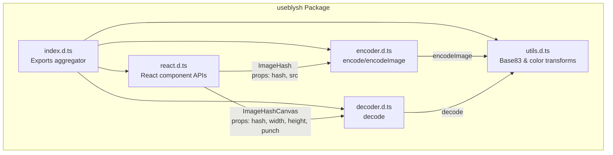
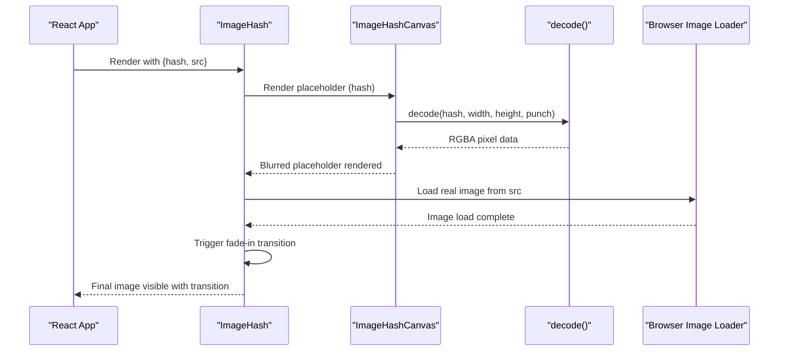
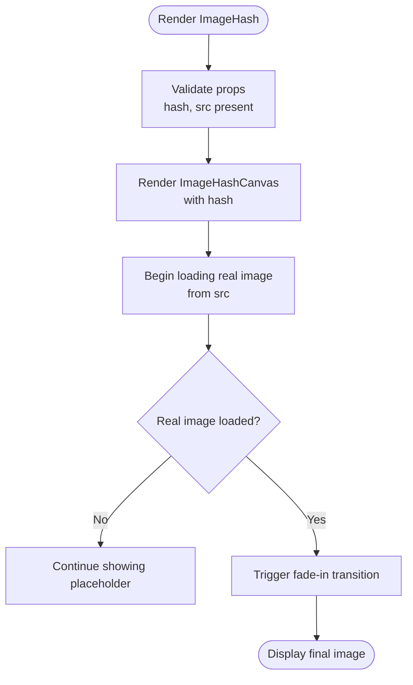
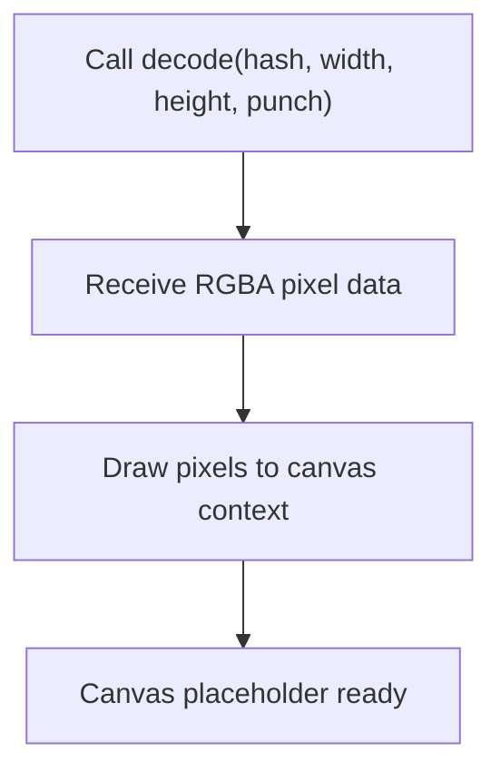
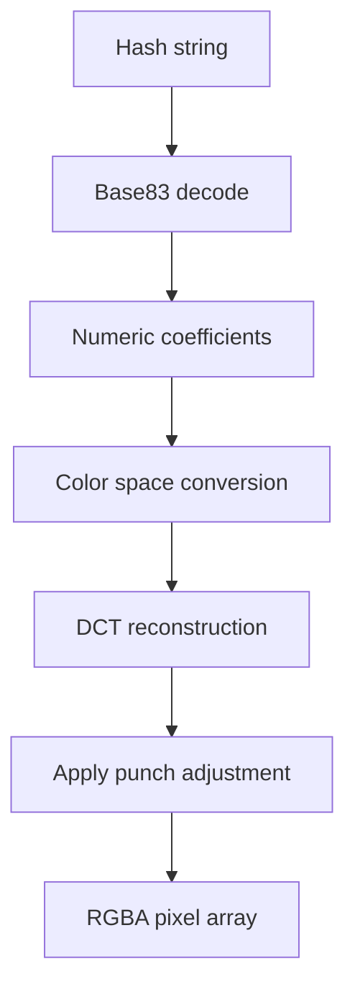
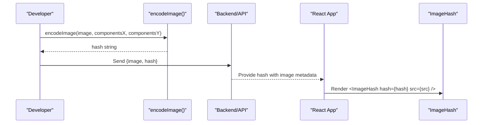
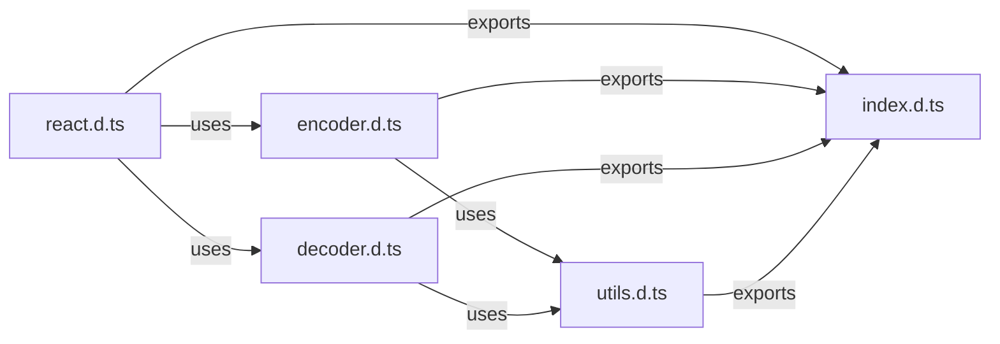

# ImageHash Component

<cite>
**Referenced Files in This Document**
- [README.md](file://README.md)
- [react.d.ts](file://packages/js-useblysh/dist/react.d.ts)
- [index.d.ts](file://packages/js-useblysh/dist/index.d.ts)
- [encoder.d.ts](file://packages/js-useblysh/dist/encoder.d.ts)
- [decoder.d.ts](file://packages/js-useblysh/dist/decoder.d.ts)
- [utils.d.ts](file://packages/js-useblysh/dist/utils.d.ts)
- [package.json](file://packages/js-useblysh/package.json)
</cite>

## Table of Contents
1. [Introduction](#introduction)
2. [Project Structure](#project-structure)
3. [Core Components](#core-components)
4. [Architecture Overview](#architecture-overview)
5. [Detailed Component Analysis](#detailed-component-analysis)
6. [Dependency Analysis](#dependency-analysis)
7. [Performance Considerations](#performance-considerations)
8. [Troubleshooting Guide](#troubleshooting-guide)
9. [Conclusion](#conclusion)

## Introduction
The ImageHash component is the primary progressive image loading solution in the useblysh toolkit. It displays a beautiful blurred placeholder derived from a compact hash string while the actual high-resolution image loads asynchronously. This approach prevents layout shifts, reduces perceived latency, and maintains visual continuity during image transitions.

Key capabilities:
- Automatic placeholder rendering using decoded hash data
- Smooth fade-in transition when the real image finishes loading
- Zero layout shift through aspect-ratio preservation
- Seamless integration with React applications via a simple component API
- Full TypeScript support for type-safe usage

## Project Structure
The useblysh package exposes a cohesive API surface centered around three core areas:
- React component APIs for progressive image loading
- Encoding utilities for generating hash strings from images
- Decoding utilities for reconstructing pixel data from hash strings

**Diagram sources**
- [index.d.ts:1-5](file://packages/js-useblysh/dist/index.d.ts#L1-L5)
- [react.d.ts:1-18](file://packages/js-useblysh/dist/react.d.ts#L1-L18)
- [encoder.d.ts:1-6](file://packages/js-useblysh/dist/encoder.d.ts#L1-L6)
- [decoder.d.ts:1-2](file://packages/js-useblysh/dist/decoder.d.ts#L1-L2)
- [utils.d.ts:1-7](file://packages/js-useblysh/dist/utils.d.ts#L1-L7)

**Section sources**
- [README.md:1-163](file://README.md#L1-L163)
- [package.json:1-62](file://packages/js-useblysh/package.json#L1-L62)

## Core Components
This section documents the ImageHash component API and related utilities that power progressive image loading.

### ImageHash Component API
The ImageHash component is a React functional component designed to render a blurred placeholder immediately and fade in the real image upon load completion.

Props:
- hash: string (required)
  - The compact hash string generated by the encoding utilities
- src: string (required)
  - The URL of the high-resolution image to load
- ...HTMLImageElement attributes (optional)
  - Standard img element props such as alt, className, style, loading, width, height, etc.

Behavior:
- Renders a blurred placeholder using the provided hash
- Loads the real image from src
- Triggers a smooth opacity transition when the real image finishes loading
- Preserves aspect ratio and layout stability

Usage example:
- See the React usage example in the project README demonstrating ImageHash integration with a unique key, hash, and src.

**Section sources**
- [react.d.ts:9-17](file://packages/js-useblysh/dist/react.d.ts#L9-L17)
- [README.md:93-106](file://README.md#L93-L106)

### ImageHashCanvas Component API
The ImageHashCanvas component provides manual control over canvas-based rendering of the blurred placeholder. It accepts canvas-specific props along with the hash and dimensions.

Props:
- hash: string (required)
  - The compact hash string
- width: number (optional)
  - Canvas width in pixels
- height: number (optional)
  - Canvas height in pixels
- punch: number (optional)
  - Rendering intensity adjustment for the blur effect
- ...HTMLCanvasElement attributes (optional)
  - Standard canvas element props such as className, style, etc.

Behavior:
- Renders the decoded placeholder directly onto a canvas
- Useful when building custom loading experiences or integrating with existing layouts

Usage example:
- See the advanced decoding example in the README demonstrating manual control with ImageHashCanvas and a custom transition.

**Section sources**
- [react.d.ts:2-8](file://packages/js-useblysh/dist/react.d.ts#L2-L8)
- [README.md:108-137](file://README.md#L108-L137)

### Encoding Utilities
The encoding utilities convert image data into compact hash strings suitable for progressive loading.

Functions:
- encode(pixels, width, height, componentsX?, componentsY?): string
  - Encodes raw pixel data into a hash string
- encodeImage(image, componentsX?, componentsY?): string
  - Encodes an HTMLImageElement into a hash string

Parameters:
- pixels: Uint8ClampedArray
  - Raw RGBA pixel data
- image: HTMLImageElement
  - An image element loaded with the target image data
- width, height: number
  - Dimensions of the pixel data or image
- componentsX, componentsY: number (optional)
  - Grid dimensions for DCT decomposition (affects hash resolution)

Typical usage:
- Generate hashes client-side during uploads or server-side using the Python library
- Store the hash alongside image metadata for progressive loading

**Section sources**
- [encoder.d.ts:1-6](file://packages/js-useblysh/dist/encoder.d.ts#L1-L6)

### Decoding Utilities
The decoding utilities reconstruct pixel data from hash strings for canvas rendering.

Function:
- decode(hash: string, width: number, height: number, punch?: number): Uint8ClampedArray
  - Reconstructs RGBA pixel data from a hash string for the given dimensions
  - punch adjusts the intensity of the reconstructed blur

Integration:
- Used internally by ImageHashCanvas to render the placeholder
- Can be used to build custom canvas-based experiences

**Section sources**
- [decoder.d.ts:1-2](file://packages/js-useblysh/dist/decoder.d.ts#L1-L2)

### Color Space and Base83 Utilities
Supporting utilities for accurate color reconstruction and compact representation.

Constants and Functions:
- CHARACTERS: string
  - Base83 character set used for encoding
- encodeBase83(value: number, length: number): string
- decodeBase83(str: string): number
- srgbToLinear(value: number): number
- linearToSrgb(value: number): number
- signPow(value: number, exp: number): number

Purpose:
- Provide efficient numeric encoding/decoding
- Convert between color spaces for perceptually accurate rendering

**Section sources**
- [utils.d.ts:1-7](file://packages/js-useblysh/dist/utils.d.ts#L1-L7)

## Architecture Overview
The ImageHash component orchestrates a seamless progressive loading experience by combining hash-based placeholders with native image loading.

**Diagram sources**
- [react.d.ts:2-17](file://packages/js-useblysh/dist/react.d.ts#L2-L17)
- [decoder.d.ts:1-2](file://packages/js-useblysh/dist/decoder.d.ts#L1-L2)

## Detailed Component Analysis

### ImageHash Internal Workflow
The ImageHash component manages a two-stage rendering pipeline:
1. Initial placeholder rendering using the hash
2. Transition to the real image after load completion

**Diagram sources**
- [react.d.ts:9-17](file://packages/js-useblysh/dist/react.d.ts#L9-L17)

### Canvas Rendering Pipeline
ImageHashCanvas decodes the hash into pixel data and renders it to a canvas:
- decode(hash, width, height, punch) produces RGBA pixel data
- The canvas draws the pixel buffer with appropriate scaling
- Optional punch parameter adjusts blur intensity

**Diagram sources**
- [decoder.d.ts:1-2](file://packages/js-useblysh/dist/decoder.d.ts#L1-L2)
- [react.d.ts:2-8](file://packages/js-useblysh/dist/react.d.ts#L2-L8)

### Hash Decoding Process
The decoding process reconstructs a low-resolution approximation of the original image:
- Base83 decoding converts the hash string into numeric coefficients
- Color space conversion ensures perceptual accuracy
- DCT-based reconstruction builds the pixel grid
- Optional punch parameter increases blur intensity

**Diagram sources**
- [utils.d.ts:1-7](file://packages/js-useblysh/dist/utils.d.ts#L1-L7)
- [decoder.d.ts:1-2](file://packages/js-useblysh/dist/decoder.d.ts#L1-L2)

### Relationship with encodeImage
The encodeImage utility generates the hash strings consumed by ImageHash:
- Accepts an HTMLImageElement containing the target image
- Performs DCT decomposition with configurable components
- Produces a compact hash string suitable for progressive loading

**Diagram sources**
- [encoder.d.ts:3-6](file://packages/js-useblysh/dist/encoder.d.ts#L3-L6)
- [README.md:93-106](file://README.md#L93-L106)

## Dependency Analysis
The component APIs are intentionally decoupled to enable flexible usage patterns:
- ImageHash depends on ImageHashCanvas for rendering
- ImageHashCanvas depends on decode for pixel reconstruction
- encodeImage depends on color space utilities for accurate encoding
- All utilities share Base83 encoding constants and math helpers

**Diagram sources**
- [index.d.ts:1-5](file://packages/js-useblysh/dist/index.d.ts#L1-L5)
- [react.d.ts:1-18](file://packages/js-useblysh/dist/react.d.ts#L1-L18)
- [encoder.d.ts:1-6](file://packages/js-useblysh/dist/encoder.d.ts#L1-L6)
- [decoder.d.ts:1-2](file://packages/js-useblysh/dist/decoder.d.ts#L1-L2)
- [utils.d.ts:1-7](file://packages/js-useblysh/dist/utils.d.ts#L1-L7)

**Section sources**
- [index.d.ts:1-5](file://packages/js-useblysh/dist/index.d.ts#L1-L5)
- [react.d.ts:1-18](file://packages/js-useblysh/dist/react.d.ts#L1-L18)
- [encoder.d.ts:1-6](file://packages/js-useblysh/dist/encoder.d.ts#L1-L6)
- [decoder.d.ts:1-2](file://packages/js-useblysh/dist/decoder.d.ts#L1-L2)
- [utils.d.ts:1-7](file://packages/js-useblysh/dist/utils.d.ts#L1-L7)

## Performance Considerations
- Hash size vs. quality trade-offs: Smaller hashes reduce payload but may lower placeholder fidelity
- Component grid sizing: Adjust componentsX/componentsY during encoding to balance quality and size
- Canvas rendering: ImageHashCanvas leverages GPU-accelerated canvas drawing for smooth rendering
- Lazy loading: Combine ImageHash with native browser lazy loading for optimal resource usage
- Memory efficiency: Reuse canvas contexts where possible in high-volume scenarios
- Network optimization: Serve appropriately sized images and leverage browser caching

## Troubleshooting Guide
Common integration challenges and solutions:
- Blank placeholder: Verify the hash is valid and matches the intended image dimensions
- Layout shifts: Ensure aspect ratio is preserved; consider setting explicit width/height on the component
- Flickering transitions: Confirm the real image load event fires and the fade-in transition completes
- CORS errors: Ensure the real image URL is accessible and properly configured for cross-origin requests
- Performance issues: Reduce hash complexity or adjust punch parameter to balance quality and speed
- TypeScript errors: Confirm all required props (hash, src) are provided and types match expectations

Debugging techniques:
- Log hash validity and dimensions before rendering
- Monitor network requests for the real image URL
- Inspect canvas rendering output for pixel data consistency
- Test with minimal props to isolate issues

**Section sources**
- [README.md:93-137](file://README.md#L93-L137)

## Conclusion
The ImageHash component delivers a robust, high-performance progressive image loading solution. By combining compact hash-based placeholders with smooth transitions and zero layout shifts, it enhances user experience while maintaining excellent performance characteristics. The modular API enables flexible integration patterns, from simple out-of-the-box usage to advanced custom implementations leveraging ImageHashCanvas.