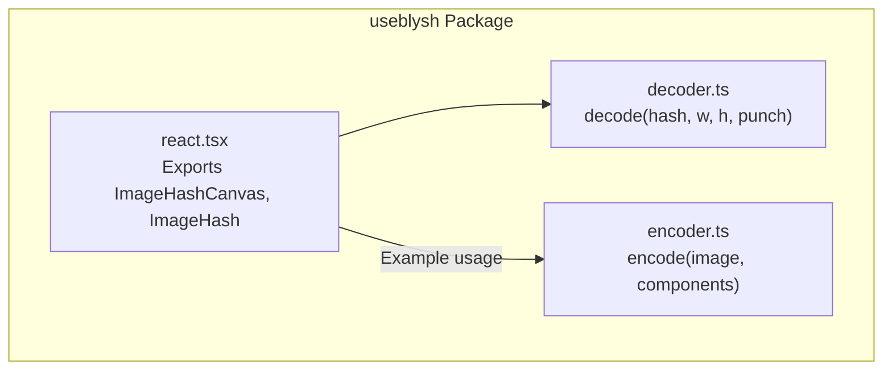
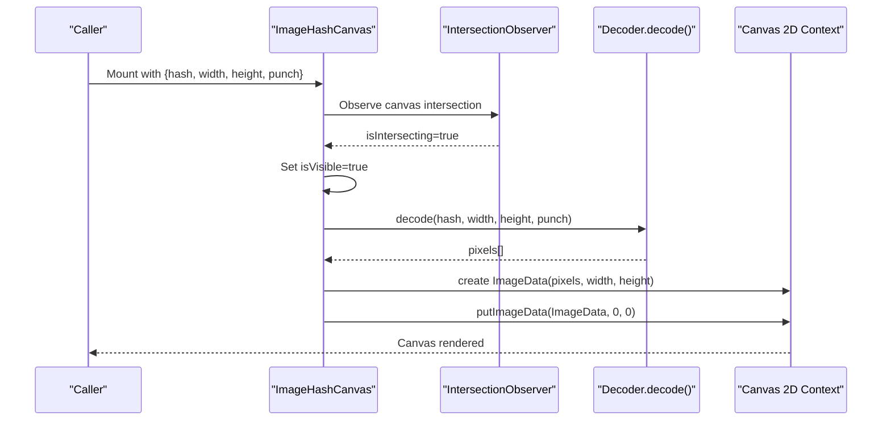
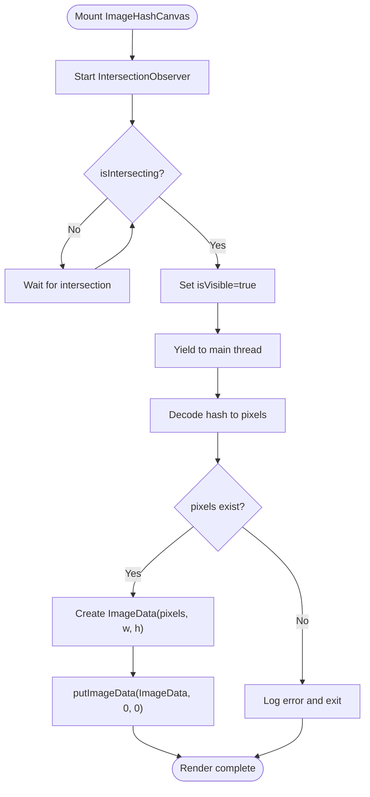
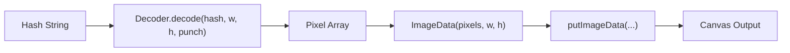
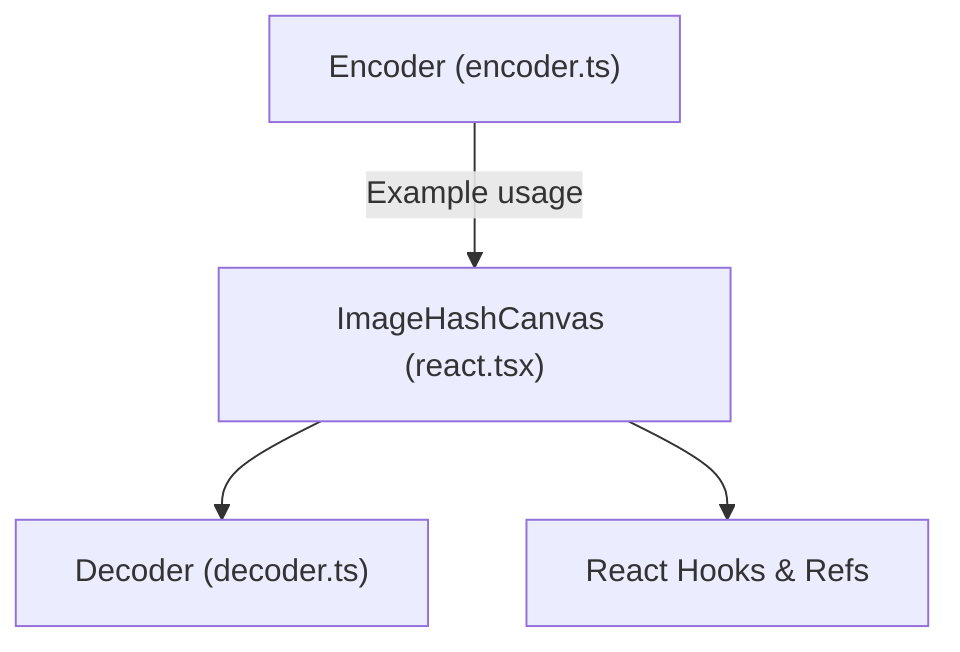

# ImageHashCanvas Component

<cite>
**Referenced Files in This Document**
- [react.tsx](file://packages/js-useblysh/src/react.tsx)
- [decoder.ts](file://packages/js-useblysh/src/decoder.ts)
- [encoder.ts](file://packages/js-useblysh/src/encoder.ts)
- [README.md](file://README.md)
- [package.json](file://packages/js-useblysh/package.json)
</cite>

## Table of Contents
1. [Introduction](#introduction)
2. [Project Structure](#project-structure)
3. [Core Components](#core-components)
4. [Architecture Overview](#architecture-overview)
5. [Detailed Component Analysis](#detailed-component-analysis)
6. [Dependency Analysis](#dependency-analysis)
7. [Performance Considerations](#performance-considerations)
8. [Troubleshooting Guide](#troubleshooting-guide)
9. [Conclusion](#conclusion)
10. [Appendices](#appendices)

## Introduction
ImageHashCanvas is a React component that renders a blur placeholder from a compact hash string using the Canvas API. It provides manual control over canvas context management, hash string processing, and pixel manipulation while integrating with the Base83 decoding utility. The component is designed for advanced use cases where you need precise control over rendering timing, canvas sizing, and transition logic, complemented by the ImageHash component for automatic image loading and fade-in behavior.

Key capabilities:
- Decode hash strings into pixel arrays using the Base83 decoder
- Render decoded pixels onto an HTMLCanvasElement via ImageData
- Optimize rendering with intersection observer and deferred execution
- Expose imperative canvas access via forwarded ref
- Support for custom width, height, and a punch parameter to adjust blur intensity

**Section sources**
- [README.md:108-137](file://README.md#L108-L137)
- [react.tsx:11-76](file://packages/js-useblysh/src/react.tsx#L11-L76)

## Project Structure
The JavaScript package (useblysh) exposes the ImageHashCanvas component and related utilities. The component relies on:
- Decoder module for Base83 decoding and pixel reconstruction
- Encoder module for generating hash strings (used in examples)
- React integration for rendering and lifecycle management

**Diagram sources**
- [react.tsx:1-76](file://packages/js-useblysh/src/react.tsx#L1-L76)
- [decoder.ts](file://packages/js-useblysh/src/decoder.ts)
- [encoder.ts](file://packages/js-useblysh/src/encoder.ts)

**Section sources**
- [package.json:1-62](file://packages/js-useblysh/package.json#L1-L62)
- [react.tsx:1-76](file://packages/js-useblysh/src/react.tsx#L1-L76)

## Core Components
- ImageHashCanvas: Renders a canvas-based blur placeholder from a hash string. It manages visibility via intersection observer, defers decoding to avoid blocking the main thread, and writes pixels using ImageData.
- ImageHash: Higher-level component that composes ImageHashCanvas with an actual image, handling lazy loading and opacity transitions.

API highlights:
- Props for ImageHashCanvas include hash, width, height, punch, and standard canvas attributes.
- The component exposes a ref for imperative access to the underlying canvas element.
- Rendering occurs only when the canvas intersects the viewport, reducing unnecessary work.

**Section sources**
- [react.tsx:4-76](file://packages/js-useblysh/src/react.tsx#L4-L76)
- [react.tsx:78-137](file://packages/js-useblysh/src/react.tsx#L78-L137)

## Architecture Overview
The rendering pipeline for ImageHashCanvas follows a predictable flow: observe visibility, decode the hash into pixels, and write to the canvas context.

**Diagram sources**
- [react.tsx:18-62](file://packages/js-useblysh/src/react.tsx#L18-L62)
- [decoder.ts](file://packages/js-useblysh/src/decoder.ts)

**Section sources**
- [react.tsx:18-62](file://packages/js-useblysh/src/react.tsx#L18-L62)

## Detailed Component Analysis

### ImageHashCanvas Implementation
- Visibility detection: Uses an intersection observer with a generous root margin and small threshold to trigger decoding early when the canvas approaches the viewport.
- Deferred execution: Decoding runs after yielding to the main thread to keep scrolling smooth.
- Pixel rendering: Converts decoded pixel data into an ImageData object and writes it to the canvas at origin.
- Error handling: Catches decoding/rendering errors and logs them without crashing the component.
- Imperative access: Forwards the canvas ref to enable external control (e.g., capturing the rendered image, measuring, or applying filters).

**Diagram sources**
- [react.tsx:18-62](file://packages/js-useblysh/src/react.tsx#L18-L62)

**Section sources**
- [react.tsx:11-76](file://packages/js-useblysh/src/react.tsx#L11-L76)

### Relationship with Decoder and Base83 Decoding
- The decoder transforms a compact hash string into a flat array of pixel values representing a low-resolution color grid.
- ImageHashCanvas passes width, height, and punch to the decoder to control resolution and blur intensity.
- The resulting pixel array is written to the canvas using ImageData, which is a direct mapping from decoded values to the canvas buffer.

**Diagram sources**
- [decoder.ts](file://packages/js-useblysh/src/decoder.ts)
- [react.tsx:52-55](file://packages/js-useblysh/src/react.tsx#L52-L55)

**Section sources**
- [react.tsx:52-55](file://packages/js-useblysh/src/react.tsx#L52-L55)
- [decoder.ts](file://packages/js-useblysh/src/decoder.ts)

### Practical Examples and Workflows
- Manual hash generation: Use the encoder to produce a hash from an image element or canvas, then pass it to ImageHashCanvas for rendering.
- Custom blur effects: Adjust the punch parameter to increase or decrease blur intensity; combine with width/height to control resolution.
- Advanced canvas manipulation: Use the forwarded ref to capture the rendered canvas, apply additional filters, or export as an image.

Integration patterns:
- Compose ImageHashCanvas with your own image loader and transition logic for full control.
- Pair with ImageHash for automatic lazy loading and fade-in behavior when you want minimal orchestration.

**Section sources**
- [README.md:49-137](file://README.md#L49-L137)
- [react.tsx:103-116](file://packages/js-useblysh/src/react.tsx#L103-L116)

## Dependency Analysis
- ImageHashCanvas depends on the decoder module for transforming hash strings into pixel data.
- It also integrates with React’s lifecycle hooks and the DOM via refs.
- The encoder module demonstrates the reverse process for generating hashes in browser environments.

**Diagram sources**
- [react.tsx:1-76](file://packages/js-useblysh/src/react.tsx#L1-L76)
- [decoder.ts](file://packages/js-useblysh/src/decoder.ts)
- [encoder.ts](file://packages/js-useblysh/src/encoder.ts)

**Section sources**
- [react.tsx:1-76](file://packages/js-useblysh/src/react.tsx#L1-L76)
- [decoder.ts](file://packages/js-useblysh/src/decoder.ts)
- [encoder.ts](file://packages/js-useblysh/src/encoder.ts)

## Performance Considerations
- Intersection observer triggers decoding early but only when the canvas is near the viewport, minimizing wasted work offscreen.
- Rendering is deferred using a zero-millisecond timeout to yield to the main thread, preventing jank during scrolling or animations.
- Canvas sizing: Keep width and height proportional to the intended display size to avoid scaling artifacts; pixelated rendering is applied via inline styles.
- Memory management: Avoid frequent re-renders by memoizing hash values and component props. Dispose of observers and timeouts in cleanup.
- Browser compatibility: ImageData and 2D canvas context are widely supported; ensure polyfills if targeting very old browsers.

[No sources needed since this section provides general guidance]

## Troubleshooting Guide
Common issues and resolutions:
- Canvas not rendering:
  - Verify the hash string is valid and matches the expected format.
  - Confirm the canvas context exists before writing pixels.
  - Check that isVisible is true (intersection observer triggered).
- Incorrect dimensions or scaling:
  - Ensure width and height match the intended display size.
  - Avoid CSS transforms that distort pixelation; rely on the canvas’s intrinsic size.
- Blur appears too sharp or too soft:
  - Adjust the punch parameter to control blur intensity.
- Performance degradation:
  - Reduce the frequency of hash updates.
  - Avoid excessive re-renders by stabilizing props and using memoization.
- Error logs:
  - Inspect console errors from decoding failures; validate inputs and environment support.

**Section sources**
- [react.tsx:42-62](file://packages/js-useblysh/src/react.tsx#L42-L62)

## Conclusion
ImageHashCanvas offers a flexible, low-level approach to rendering blur placeholders from compact hash strings. By combining intersection observation, deferred rendering, and direct canvas manipulation, it enables precise control over performance and appearance. When paired with the encoder and ImageHash component, it supports both simple and advanced use cases, from quick placeholders to custom rendering pipelines.

[No sources needed since this section summarizes without analyzing specific files]

## Appendices

### API Reference: ImageHashCanvas
- Props:
  - hash: string — The Base83-encoded hash to decode and render.
  - width: number — Canvas width in pixels (default provided).
  - height: number — Canvas height in pixels (default provided).
  - punch: number — Controls blur intensity (default provided).
  - Additional canvas attributes: Passed through to the underlying canvas element.
- Ref:
  - Exposes the HTMLCanvasElement for imperative operations (e.g., capturing the rendered image, measuring, or applying filters).
- Behavior:
  - Renders only when intersecting the viewport.
  - Writes decoded pixels to the canvas using ImageData.

**Section sources**
- [react.tsx:4-16](file://packages/js-useblysh/src/react.tsx#L4-L16)
- [react.tsx:11-76](file://packages/js-useblysh/src/react.tsx#L11-L76)

### Integration Patterns
- Manual control: Use ImageHashCanvas alongside your own image loader and transition logic.
- Automatic behavior: Use ImageHash for integrated lazy loading and fade-in transitions.
- Composition: Place ImageHashCanvas behind your content and reveal it conditionally based on loading states.

**Section sources**
- [react.tsx:78-137](file://packages/js-useblysh/src/react.tsx#L78-L137)
- [README.md:108-137](file://README.md#L108-L137)