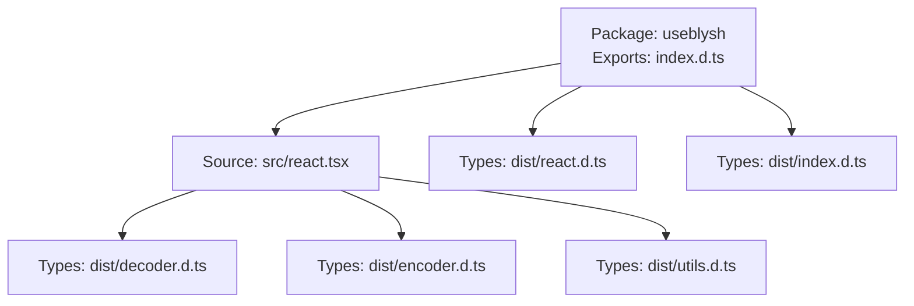
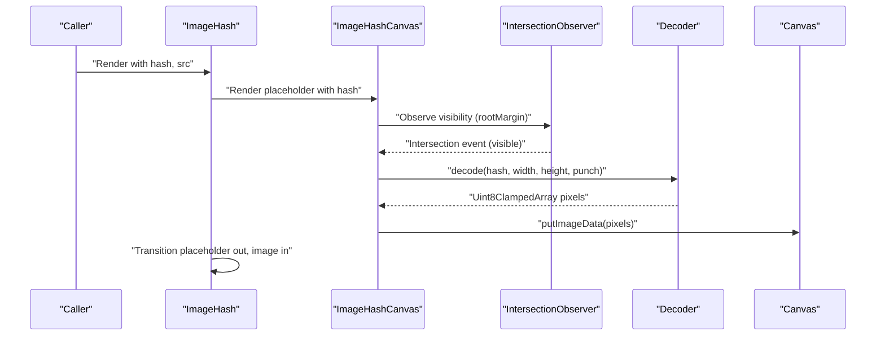
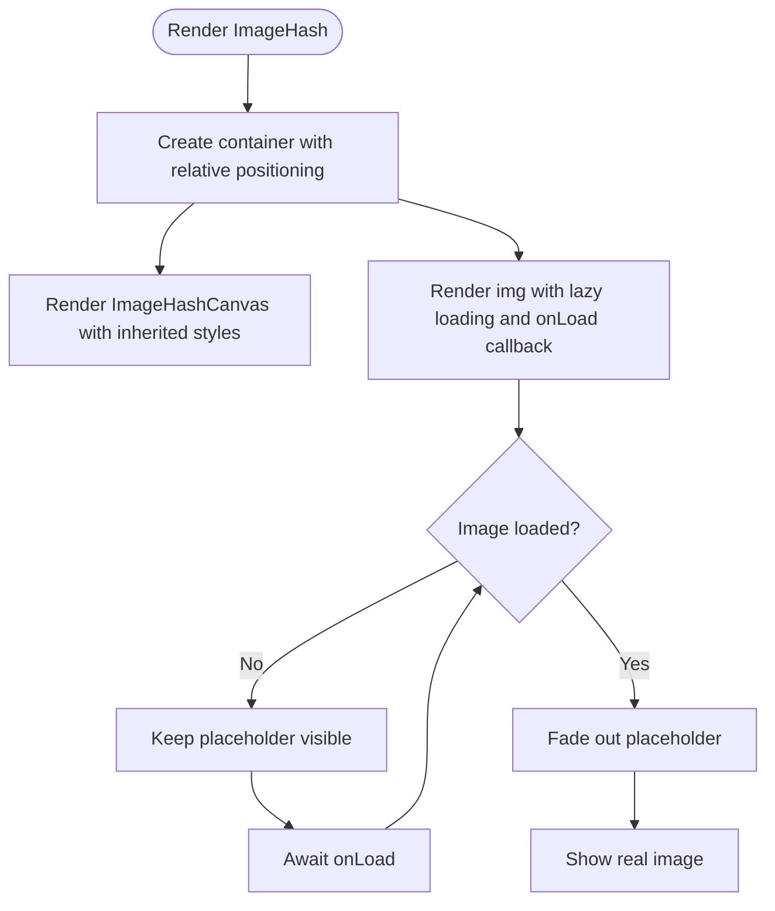
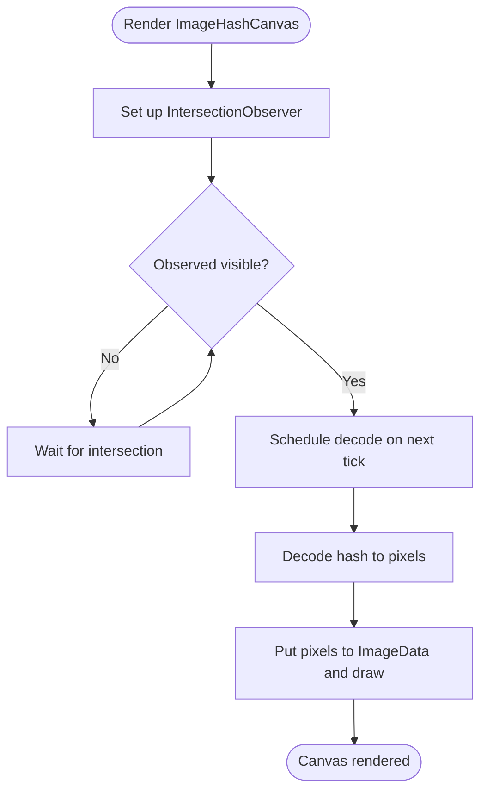
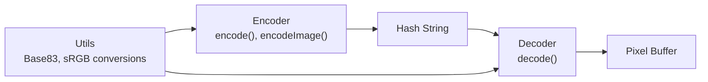
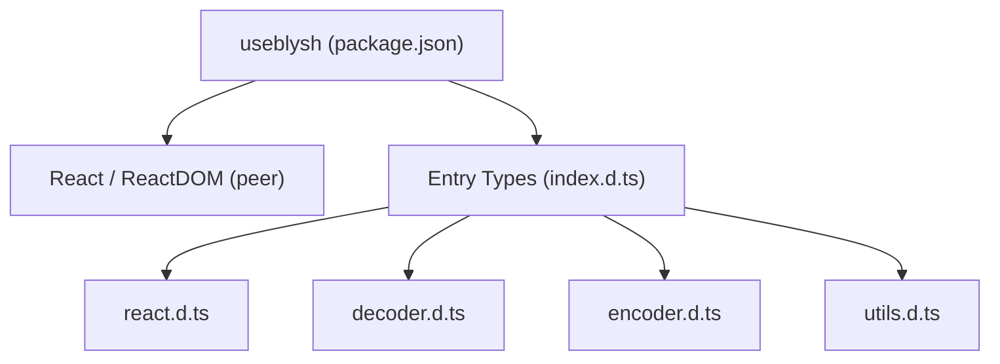

# React Integration Patterns

<cite>
**Referenced Files in This Document**
- [README.md](file://README.md)
- [package.json](file://packages/js-useblysh/package.json)
- [react.tsx](file://packages/js-useblysh/src/react.tsx)
- [react.d.ts](file://packages/js-useblysh/dist/react.d.ts)
- [index.d.ts](file://packages/js-useblysh/dist/index.d.ts)
- [decoder.d.ts](file://packages/js-useblysh/dist/decoder.d.ts)
- [encoder.d.ts](file://packages/js-useblysh/dist/encoder.d.ts)
- [utils.d.ts](file://packages/js-useblysh/dist/utils.d.ts)
</cite>

## Table of Contents
1. [Introduction](#introduction)
2. [Project Structure](#project-structure)
3. [Core Components](#core-components)
4. [Architecture Overview](#architecture-overview)
5. [Detailed Component Analysis](#detailed-component-analysis)
6. [Dependency Analysis](#dependency-analysis)
7. [Performance Considerations](#performance-considerations)
8. [Troubleshooting Guide](#troubleshooting-guide)
9. [Conclusion](#conclusion)
10. [Appendices](#appendices)

## Introduction
This document explains React integration patterns and component composition strategies for the useblysh library. It covers the complete React wrapper API, TypeScript definitions, and component registration patterns. It also documents integration approaches with popular React frameworks (Next.js, Gatsby, Create React App), component composition patterns, prop drilling solutions, state management integration, advanced use cases (infinite scrolling galleries, modal image viewers, responsive image grids), performance optimizations (React.memo usage, lazy loading strategies, bundle size considerations), SSR compatibility and hydration patterns, and troubleshooting guidance for common React-specific issues.

## Project Structure
The React integration is encapsulated in a single NPM package with a clear export surface and TypeScript definitions. The package exposes:
- React components: ImageHash and ImageHashCanvas
- Decoder and encoder utilities
- Utility helpers for Base83 encoding/decoding and color space conversions
- Peer dependencies for React and ReactDOM

**Diagram sources**
- [package.json:1-62](file://packages/js-useblysh/package.json#L1-L62)
- [react.tsx:1-137](file://packages/js-useblysh/src/react.tsx#L1-L137)
- [react.d.ts:1-18](file://packages/js-useblysh/dist/react.d.ts#L1-L18)
- [index.d.ts:1-5](file://packages/js-useblysh/dist/index.d.ts#L1-L5)
- [decoder.d.ts:1-2](file://packages/js-useblysh/dist/decoder.d.ts#L1-L2)
- [encoder.d.ts:1-6](file://packages/js-useblysh/dist/encoder.d.ts#L1-L6)
- [utils.d.ts:1-7](file://packages/js-useblysh/dist/utils.d.ts#L1-L7)

**Section sources**
- [package.json:1-62](file://packages/js-useblysh/package.json#L1-L62)
- [index.d.ts:1-5](file://packages/js-useblysh/dist/index.d.ts#L1-L5)

## Core Components
The React integration centers on two primary components:
- ImageHash: A composite component that renders a blurred placeholder while the real image loads lazily.
- ImageHashCanvas: A low-level canvas-based component that decodes and draws the placeholder.

Key props and behaviors:
- ImageHashProps: hash, src, plus standard img attributes. Internally manages opacity transition and lazy loading.
- ImageHashCanvasProps: hash, width, height, punch, plus standard canvas attributes. Uses intersection observation to defer decoding until near-viewport and yields to the main thread via a zero-delay timeout.

Registration pattern:
- Components are exported directly from the package entry and can be imported in any React app. No explicit registration step is required.

**Section sources**
- [react.tsx:87-137](file://packages/js-useblysh/src/react.tsx#L87-L137)
- [react.d.ts:8-17](file://packages/js-useblysh/dist/react.d.ts#L8-L17)

## Architecture Overview
The React components orchestrate decoding and rendering through a small pipeline:
- On mount, ImageHash sets up a container with absolute-positioned placeholder and real image.
- ImageHashCanvas uses IntersectionObserver to detect visibility and decodes the hash into pixel data only when near the viewport.
- Decoding is performed off the main render thread using a zero-delay timeout to avoid jank.
- The decoded pixel data is drawn onto a canvas element.

**Diagram sources**
- [react.tsx:11-74](file://packages/js-useblysh/src/react.tsx#L11-L74)
- [react.tsx:87-137](file://packages/js-useblysh/src/react.tsx#L87-L137)
- [decoder.d.ts:1-2](file://packages/js-useblysh/dist/decoder.d.ts#L1-L2)

## Detailed Component Analysis

### ImageHash Component
- Purpose: Provide a drop-in replacement for the img tag that shows a blurred placeholder until the real image loads.
- Composition: Container div with two children: ImageHashCanvas (placeholder) and img (real image).
- Behavior: Tracks load state and toggles opacity with transitions; inherits className/style from parent via inline overrides.

**Diagram sources**
- [react.tsx:87-137](file://packages/js-useblysh/src/react.tsx#L87-L137)

**Section sources**
- [react.tsx:87-137](file://packages/js-useblysh/src/react.tsx#L87-L137)
- [react.d.ts:9-17](file://packages/js-useblysh/dist/react.d.ts#L9-L17)

### ImageHashCanvas Component
- Purpose: Decode and draw the placeholder directly onto a canvas element.
- Visibility optimization: Uses IntersectionObserver with a root margin to start decoding before the element enters the viewport.
- Rendering safety: Decoding occurs after yielding to the main thread via a zero-delay timeout to avoid UI stalls.
- Props: hash, width, height, punch; supports standard canvas attributes.

**Diagram sources**
- [react.tsx:11-74](file://packages/js-useblysh/src/react.tsx#L11-L74)
- [decoder.d.ts:1-2](file://packages/js-useblysh/dist/decoder.d.ts#L1-L2)

**Section sources**
- [react.tsx:11-74](file://packages/js-useblysh/src/react.tsx#L11-L74)
- [react.d.ts:2-8](file://packages/js-useblysh/dist/react.d.ts#L2-L8)

### Decoder and Encoder Utilities
- Decoder: Converts a hash string into a pixel buffer given target width, height, and a punch factor.
- Encoder: Converts pixel data or an HTMLImageElement into a compact hash string.
- Utilities: Base83 encoding/decoding and color space conversions support the hashing pipeline.

**Diagram sources**
- [encoder.d.ts:1-6](file://packages/js-useblysh/dist/encoder.d.ts#L1-L6)
- [decoder.d.ts:1-2](file://packages/js-useblysh/dist/decoder.d.ts#L1-L2)
- [utils.d.ts:1-7](file://packages/js-useblysh/dist/utils.d.ts#L1-L7)

**Section sources**
- [encoder.d.ts:1-6](file://packages/js-useblysh/dist/encoder.d.ts#L1-L6)
- [decoder.d.ts:1-2](file://packages/js-useblysh/dist/decoder.d.ts#L1-L2)
- [utils.d.ts:1-7](file://packages/js-useblysh/dist/utils.d.ts#L1-L7)

## Dependency Analysis
- Peer dependencies: React >= 16.8.0 and React DOM >= 16.8.0 ensure hooks and concurrent features are available.
- Export surface: The package exports a single entry that re-exports utilities and React components.
- Type definitions: Strongly typed React props and component declarations enable safe composition.

**Diagram sources**
- [package.json:35-49](file://packages/js-useblysh/package.json#L35-L49)
- [index.d.ts:1-5](file://packages/js-useblysh/dist/index.d.ts#L1-L5)

**Section sources**
- [package.json:35-49](file://packages/js-useblysh/package.json#L35-L49)
- [index.d.ts:1-5](file://packages/js-useblysh/dist/index.d.ts#L1-L5)

## Performance Considerations
- Lazy loading: ImageHash defers network requests via native lazy loading on the real image.
- Off-main-thread decoding: ImageHashCanvas schedules decoding on the next tick to avoid blocking the UI.
- Intersection-based activation: Canvas decoding starts when the element is within a generous root margin, reducing perceived latency.
- Pixelated rendering hint: Canvas uses a property to preserve crispness at small sizes.
- Bundle size: The package is designed for minimal footprint; import only what you need (components or utilities).

[No sources needed since this section provides general guidance]

## Troubleshooting Guide
Common issues and remedies:
- Canvas not rendering:
  - Ensure the canvas element is mounted and visible before decoding.
  - Verify hash validity and that decoding does not throw errors.
- Transition flicker:
  - Confirm opacity transitions are applied consistently on both placeholder and image.
- SSR hydration mismatch:
  - Avoid client-only decoding on the server; ensure decoding occurs after mount.
- Prop drilling:
  - Wrap ImageHash with a lightweight context provider to pass shared props (e.g., default width/height).
- Infinite scroll:
  - Use virtualized lists to unmount offscreen items; rely on IntersectionObserver to avoid unnecessary decoding.
- Modal viewer:
  - Render the modal’s image with ImageHash to maintain layout stability and smooth transitions.

**Section sources**
- [react.tsx:11-74](file://packages/js-useblysh/src/react.tsx#L11-L74)
- [react.tsx:87-137](file://packages/js-useblysh/src/react.tsx#L87-L137)

## Conclusion
useblysh provides a concise, high-performance React integration with strong TypeScript support. Its components are designed for composability, lazy loading, and SSR-friendly rendering. By leveraging IntersectionObserver, off-main-thread decoding, and controlled opacity transitions, the library delivers smooth progressive image loading with minimal overhead. The included utilities and type definitions enable robust integrations across modern React applications and frameworks.

[No sources needed since this section summarizes without analyzing specific files]

## Appendices

### Framework Integration Notes
- Next.js:
  - Use ImageHash directly in pages and components; ensure client-side rendering for canvas decoding.
  - For static generation, precompute hashes on the server and pass them to client components.
- Gatsby:
  - Import ImageHash in components; use gatsby-plugin-image for additional optimization where appropriate.
- Create React App:
  - Install the package and import components directly; no additional setup required.

[No sources needed since this section provides general guidance]

### Advanced Use Cases
- Infinite scrolling galleries:
  - Preload hashes in initial payload; render ImageHash for each item; rely on IntersectionObserver to decode only visible items.
- Modal image viewers:
  - Render the modal image with ImageHash to preserve aspect ratio and provide smooth fade-in.
- Responsive image grids:
  - Compute width/height based on breakpoints and pass to ImageHashCanvas for consistent placeholder sizing.

[No sources needed since this section provides general guidance]

### TypeScript Definitions Reference
- React components:
  - ImageHashCanvasProps: hash, width, height, punch, plus canvas attributes.
  - ImageHashProps: hash, src, plus img attributes.
- Decoder and encoder:
  - decode(hash, width, height, punch): returns pixel buffer.
  - encode(pixels, width, height, componentsX?, componentsY?): returns hash string.
  - encodeImage(image, componentsX?, componentsY?): returns hash string.
- Utilities:
  - Base83 encoding/decoding and color space conversions.

**Section sources**
- [react.d.ts:1-18](file://packages/js-useblysh/dist/react.d.ts#L1-L18)
- [decoder.d.ts:1-2](file://packages/js-useblysh/dist/decoder.d.ts#L1-L2)
- [encoder.d.ts:1-6](file://packages/js-useblysh/dist/encoder.d.ts#L1-L6)
- [utils.d.ts:1-7](file://packages/js-useblysh/dist/utils.d.ts#L1-L7)