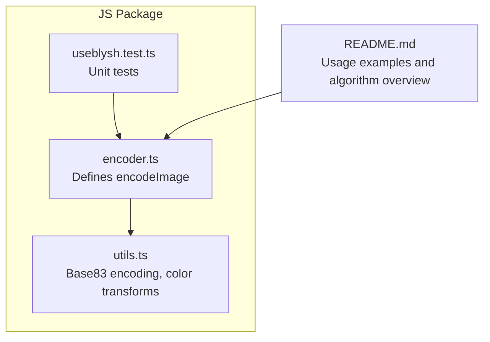
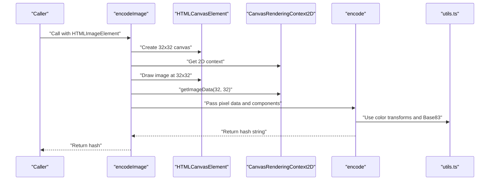
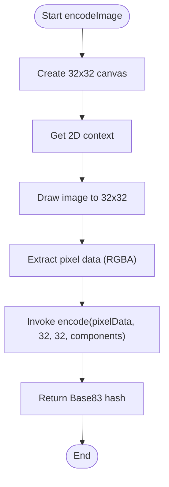
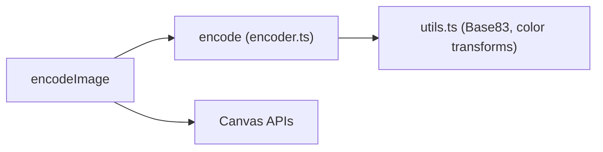

# encodeImage Utility Function

<cite>
**Referenced Files in This Document**
- [README.md](file://README.md)
- [encoder.ts](file://packages/js-useblysh/src/encoder.ts)
- [utils.ts](file://packages/js-useblysh/src/utils.ts)
- [useblysh.test.ts](file://packages/js-useblysh/src/useblysh.test.ts)
</cite>

## Table of Contents
1. [Introduction](#introduction)
2. [Project Structure](#project-structure)
3. [Core Components](#core-components)
4. [Architecture Overview](#architecture-overview)
5. [Detailed Component Analysis](#detailed-component-analysis)
6. [Dependency Analysis](#dependency-analysis)
7. [Performance Considerations](#performance-considerations)
8. [Troubleshooting Guide](#troubleshooting-guide)
9. [Conclusion](#conclusion)
10. [Appendices](#appendices)

## Introduction
This document provides comprehensive technical documentation for the encodeImage utility function, which generates compact visual hashes for browser-side image processing. It explains the function signature, parameters, return value semantics, and error handling mechanisms. It also details the complete image processing pipeline, including canvas operations, DCT transformation, quantization, and Base83 encoding. The mathematical foundation of the Blysh algorithm is described alongside its implementation in the browser environment. Practical usage examples demonstrate integration with file upload workflows, drag-and-drop implementations, and batch processing scenarios. Performance optimization techniques, memory management considerations, and browser compatibility requirements are addressed. Finally, troubleshooting guidance covers common issues such as large images, CORS restrictions, and canvas-related errors.

## Project Structure
The encodeImage function resides in the JavaScript package of the useblysh toolkit. The relevant source files include the encoder module that defines encodeImage and the supporting utilities module that provides Base83 encoding and color space transformations. The README demonstrates practical usage examples and highlights the Blysh algorithm’s core steps.

**Diagram sources**
- [encoder.ts](file://packages/js-useblysh/src/encoder.ts)
- [utils.ts](file://packages/js-useblysh/src/utils.ts)
- [useblysh.test.ts](file://packages/js-useblysh/src/useblysh.test.ts)
- [README.md](file://README.md)

**Section sources**
- [README.md](file://README.md)
- [encoder.ts](file://packages/js-useblysh/src/encoder.ts)

## Core Components
The encodeImage function is part of the encoder module and serves as the primary browser-side entry point for generating image hashes. It accepts an HTMLImageElement and optional parameters controlling the DCT decomposition granularity, then returns a compact Base83-encoded string representing the image’s perceptual fingerprint.

Key characteristics:
- Input: HTMLImageElement
- Optional parameters: componentsX (default 4), componentsY (default 3)
- Output: string (Base83-encoded hash)
- Error handling: throws descriptive errors for invalid parameters and unsupported contexts

Integration points:
- Uses a 32x32 canvas for downsampling and pixel extraction
- Delegates core encoding to the encode function
- Relies on utility functions for color space conversion and Base83 encoding

**Section sources**
- [encoder.ts](file://packages/js-useblysh/src/encoder.ts)

## Architecture Overview
The encodeImage pipeline integrates browser APIs with mathematical transforms and compression utilities to produce a compact hash. The flow begins with canvas rendering, continues through pixel sampling and DCT computation, and concludes with quantization and Base83 encoding.

**Diagram sources**
- [encoder.ts](file://packages/js-useblysh/src/encoder.ts)
- [utils.ts](file://packages/js-useblysh/src/utils.ts)

## Detailed Component Analysis

### Function Signature and Semantics
- Name: encodeImage
- Parameters:
  - image: HTMLImageElement (required)
  - componentsX: number (optional, default 4)
  - componentsY: number (optional, default 3)
- Returns: string (Base83-encoded hash)
- Behavior:
  - Creates a 32x32 offscreen canvas
  - Draws the input image scaled to 32x32
  - Extracts pixel data (Uint8ClampedArray)
  - Invokes encode with pixel data and component counts
  - Returns the resulting hash

Error handling:
- Throws if the canvas 2D context cannot be obtained
- Delegates parameter validation to encode (enforces component bounds)

**Section sources**
- [encoder.ts](file://packages/js-useblysh/src/encoder.ts)

### Mathematical Foundation: Blysh Algorithm
The Blysh algorithm performs a 2D Discrete Cosine Transform (DCT) over RGB channels to capture dominant frequency components. The process includes:
- Color space conversion: sRGB to linear RGB for perceptual accuracy
- DCT computation: cosine basis functions applied across spatial dimensions
- Normalization: scaling by component indices and image dimensions
- Quantization: DC and AC coefficients encoded via Base83
- Encoding: compact representation stored as a Base83 string

The README describes the high-level workflow and emphasizes the Base83 compression step.

**Section sources**
- [README.md](file://README.md)
- [encoder.ts](file://packages/js-useblysh/src/encoder.ts)

### Image Processing Pipeline
The pipeline stages are as follows:
1. Canvas creation and sizing:
   - A 32x32 canvas is used for consistent, fast processing and parity with the Python implementation.
2. Rendering:
   - The image is drawn onto the canvas at fixed dimensions, ensuring uniformity regardless of input size.
3. Pixel extraction:
   - getImageData retrieves RGBA pixel data as a contiguous array.
4. DCT and quantization:
   - The encode function computes DCT coefficients per channel and normalizes them.
5. Base83 encoding:
   - Coefficients are quantized and encoded using Base83 for compactness.

**Diagram sources**
- [encoder.ts](file://packages/js-useblysh/src/encoder.ts)

**Section sources**
- [encoder.ts](file://packages/js-useblysh/src/encoder.ts)

### Relationship with Core Utilities
- Color transforms:
  - srgbToLinear and linearToSrgb convert between color spaces to align with perceptual metrics.
- Base83 encoding:
  - encodeBase83 compresses numeric coefficients into a compact string representation.
- DCT implementation:
  - The encode function computes cosine basis products and accumulates per-channel sums.

These utilities underpin the mathematical fidelity of the hash while maintaining small output sizes.

**Section sources**
- [encoder.ts](file://packages/js-useblysh/src/encoder.ts)
- [utils.ts](file://packages/js-useblysh/src/utils.ts)

### Usage Examples and Integration Patterns
Practical integration patterns are demonstrated in the README and unit tests:
- File upload workflow:
  - Create an Image element from a File via URL.createObjectURL
  - On load, pass the Image to encodeImage to generate the hash
  - Send both the file and hash to the server
- Drag-and-drop:
  - Capture dropped files, create Image URLs, and compute hashes similarly
- Batch processing:
  - Iterate over multiple files, compute hashes, and collect results for bulk upload

The README provides concise code examples for browser-side hashing and React placeholder rendering.

**Section sources**
- [README.md](file://README.md)
- [useblysh.test.ts](file://packages/js-useblysh/src/useblysh.test.ts)

## Dependency Analysis
The encodeImage function depends on:
- Browser APIs: HTMLCanvasElement, CanvasRenderingContext2D, ImageData
- Internal encoder: encode (DCT and quantization)
- Utility functions: Base83 encoding and color space conversions

**Diagram sources**
- [encoder.ts](file://packages/js-useblysh/src/encoder.ts)
- [utils.ts](file://packages/js-useblysh/src/utils.ts)

**Section sources**
- [encoder.ts](file://packages/js-useblysh/src/encoder.ts)

## Performance Considerations
- Canvas sizing:
  - Fixed 32x32 reduces memory footprint and computation cost while preserving perceptual quality.
- Pixel access:
  - getImageData returns a flat array; avoid unnecessary copies or conversions.
- Component selection:
  - Lower componentsX/componentsY reduce coefficient count and hash length but may decrease uniqueness.
- Memory management:
  - Reuse canvases cautiously; otherwise, rely on garbage collection after use.
- Asynchronous processing:
  - Offload hashing to Web Workers for heavy batches to keep the UI responsive.
- Compression:
  - Base83 encoding minimizes payload size compared to raw numeric arrays.

[No sources needed since this section provides general guidance]

## Troubleshooting Guide
Common issues and resolutions:
- Large images:
  - The pipeline downsamples to 32x32; ensure the input image is accessible and rendered correctly before hashing.
- CORS restrictions:
  - Cross-origin images must be properly allowed; otherwise, drawing to canvas may taint it and cause errors when extracting pixel data.
- Canvas context unavailable:
  - The function throws if a 2D context cannot be obtained; verify the environment supports canvas.
- Invalid parameters:
  - component values outside [1, 9] trigger validation errors; adjust accordingly.
- Hash decoding failures:
  - Unit tests demonstrate that invalid hashes raise errors; ensure the hash originates from the same encoder version and parameters.

Debugging techniques:
- Log the image dimensions and component counts prior to hashing.
- Verify that the Image element has loaded and is drawable.
- Inspect the generated hash length and character set to confirm Base83 encoding.
- Test with controlled pixel arrays to isolate algorithmic issues.

**Section sources**
- [encoder.ts](file://packages/js-useblysh/src/encoder.ts)
- [useblysh.test.ts](file://packages/js-useblysh/src/useblysh.test.ts)

## Conclusion
The encodeImage function provides a robust, browser-native pathway for generating compact visual hashes using DCT and Base83 encoding. Its design balances performance, portability, and fidelity, enabling efficient progressive image loading and placeholder rendering. By following the usage patterns and troubleshooting guidance herein, developers can integrate encodeImage seamlessly into upload workflows, drag-and-drop experiences, and batch processing pipelines while maintaining strong cross-browser compatibility and predictable performance.

[No sources needed since this section summarizes without analyzing specific files]

## Appendices

### API Reference Summary
- Function: encodeImage
  - Parameters:
    - image: HTMLImageElement
    - componentsX: number (optional, default 4)
    - componentsY: number (optional, default 3)
  - Returns: string (Base83-encoded hash)
  - Throws: Error for invalid context or parameter bounds

**Section sources**
- [encoder.ts](file://packages/js-useblysh/src/encoder.ts)