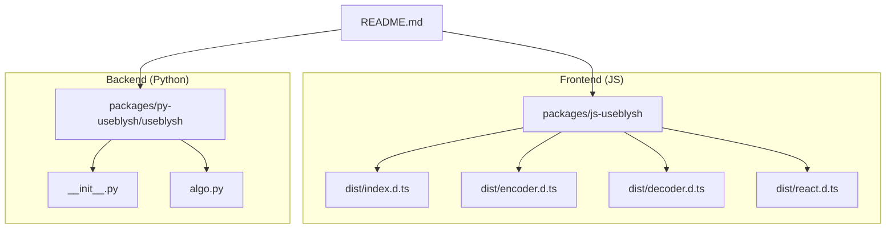
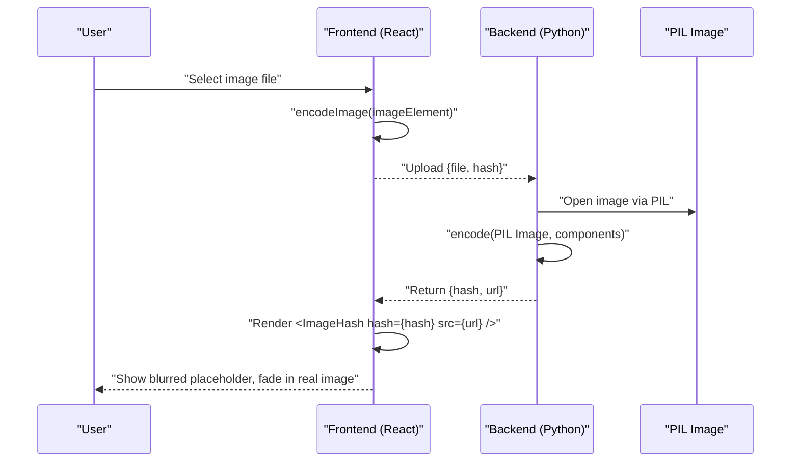
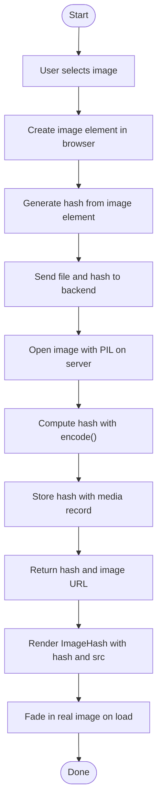
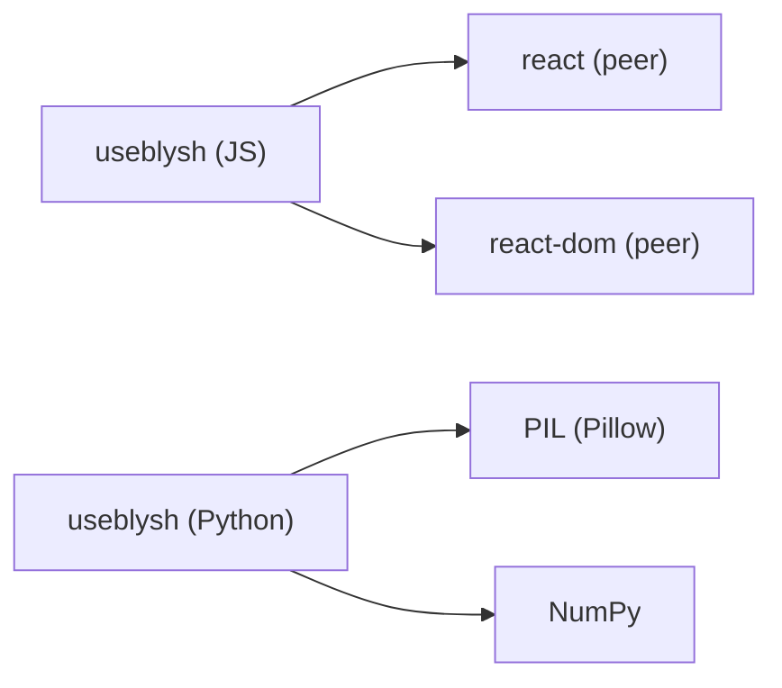

# Getting Started

<cite>
**Referenced Files in This Document**
- [README.md](file://README.md)
- [package.json](file://packages/js-useblysh/package.json)
- [index.d.ts](file://packages/js-useblysh/dist/index.d.ts)
- [encoder.d.ts](file://packages/js-useblysh/dist/encoder.d.ts)
- [decoder.d.ts](file://packages/js-useblysh/dist/decoder.d.ts)
- [react.d.ts](file://packages/js-useblysh/dist/react.d.ts)
- [__init__.py](file://packages/py-useblysh/useblysh/__init__.py)
- [algo.py](file://packages/py-useblysh/useblysh/algo.py)
</cite>

## Table of Contents
1. [Introduction](#introduction)
2. [Project Structure](#project-structure)
3. [Core Components](#core-components)
4. [Architecture Overview](#architecture-overview)
5. [Detailed Component Analysis](#detailed-component-analysis)
6. [Dependency Analysis](#dependency-analysis)
7. [Performance Considerations](#performance-considerations)
8. [Troubleshooting Guide](#troubleshooting-guide)
9. [Conclusion](#conclusion)
10. [Appendices](#appendices)

## Introduction
useblysh provides a unified solution for generating compact visual hashes from images and rendering elegant blurred placeholders in React applications. It enables progressive image loading, reduces layout shifts, and improves perceived performance by replacing large images with small hash strings during initial loads. The library offers identical hashing logic for both Python (backend) and React (frontend), ensuring consistent behavior across your stack.

Key benefits:
- Full-stack compatibility between Python and React
- Zero layout shift with immediate space reservation
- Lightweight hash strings (e.g., ~20 bytes) compared to full-size images
- Modern development experience with TypeScript and React 18/19 support

## Project Structure
The repository is organized into two primary packages:
- Frontend (JavaScript/TypeScript): React-focused package exposing encoding, decoding, and React components.
- Backend (Python): PIL-based package implementing the hashing algorithm and base83 encoding/decoding utilities.

**Diagram sources**
- [README.md](file://README.md)
- [package.json](file://packages/js-useblysh/package.json)
- [index.d.ts](file://packages/js-useblysh/dist/index.d.ts)
- [encoder.d.ts](file://packages/js-useblysh/dist/encoder.d.ts)
- [decoder.d.ts](file://packages/js-useblysh/dist/decoder.d.ts)
- [react.d.ts](file://packages/js-useblysh/dist/react.d.ts)
- [__init__.py](file://packages/py-useblysh/useblysh/__init__.py)
- [algo.py](file://packages/py-useblysh/useblysh/algo.py)

**Section sources**
- [README.md](file://README.md)
- [package.json](file://packages/js-useblysh/package.json)

## Core Components
This section outlines the essential building blocks you will use to integrate useblysh into your projects.

- Frontend (React/TypeScript)
  - Encoding functions:
    - encode: Converts raw pixel data into a hash string given component counts.
    - encodeImage: Generates a hash directly from an HTMLImageElement.
  - React components:
    - ImageHash: Renders a blurred placeholder while the real image loads.
    - ImageHashCanvas: Low-level canvas-based placeholder rendering for advanced control.
  - Decoder:
    - decode: Reconstructs pixel data from a hash for manual rendering scenarios.

- Backend (Python)
  - encode: Computes the hash from a PIL Image with configurable component grids.
  - Base utilities: Base83 encoding/decoding helpers and color space conversions.

Typical usage patterns:
- Frontend: Generate hashes during uploads and pass them alongside image metadata to the backend.
- Backend: Compute hashes for stored images and return them in API responses.
- Frontend: Render ImageHash with the stored hash and the real image URL.

**Section sources**
- [index.d.ts](file://packages/js-useblysh/dist/index.d.ts)
- [encoder.d.ts](file://packages/js-useblysh/dist/encoder.d.ts)
- [decoder.d.ts](file://packages/js-useblysh/dist/decoder.d.ts)
- [react.d.ts](file://packages/js-useblysh/dist/react.d.ts)
- [__init__.py](file://packages/py-useblysh/useblysh/__init__.py)
- [algo.py](file://packages/py-useblysh/useblysh/algo.py)

## Architecture Overview
The end-to-end workflow spans client-side hashing, server-side computation, and React-based placeholder rendering.

**Diagram sources**
- [README.md](file://README.md)
- [encoder.d.ts](file://packages/js-useblysh/dist/encoder.d.ts)
- [react.d.ts](file://packages/js-useblysh/dist/react.d.ts)
- [algo.py](file://packages/py-useblysh/useblysh/algo.py)

## Detailed Component Analysis

### Frontend: React Integration
- Installation
  - Install the NPM package for React and TypeScript support.
- Basic usage
  - Generate a hash from an image element during upload.
  - Send both the file and the generated hash to your backend.
  - Render the image using ImageHash with the stored hash and the real image URL.
- Advanced control
  - Use ImageHashCanvas to manually manage placeholder rendering and image loading transitions.

Implementation steps:
1. Add the package to your React project.
2. Capture the selected file and create an image element.
3. Call the encoding function to produce the hash.
4. Upload the file and hash to your backend.
5. On response, render ImageHash with the returned hash and image URL.

Common integration patterns:
- RESTful API integration: Include the hash string in your JSON payload alongside image metadata.
- React component integration: Wrap your media rendering with ImageHash for automatic placeholder behavior.

Prerequisite knowledge:
- React and TypeScript fundamentals
- Understanding of DOM APIs for image handling

**Section sources**
- [README.md](file://README.md)
- [package.json](file://packages/js-useblysh/package.json)
- [encoder.d.ts](file://packages/js-useblysh/dist/encoder.d.ts)
- [react.d.ts](file://packages/js-useblysh/dist/react.d.ts)

### Backend: Python Integration
- Installation
  - Install the PyPI package in your Python environment.
- Basic usage
  - Open an image with PIL.
  - Compute the hash using the provided encode function with desired component grid sizes.
  - Store the hash with your image record and serve it in API responses.
- Prerequisites
  - Familiarity with Python and PIL/Pillow for image manipulation.

Integration steps:
1. Install the package in your Python runtime.
2. Load images via PIL.
3. Generate hashes using the encode function.
4. Persist the hash and return it with your media endpoints.

**Section sources**
- [README.md](file://README.md)
- [algo.py](file://packages/py-useblysh/useblysh/algo.py)
- [__init__.py](file://packages/py-useblysh/useblysh/__init__.py)

### Fundamental Workflow: From Upload to Display

**Diagram sources**
- [README.md](file://README.md)
- [encoder.d.ts](file://packages/js-useblysh/dist/encoder.d.ts)
- [react.d.ts](file://packages/js-useblysh/dist/react.d.ts)
- [algo.py](file://packages/py-useblysh/useblysh/algo.py)

## Dependency Analysis
- Frontend peer dependencies
  - React and ReactDOM are required as peer dependencies for the React components and hooks.
- Backend dependencies
  - PIL (Pillow) and NumPy are used for image processing and numerical operations.
- Build and dev toolchain (frontend)
  - Vite, React, TypeScript, and related plugins are used for development and building.

**Diagram sources**
- [package.json](file://packages/js-useblysh/package.json)
- [algo.py](file://packages/py-useblysh/useblysh/algo.py)

**Section sources**
- [package.json](file://packages/js-useblysh/package.json)
- [algo.py](file://packages/py-useblysh/useblysh/algo.py)

## Performance Considerations
- Hash size vs. quality trade-off
  - Component counts control the resolution and fidelity of the reconstructed placeholder. Larger grids increase hash size and decoding cost but improve visual accuracy.
- Image preprocessing
  - Using a consistent downsample method (e.g., LANCZOS) ensures deterministic hashing and predictable performance.
- Rendering efficiency
  - ImageHash leverages canvas-based decoding for smooth placeholder rendering and minimal layout shifts.
- Network optimization
  - Transmitting short hash strings instead of full images during initial loads dramatically reduces latency and bandwidth usage.

## Troubleshooting Guide
- Frontend installation issues
  - Ensure React and ReactDOM versions meet the peer dependency requirements.
  - Verify your bundler supports ES modules and TypeScript declarations.
- Backend installation issues
  - Confirm PIL (Pillow) and NumPy are installed and compatible with your Python version.
  - If hashing fails, check that the input image is valid and opened via PIL.
- Environment setup problems
  - For frontend, ensure your build pipeline includes React and TypeScript support.
  - For backend, confirm the working directory and image paths are correct.
- Common pitfalls
  - Mismatched component counts between encoding and decoding can cause errors.
  - Incorrect image orientation or color modes should be normalized before hashing.

## Conclusion
useblysh streamlines progressive image loading by generating compact, consistent hashes across your full-stack application. By integrating the frontend encoding and React components with backend hashing, you can deliver engaging, layout-stable experiences with minimal overhead. Start with the installation steps, generate hashes during uploads, and render placeholders seamlessly using the provided React components.

## Appendices
- Quick links
  - Frontend installation command: see [Installation](file://README.md)
  - Backend installation command: see [Installation](file://README.md)
  - Example usage (browser hashing): see [Simple Examples](file://README.md)
  - Example usage (server-side hashing): see [Simple Examples](file://README.md)
  - React component usage: see [Simple Examples](file://README.md)