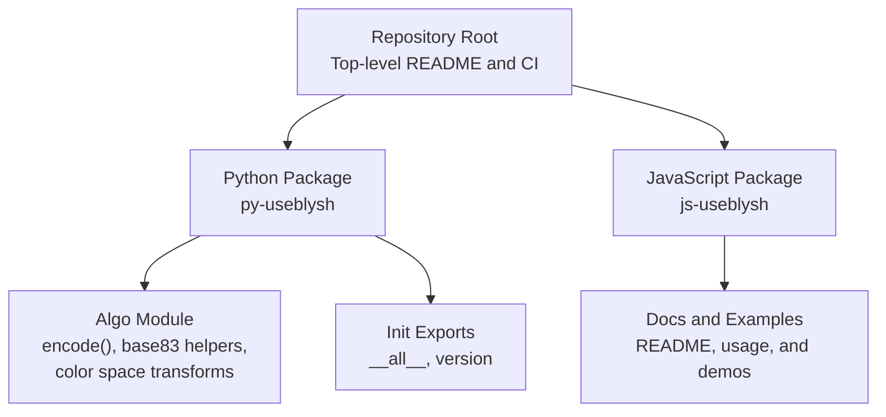
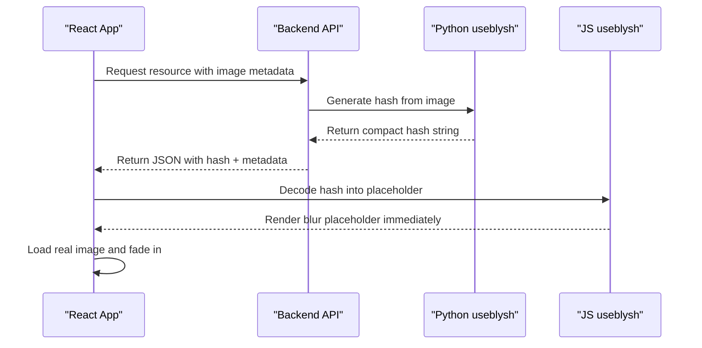
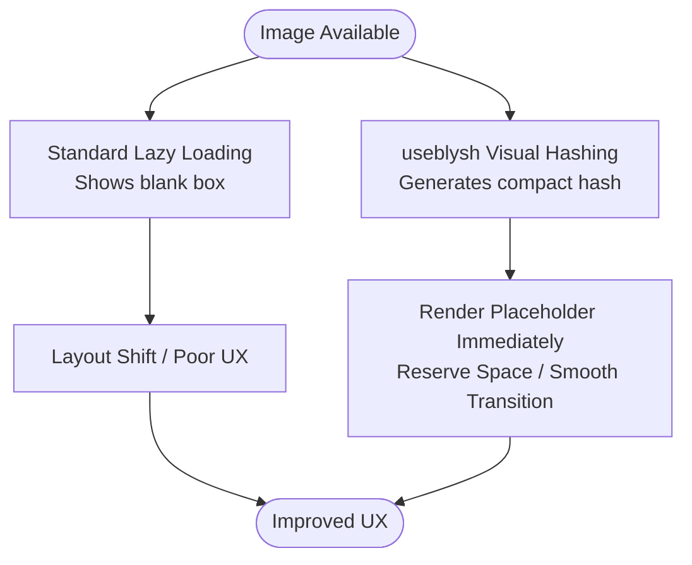
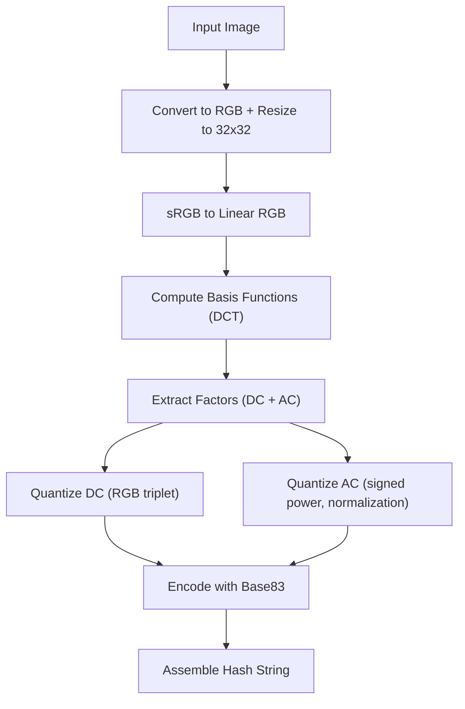
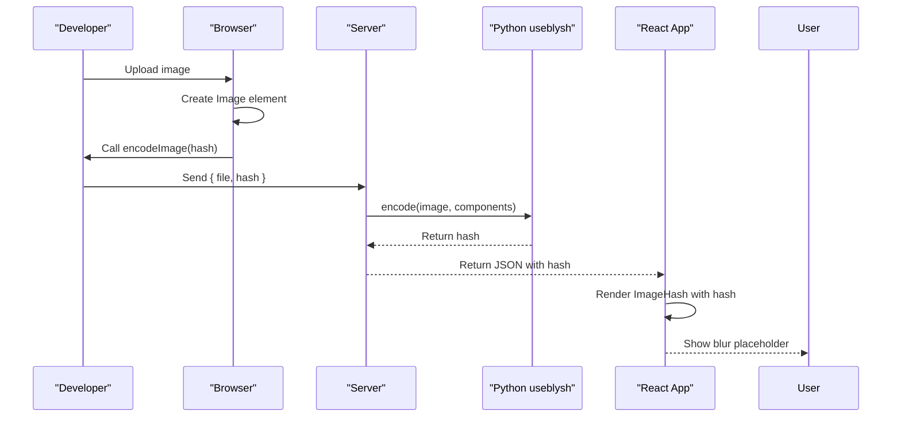
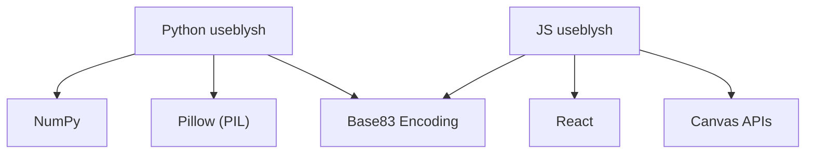

# Project Overview

<cite>
**Referenced Files in This Document**
- [README.md](file://README.md)
- [packages/js-useblysh/README.md](file://packages/js-useblysh/README.md)
- [packages/py-useblysh/README.md](file://packages/py-useblysh/README.md)
- [packages/py-useblysh/useblysh/algo.py](file://packages/py-useblysh/useblysh/algo.py)
- [packages/py-useblysh/useblysh/__init__.py](file://packages/py-useblysh/useblysh/__init__.py)
</cite>

## Table of Contents
1. [Introduction](#introduction)
2. [Project Structure](#project-structure)
3. [Core Components](#core-components)
4. [Architecture Overview](#architecture-overview)
5. [Detailed Component Analysis](#detailed-component-analysis)
6. [Dependency Analysis](#dependency-analysis)
7. [Performance Considerations](#performance-considerations)
8. [Troubleshooting Guide](#troubleshooting-guide)
9. [Conclusion](#conclusion)

## Introduction
useblysh is a high-performance visual hashing toolkit designed to enable seamless progressive image loading. Its core value proposition is transforming heavy images (often 1 MB or larger) into compact hash strings (around 20 bytes) that preserve visual fidelity while dramatically reducing payload size. These hashes are generated via a shared algorithm and can be transmitted inline with JSON responses, enabling immediate rendering of elegant, byte-sized blurs that reserve layout space and prevent layout shift.

The toolkit provides a unified approach across full-stack environments:
- A Python backend library for generating hashes on the server
- A React/TypeScript frontend library for decoding and rendering placeholders

This dual-language implementation ensures identical hashing logic across platforms, allowing a single hash to be generated on the server and decoded on the client for progressive loading.

Key benefits include:
- Zero layout shift: placeholders reserve the correct aspect ratio and space instantly
- Performance optimization: replace large images with small strings during initial loads
- Modern development stack: fully typed with TypeScript and optimized for React 18/19

Practical outcomes:
- Users see a smooth blur placeholder immediately, keeping engagement high
- Social media feeds and infinite scroll experiences render complete layouts before downloading actual image bytes
- SEO and Core Web Vitals improve due to reduced layout shift

**Section sources**
- [README.md:11-18](file://README.md#L11-L18)
- [README.md:141-150](file://README.md#L141-L150)
- [packages/py-useblysh/README.md:14](file://packages/py-useblysh/README.md#L14)

## Project Structure
At a high level, the repository is organized into:
- Root documentation and top-level examples
- A Python package implementing the visual hashing algorithm and exposing a simple API
- A JavaScript/TypeScript package for React-based decoding and rendering

**Diagram sources**
- [README.md:1-163](file://README.md#L1-L163)
- [packages/py-useblysh/useblysh/algo.py:1-112](file://packages/py-useblysh/useblysh/algo.py#L1-L112)
- [packages/py-useblysh/useblysh/__init__.py:1-5](file://packages/py-useblysh/useblysh/__init__.py#L1-L5)
- [packages/js-useblysh/README.md:1-126](file://packages/js-useblysh/README.md#L1-L126)

**Section sources**
- [README.md:1-163](file://README.md#L1-L163)
- [packages/py-useblysh/useblysh/algo.py:1-112](file://packages/py-useblysh/useblysh/algo.py#L1-L112)
- [packages/py-useblysh/useblysh/__init__.py:1-5](file://packages/py-useblysh/useblysh/__init__.py#L1-L5)
- [packages/js-useblysh/README.md:1-126](file://packages/js-useblysh/README.md#L1-L126)

## Core Components
- Visual hashing pipeline: The Python backend computes a hash from an image using a Discrete Cosine Transform (DCT) over a downsampled grid, quantizing frequency components into a compact Base83-encoded string.
- Frontend decoding and rendering: The React/TypeScript package decodes the hash into a low-resolution representation and renders a smooth blur placeholder, fading in the real image when it becomes available.
- Unified hashing logic: Both Python and JavaScript implementations share the same algorithmic foundation, ensuring compatibility and consistent visual quality across the stack.

Benefits:
- Seamless progressive loading: users see a high-quality placeholder immediately
- Layout stability: prevents CLS by reserving space up front
- Performance: reduces initial payload by sending ~20 bytes instead of full images

**Section sources**
- [README.md:11-18](file://README.md#L11-L18)
- [README.md:141-150](file://README.md#L141-L150)
- [packages/py-useblysh/README.md:14](file://packages/py-useblysh/README.md#L14)
- [packages/js-useblysh/README.md:14](file://packages/js-useblysh/README.md#L14)

## Architecture Overview
The system operates in two complementary stages:
- Hash generation (backend): An image is processed into a compact hash string using DCT and Base83 encoding.
- Progressive rendering (frontend): The hash is decoded into a canvas-rendered blur placeholder, which is shown until the real image finishes loading.

**Diagram sources**
- [README.md:47-106](file://README.md#L47-L106)
- [packages/py-useblysh/README.md:31-44](file://packages/py-useblysh/README.md#L31-L44)
- [packages/js-useblysh/README.md:34-69](file://packages/js-useblysh/README.md#L34-L69)

## Detailed Component Analysis

### Problem Statement and Solution
- Problem: Standard lazy loading often shows empty white boxes, leading to poor UX and layout shift.
- Solution: useblysh encodes images into tiny strings that can be included in initial API responses, enabling immediate rendering of elegant placeholders that reserve layout space and prevent CLS.

**Section sources**
- [README.md:11-18](file://README.md#L11-L18)
- [README.md:141-150](file://README.md#L141-L150)

### Blysh Algorithm Foundation (Technical Details)
The Python implementation demonstrates the core algorithm:
- Color space conversion: sRGB to linear RGB for perceptual accuracy
- DCT decomposition: compute basis functions over a fixed grid (downsampled to 32x32)
- Quantization: DC and AC coefficients encoded with Base83; maximum AC scaled for robustness
- Compact representation: size flags, maximum AC scaling, DC color triplet, and quantized AC factors

**Diagram sources**
- [packages/py-useblysh/useblysh/algo.py:39-112](file://packages/py-useblysh/useblysh/algo.py#L39-L112)

**Section sources**
- [README.md:154-160](file://README.md#L154-L160)
- [packages/py-useblysh/useblysh/algo.py:1-112](file://packages/py-useblysh/useblysh/algo.py#L1-L112)

### Unified Hash Generation Across Platforms
- Python backend: exposes encode() and Base83 helpers; integrates with PIL/Pillow for image IO
- JavaScript frontend: decodes the same hash format into a canvas blur and integrates with React components for progressive loading

**Diagram sources**
- [packages/py-useblysh/useblysh/__init__.py:1-5](file://packages/py-useblysh/useblysh/__init__.py#L1-L5)
- [packages/py-useblysh/useblysh/algo.py:39-112](file://packages/py-useblysh/useblysh/algo.py#L39-L112)
- [packages/js-useblysh/README.md:34-69](file://packages/js-useblysh/README.md#L34-L69)

**Section sources**
- [README.md:154-160](file://README.md#L154-L160)
- [packages/py-useblysh/useblysh/__init__.py:1-5](file://packages/py-useblysh/useblysh/__init__.py#L1-L5)
- [packages/py-useblysh/useblysh/algo.py:39-112](file://packages/py-useblysh/useblysh/algo.py#L39-L112)
- [packages/js-useblysh/README.md:34-69](file://packages/js-useblysh/README.md#L34-L69)

### Practical Examples: From Heavy Images to Byte-Sized Blurs
- Browser-side hash generation: capture an uploaded image, convert to an Image element, and generate a hash for immediate transmission to the backend.
- Backend hash generation: open an image with Pillow, call encode() with configurable components, and return the hash alongside resource metadata.
- Frontend placeholder rendering: pass the stored hash to a React component to render a blur placeholder; optionally manage image loading manually with a canvas-based component.

**Diagram sources**
- [README.md:49-106](file://README.md#L49-L106)
- [packages/py-useblysh/README.md:31-44](file://packages/py-useblysh/README.md#L31-L44)
- [packages/js-useblysh/README.md:34-69](file://packages/js-useblysh/README.md#L34-L69)

**Section sources**
- [README.md:49-106](file://README.md#L49-L106)
- [packages/py-useblysh/README.md:31-44](file://packages/py-useblysh/README.md#L31-L44)
- [packages/js-useblysh/README.md:34-69](file://packages/js-useblysh/README.md#L34-L69)

## Dependency Analysis
- Python package dependencies:
  - NumPy for numerical operations and array manipulation
  - Pillow (PIL) for image IO and resizing
- JavaScript package dependencies:
  - React and React DOM for component rendering
  - Canvas APIs for decoding and drawing placeholder blurs
- Shared contract:
  - Base83 character set and encoding/decoding routines
  - Consistent DCT-based quantization and reconstruction semantics

**Diagram sources**
- [packages/py-useblysh/useblysh/algo.py:1-112](file://packages/py-useblysh/useblysh/algo.py#L1-L112)
- [packages/js-useblysh/README.md:34-69](file://packages/js-useblysh/README.md#L34-L69)

**Section sources**
- [packages/py-useblysh/useblysh/algo.py:1-112](file://packages/py-useblysh/useblysh/algo.py#L1-L112)
- [packages/js-useblysh/README.md:34-69](file://packages/js-useblysh/README.md#L34-L69)

## Performance Considerations
- Payload reduction: hashes are ~20 bytes versus megabytes for full images
- Initial render speed: placeholders are rendered immediately from the hash, avoiding blank spaces
- Network efficiency: progressive loading allows the rest of the page to render while images stream in
- Memory footprint: canvas-based decoding is efficient and avoids storing large image buffers unnecessarily

[No sources needed since this section provides general guidance]

## Troubleshooting Guide
Common issues and resolutions:
- Incorrect component counts: ensure components_x and components_y are within supported bounds; otherwise, the encoder raises an error
- Color accuracy: verify sRGB-to-linear conversions are applied consistently on both ends
- Canvas rendering: confirm the target environment supports canvas APIs and that the React components are mounted before decoding

**Section sources**
- [packages/py-useblysh/useblysh/algo.py:40-41](file://packages/py-useblysh/useblysh/algo.py#L40-L41)

## Conclusion
useblysh delivers a modern, high-performance solution for visual hashing and progressive image loading. By encoding images into compact, cross-platform compatible hashes and rendering elegant placeholders, it eliminates layout shift, improves perceived performance, and enhances user experience. The unified algorithm across Python and React enables seamless integration into full-stack applications, supporting contemporary development practices and strong typing.

[No sources needed since this section summarizes without analyzing specific files]