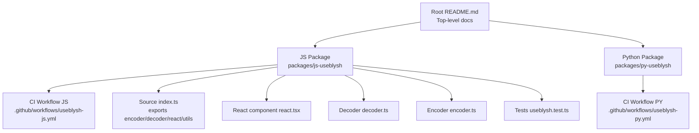
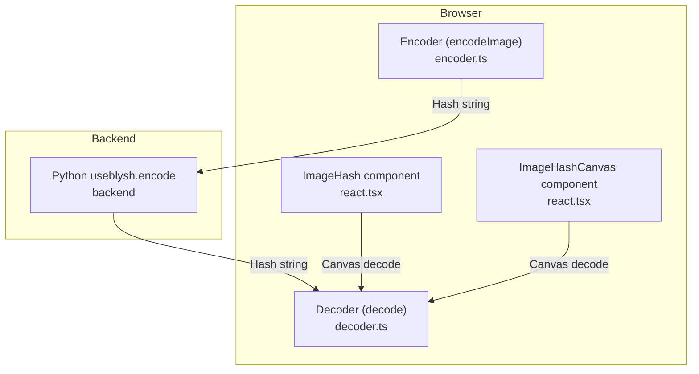
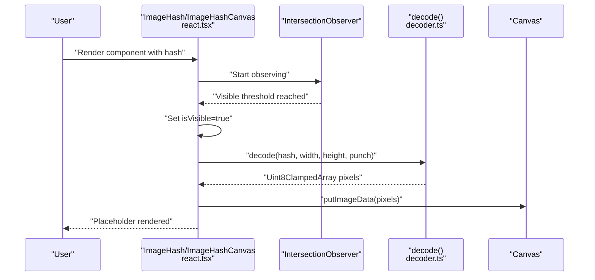
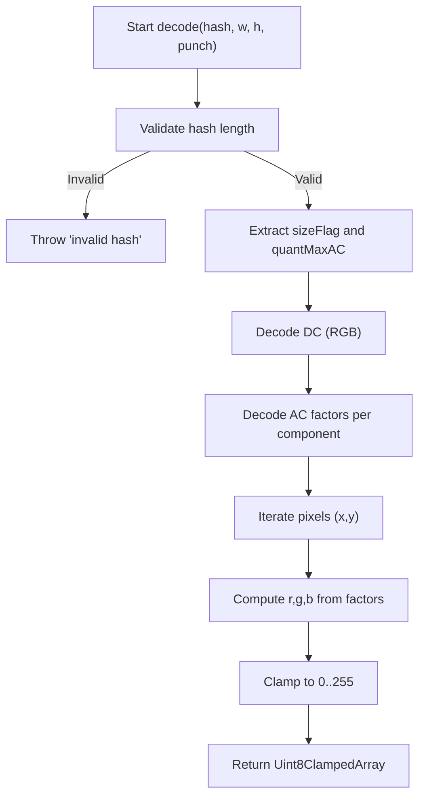
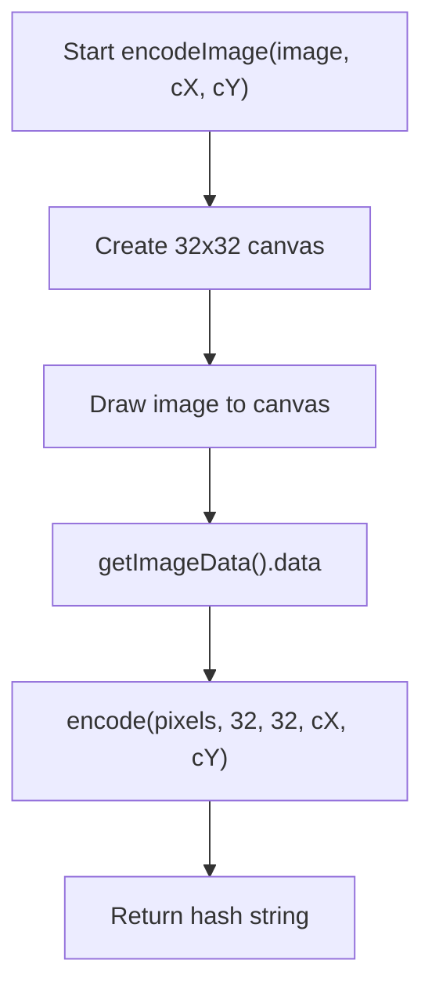
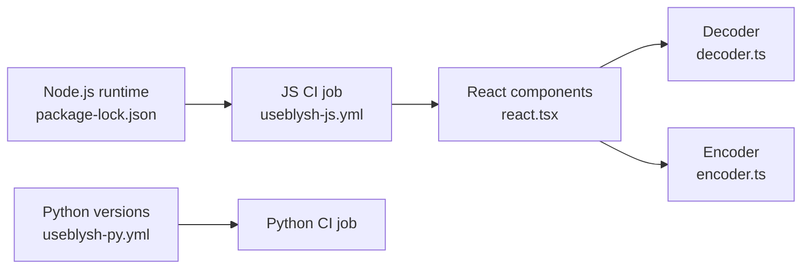

# Troubleshooting and FAQ

<cite>
**Referenced Files in This Document**
- [README.md](file://README.md)
- [useblysh-js.yml](file://.github/workflows/useblysh-js.yml)
- [useblysh-py.yml](file://.github/workflows/useblysh-py.yml)
- [index.ts](file://packages/js-useblysh/src/index.ts)
- [react.tsx](file://packages/js-useblysh/src/react.tsx)
- [decoder.ts](file://packages/js-useblysh/src/decoder.ts)
- [encoder.ts](file://packages/js-useblysh/src/encoder.ts)
- [useblysh.test.ts](file://packages/js-useblysh/src/useblysh.test.ts)
- [package-lock.json](file://packages/js-useblysh/package-lock.json)
- [README.md](file://packages/js-useblysh/README.md)
</cite>

## Table of Contents
1. [Introduction](#introduction)
2. [Project Structure](#project-structure)
3. [Core Components](#core-components)
4. [Architecture Overview](#architecture-overview)
5. [Detailed Component Analysis](#detailed-component-analysis)
6. [Dependency Analysis](#dependency-analysis)
7. [Performance Considerations](#performance-considerations)
8. [Troubleshooting Guide](#troubleshooting-guide)
9. [FAQ](#faq)
10. [Community Support and Contribution](#community-support-and-contribution)
11. [Conclusion](#conclusion)

## Introduction
This document provides a comprehensive troubleshooting and FAQ guide for the useblysh project. It focuses on installation issues, performance tuning, browser compatibility, debugging hash generation and rendering, integration pitfalls, and diagnostics. It also outlines community resources and contribution guidelines to help you resolve problems quickly and effectively.

## Project Structure
The repository is a monorepo with two packages:
- JavaScript package under packages/js-useblysh
- Python package under packages/py-useblysh

The JavaScript package exposes encoding/decoding utilities, React components, and tests. The Python package is validated via CI workflows that build and test across multiple Python versions.

**Diagram sources**
- [README.md](file://README.md)
- [useblysh-js.yml](file://.github/workflows/useblysh-js.yml)
- [useblysh-py.yml](file://.github/workflows/useblysh-py.yml)
- [index.ts](file://packages/js-useblysh/src/index.ts)
- [react.tsx](file://packages/js-useblysh/src/react.tsx)
- [decoder.ts](file://packages/js-useblysh/src/decoder.ts)
- [encoder.ts](file://packages/js-useblysh/src/encoder.ts)
- [useblysh.test.ts](file://packages/js-useblysh/src/useblysh.test.ts)

**Section sources**
- [README.md](file://README.md)
- [useblysh-js.yml](file://.github/workflows/useblysh-js.yml)
- [useblysh-py.yml](file://.github/workflows/useblysh-py.yml)

## Core Components
- Encoder/Decoder: Core functions to convert pixel data to/from a compact hash string.
- React Components: ImageHash and ImageHashCanvas for rendering placeholders and managing image transitions.
- Utilities: Color space conversions and Base83 encoding/decoding helpers.
- Tests: Validation of encode/decode round-trip correctness and error conditions.

Key responsibilities:
- Encoding: Convert an image to a small hash string suitable for transport and rendering.
- Decoding: Reconstruct pixel data from a hash for canvas rendering.
- Rendering: Provide React components that show a blurred placeholder while the real image loads.

**Section sources**
- [index.ts](file://packages/js-useblysh/src/index.ts)
- [react.tsx](file://packages/js-useblysh/src/react.tsx)
- [decoder.ts](file://packages/js-useblysh/src/decoder.ts)
- [encoder.ts](file://packages/js-useblysh/src/encoder.ts)
- [useblysh.test.ts](file://packages/js-useblysh/src/useblysh.test.ts)

## Architecture Overview
The system consists of:
- Browser-side hashing and rendering via React components.
- Backend hashing using Python with identical algorithmic logic.
- Consistent decoding pipeline across platforms.

**Diagram sources**
- [react.tsx](file://packages/js-useblysh/src/react.tsx)
- [encoder.ts](file://packages/js-useblysh/src/encoder.ts)
- [decoder.ts](file://packages/js-useblysh/src/decoder.ts)
- [README.md](file://README.md)

## Detailed Component Analysis

### React Rendering Pipeline
The ImageHash and ImageHashCanvas components coordinate decoding and rendering. They use intersection observation to defer decoding until the element is near the viewport, and schedule decoding off the critical rendering path.

**Diagram sources**
- [react.tsx](file://packages/js-useblysh/src/react.tsx)
- [decoder.ts](file://packages/js-useblysh/src/decoder.ts)

**Section sources**
- [react.tsx](file://packages/js-useblysh/src/react.tsx)
- [decoder.ts](file://packages/js-useblysh/src/decoder.ts)

### Decoder Algorithm Flow
The decoder validates the hash, extracts metadata, decodes DC/AC coefficients, applies color transforms, and produces pixel data.

**Diagram sources**
- [decoder.ts](file://packages/js-useblysh/src/decoder.ts)

**Section sources**
- [decoder.ts](file://packages/js-useblysh/src/decoder.ts)

### Encoder and Hash Generation
The encoder converts an image to a hash by downsampling to a fixed size, computing DCT-like factors, normalizing, and packing into Base83.

**Diagram sources**
- [encoder.ts](file://packages/js-useblysh/src/encoder.ts)

**Section sources**
- [encoder.ts](file://packages/js-useblysh/src/encoder.ts)

## Dependency Analysis
- Node.js engine requirement: The JS package declares a minimum Node.js version in its lockfile, indicating a specific runtime baseline.
- CI jobs specify pinned Node and Python versions to ensure reproducible builds.
- The React components depend on DOM APIs (Canvas, ImageData) and IntersectionObserver.

**Diagram sources**
- [package-lock.json](file://packages/js-useblysh/package-lock.json)
- [useblysh-js.yml](file://.github/workflows/useblysh-js.yml)
- [useblysh-py.yml](file://.github/workflows/useblysh-py.yml)
- [react.tsx](file://packages/js-useblysh/src/react.tsx)
- [decoder.ts](file://packages/js-useblysh/src/decoder.ts)
- [encoder.ts](file://packages/js-useblysh/src/encoder.ts)

**Section sources**
- [package-lock.json](file://packages/js-useblysh/package-lock.json)
- [useblysh-js.yml](file://.github/workflows/useblysh-js.yml)
- [useblysh-py.yml](file://.github/workflows/useblysh-py.yml)

## Performance Considerations
- Rendering off-main-thread: Decoding is scheduled after yielding to the main thread to avoid jank during scrolling.
- IntersectionObserver threshold: Adjust visibility thresholds to balance early decoding vs. wasted work.
- Canvas sizing: Fixed 32x32 canvas for hashing ensures consistent performance and identical results across platforms.
- Punch parameter: Controls contrast of decoded pixels; higher values increase perceived sharpness but may alter perceived quality.
- Memory: Decoded pixel buffers are short-lived; ensure cleanup of image URLs and canvases when unmounting components.

[No sources needed since this section provides general guidance]

## Troubleshooting Guide

### Installation Problems
- Node.js version mismatch
  - Symptom: Build failures or runtime errors.
  - Resolution: Align your Node.js version with the CI job’s pinned version and re-run install/build.
  - Reference: [useblysh-js.yml](file://.github/workflows/useblysh-js.yml), [package-lock.json](file://packages/js-useblysh/package-lock.json)
- Python environment issues
  - Symptom: Missing dependencies or incompatible interpreter.
  - Resolution: Use the Python versions tested by the CI job and install dependencies as shown in the workflow.
  - Reference: [useblysh-py.yml](file://.github/workflows/useblysh-py.yml)
- Platform-specific binaries
  - Symptom: Failure to install native dependencies.
  - Resolution: Ensure your OS/architecture is supported by the package’s prebuilt binaries; otherwise rebuild or use a compatible environment.
  - Reference: [package-lock.json](file://packages/js-useblysh/package-lock.json)

### Hash Generation Issues
- Empty or invalid hash
  - Symptom: Blank placeholder or decode errors.
  - Resolution: Verify the hash length and validity; ensure consistent component counts between encoder and decoder.
  - Reference: [decoder.ts](file://packages/js-useblysh/src/decoder.ts), [useblysh.test.ts](file://packages/js-useblysh/src/useblysh.test.ts)
- Inconsistent hashes across platforms
  - Symptom: Different hashes for identical images.
  - Resolution: Confirm identical component counts and ensure the same image preprocessing pipeline on both sides.
  - Reference: [README.md](file://README.md), [encoder.ts](file://packages/js-useblysh/src/encoder.ts), [decoder.ts](file://packages/js-useblysh/src/decoder.ts)

### Rendering Bottlenecks
- Slow placeholder rendering
  - Symptom: Delayed blur appearance.
  - Resolution: Reduce decode frequency by adjusting IntersectionObserver thresholds; avoid unnecessary re-renders by passing a stable hash prop.
  - Reference: [react.tsx](file://packages/js-useblysh/src/react.tsx)
- Layout shifts or CLS regressions
  - Symptom: Unexpected page movement.
  - Resolution: Ensure aspect ratio is reserved before decoding; pass explicit width/height to components.
  - Reference: [README.md](file://README.md), [react.tsx](file://packages/js-useblysh/src/react.tsx)

### Browser Compatibility
- Unsupported APIs
  - Symptom: Canvas or IntersectionObserver errors.
  - Resolution: Provide polyfills for legacy browsers; test against the browserslist targets used by the project.
  - Reference: [package-lock.json](file://packages/js-useblysh/package-lock.json)
- Rendering artifacts
  - Symptom: Blurry or pixelated output.
  - Resolution: Adjust the punch parameter; verify color space conversions are applied consistently.
  - Reference: [decoder.ts](file://packages/js-useblysh/src/decoder.ts)

### Integration Challenges
- API connectivity and data format mismatches
  - Symptom: Backend returns unexpected hash format.
  - Resolution: Validate that the backend uses the same algorithm and component counts; confirm the frontend decoders match.
  - Reference: [README.md](file://README.md), [useblysh-py.yml](file://.github/workflows/useblysh-py.yml)
- Framework compatibility
  - Symptom: React component not rendering or SSR errors.
  - Resolution: Ensure DOM APIs are available; initialize decoding only on the client; pass stable keys to components.
  - Reference: [react.tsx](file://packages/js-useblysh/src/react.tsx), [README.md](file://README.md)

### Debugging Techniques
- Validate encode/decode round-trip
  - Use the unit tests as a reference for expected behavior and error conditions.
  - Reference: [useblysh.test.ts](file://packages/js-useblysh/src/useblysh.test.ts)
- Inspect decoded pixel data
  - Log the returned pixel array dimensions and channel values to verify reconstruction.
  - Reference: [decoder.ts](file://packages/js-useblysh/src/decoder.ts)
- Profiling rendering
  - Measure decode timing and adjust IntersectionObserver thresholds to reduce contention.
  - Reference: [react.tsx](file://packages/js-useblysh/src/react.tsx)

**Section sources**
- [useblysh-js.yml](file://.github/workflows/useblysh-js.yml)
- [useblysh-py.yml](file://.github/workflows/useblysh-py.yml)
- [package-lock.json](file://packages/js-useblysh/package-lock.json)
- [decoder.ts](file://packages/js-useblysh/src/decoder.ts)
- [encoder.ts](file://packages/js-useblysh/src/encoder.ts)
- [react.tsx](file://packages/js-useblysh/src/react.tsx)
- [useblysh.test.ts](file://packages/js-useblysh/src/useblysh.test.ts)
- [README.md](file://README.md)

## FAQ
- Why does my hash appear invalid?
  - Ensure the hash meets the minimum length and follows the expected format. Check for typos and verify the decoder throws an error for malformed input.
  - Reference: [decoder.ts](file://packages/js-useblysh/src/decoder.ts), [useblysh.test.ts](file://packages/js-useblysh/src/useblysh.test.ts)
- How do I ensure consistent hashes across Python and JavaScript?
  - Use the same component counts for both encoder and decoder, and ensure identical image preprocessing.
  - Reference: [README.md](file://README.md), [encoder.ts](file://packages/js-useblysh/src/encoder.ts), [decoder.ts](file://packages/js-useblysh/src/decoder.ts)
- Why is decoding laggy on mobile?
  - Tune IntersectionObserver thresholds and avoid decoding off-screen elements; consider reducing the number of simultaneous decodes.
  - Reference: [react.tsx](file://packages/js-useblysh/src/react.tsx)
- What browsers are supported?
  - Target modern browsers; provide polyfills for older environments. Validate against the browserslist targets used by the project.
  - Reference: [package-lock.json](file://packages/js-useblysh/package-lock.json)
- How can I improve visual quality?
  - Increase the punch parameter moderately; ensure proper color space conversions and consistent component sizes.
  - Reference: [decoder.ts](file://packages/js-useblysh/src/decoder.ts)
- Are there performance benchmarks?
  - Use the unit tests as a baseline; measure decode time and adjust parameters accordingly.
  - Reference: [useblysh.test.ts](file://packages/js-useblysh/src/useblysh.test.ts)

**Section sources**
- [decoder.ts](file://packages/js-useblysh/src/decoder.ts)
- [encoder.ts](file://packages/js-useblysh/src/encoder.ts)
- [react.tsx](file://packages/js-useblysh/src/react.tsx)
- [useblysh.test.ts](file://packages/js-useblysh/src/useblysh.test.ts)
- [README.md](file://README.md)
- [package-lock.json](file://packages/js-useblysh/package-lock.json)

## Community Support and Contribution
- Reporting issues
  - Provide environment details (Node/Python versions, browsers), reproduction steps, and expected vs. actual behavior.
  - Reference: [useblysh-js.yml](file://.github/workflows/useblysh-js.yml), [useblysh-py.yml](file://.github/workflows/useblysh-py.yml)
- Contributing
  - Follow the established CI workflows for building and testing; keep changes aligned with the documented API and tests.
  - Reference: [README.md](file://README.md), [useblysh.test.ts](file://packages/js-useblysh/src/useblysh.test.ts)
- Additional resources
  - Consult the top-level README for usage examples and integration guidance.
  - Reference: [README.md](file://README.md), [README.md](file://packages/js-useblysh/README.md)

**Section sources**
- [useblysh-js.yml](file://.github/workflows/useblysh-js.yml)
- [useblysh-py.yml](file://.github/workflows/useblysh-py.yml)
- [README.md](file://README.md)
- [README.md](file://packages/js-useblysh/README.md)
- [useblysh.test.ts](file://packages/js-useblysh/src/useblysh.test.ts)

## Conclusion
By aligning environments with the CI configurations, validating encode/decode round-trips, and tuning rendering parameters, most issues can be resolved efficiently. Use the provided diagnostics and community resources to report problems and contribute improvements.

[No sources needed since this section summarizes without analyzing specific files]